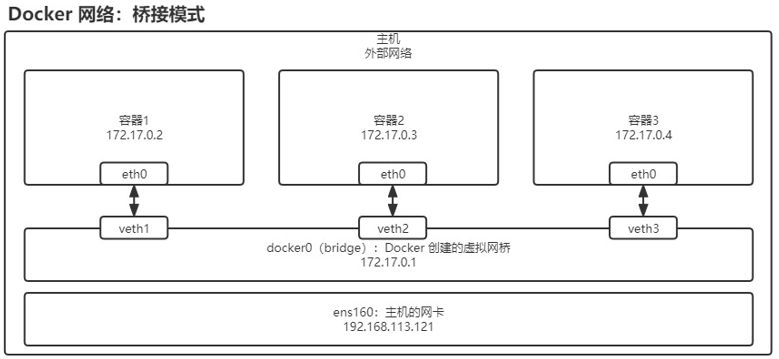
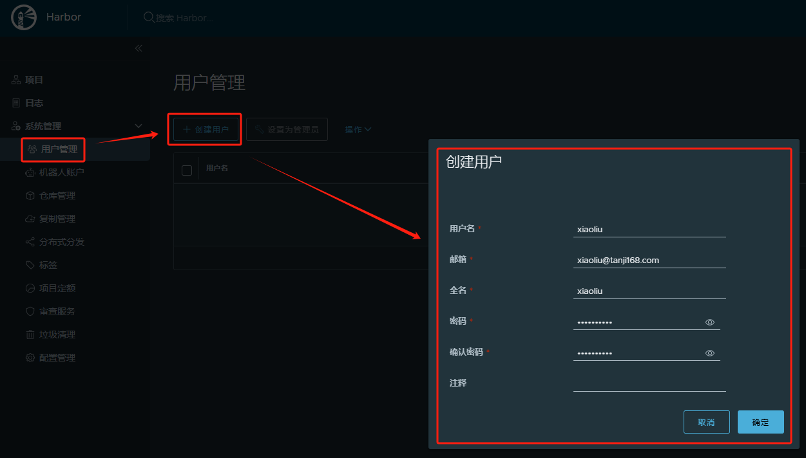
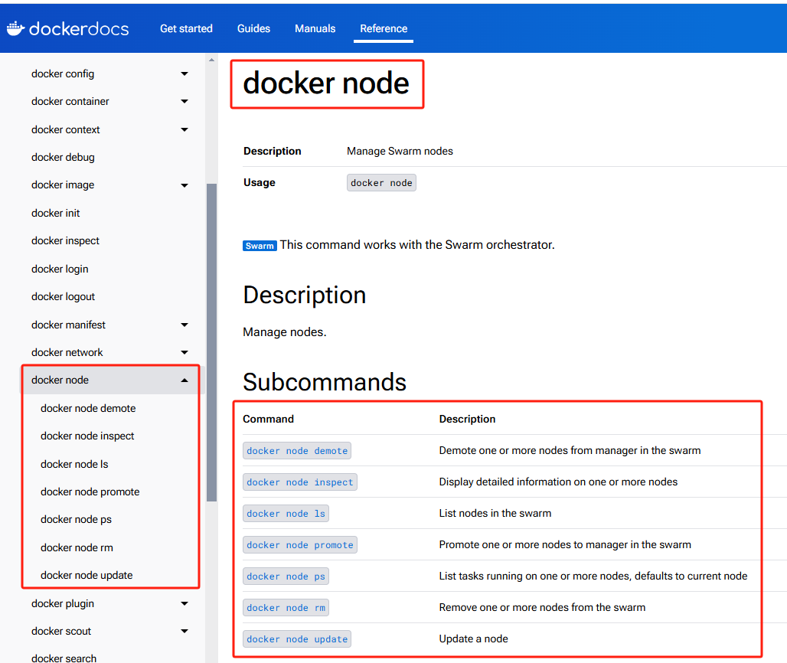
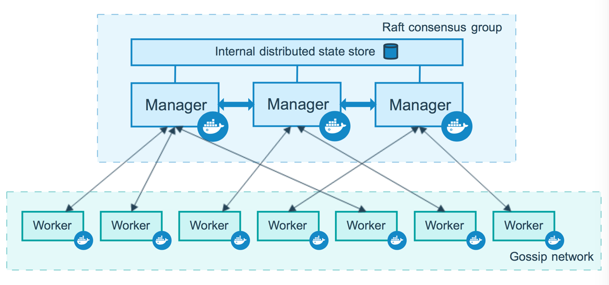
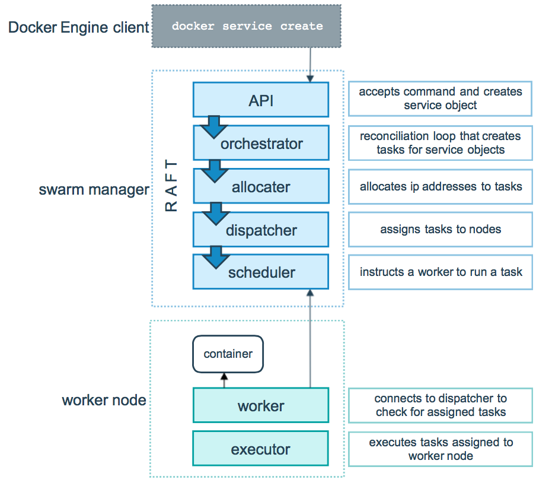
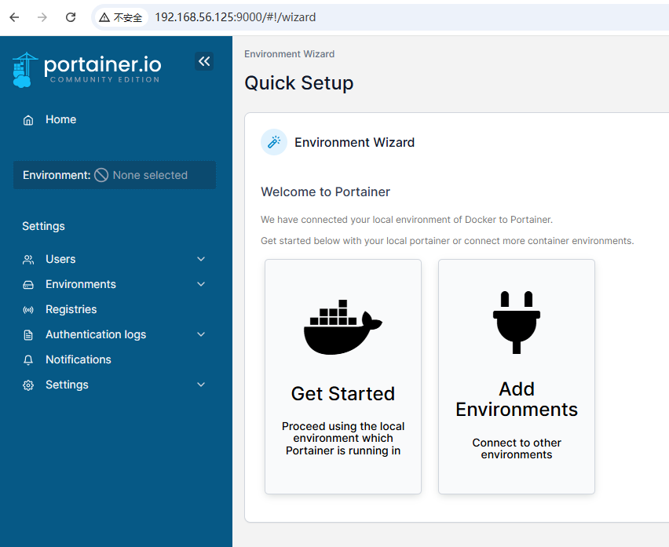
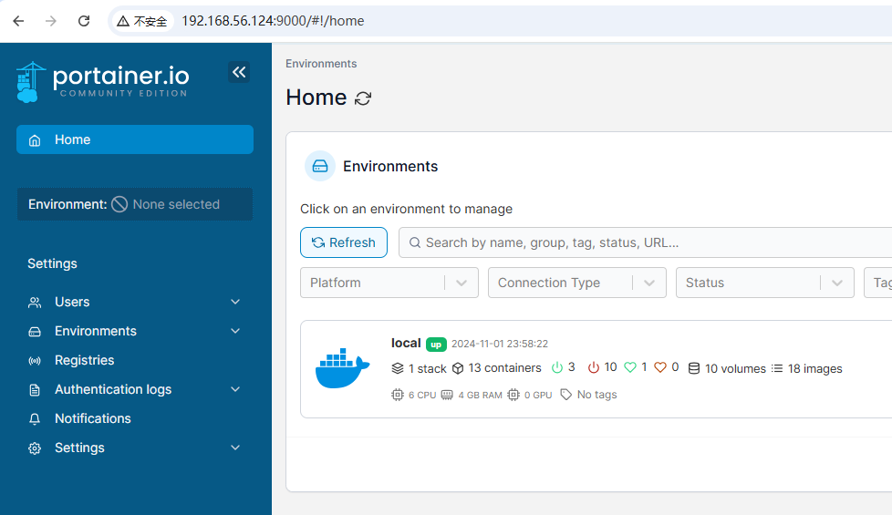

# 前置条件

学习视频：[2023最新Docker实战+微服务打包Docker容器](https://www.bilibili.com/video/BV1PT411d7ci?spm_id_from=333.788.videopod.episodes&vd_source=f050b4d563f8e729f80ae8b3803dfe24)

Docker 官网：https://hub.docker.com

​	[[查看支持的镜像版本号](https://hub.docker.com/search?q=helloworld&type=image)] 注意，需要翻墙访问

## 服务器

Linux 内核版 >= 3.10.0


## Docker版本

Docker CE => Docker 官方社区版本

> Docker Client 客户端
>
> Docker Daemon 后台守护进程
>
> > Server
> >
> > Engine

# Docker CE 镜像

## Docker安装

参考[[来源] 阿里云镜像站](https://developer.aliyun.com/mirror/docker-ce?spm=a2c6h.13651102.0.0.3e221b11Vnzr56)

**CentOS 7（使用 yum 进行安装）**

```shell
# step 1: 安装必要的一些系统工具
sudo yum install -y yum-utils device-mapper-persistent-data lvm2

# Step 2: 添加软件源信息
# 执行后，在 /etc/yum.repos.d 目录下会生成 docker-ce.repo 文件
sudo yum-config-manager --add-repo https://mirrors.aliyun.com/docker-ce/linux/centos/docker-ce.repo
# PS:如果出现如下错误信息
Loaded plugins: fastestmirror
adding repo from: https://mirrors.aliyun.com/docker-ce/linux/centos/docker-ce.repo
grabbing file https://mirrors.aliyun.com/docker-ce/linux/centos/docker-ce.repo to /etc/yum.repos.d/docker-ce.repo
Could not fetch/save url https://mirrors.aliyun.com/docker-ce/linux/centos/docker-ce.repo to file /etc/yum.repos.d/docker-ce.repo: [Errno 14] curl#60 - "Peer's Certificate issuer is not recognized."
# 编辑 /etc/yum.conf 文件, 在 [main] 下面添加 sslverify=0 参数
vi /etc/yum.conf
# 配置如下----------------------
[main]
sslverify=0
# -----------------------------

# Step 3: 更新并安装Docker-CE
sudo yum makecache fast
sudo yum -y install docker-ce

# Step 4: 开启Docker服务：sudo systemctl start docker 或 sudo service docker start
sudo systemctl start docker

# Setp 5:设置开机启动
sudo systemctl enable docker

# 注意：
# 官方软件源默认启用了最新的软件，您可以通过编辑软件源的方式获取各个版本的软件包。例如官方并没有将测试版本的软件源置为可用，您可以通过以下方式开启。同理可以开启各种测试版本等。
# vim /etc/yum.repos.d/docker-ee.repo
#   将[docker-ce-test]下方的enabled=0修改为enabled=1
#
# 安装指定版本的Docker-CE:
# Step 1: 查找Docker-CE的版本:
# yum list docker-ce.x86_64 --showduplicates | sort -r
#   Loading mirror speeds from cached hostfile
#   Loaded plugins: branch, fastestmirror, langpacks
#   docker-ce.x86_64            17.03.1.ce-1.el7.centos            docker-ce-stable
#   docker-ce.x86_64            17.03.1.ce-1.el7.centos            @docker-ce-stable
#   docker-ce.x86_64            17.03.0.ce-1.el7.centos            docker-ce-stable
#   Available Packages
# Step2: 安装指定版本的Docker-CE: (VERSION例如上面的17.03.0.ce.1-1.el7.centos)
# sudo yum -y install docker-ce-[VERSION]
```

**安装校验**

必须 Client 和 Server 都有才算是安装成功

```shell
[root@localhost ~]# docker version
Client: Docker Engine - Community
 Version:           26.1.4
 API version:       1.45
 Go version:        go1.21.11
 Git commit:        5650f9b
 Built:             Wed Jun  5 11:32:04 2024
 OS/Arch:           linux/amd64
 Context:           default

Server: Docker Engine - Community
 Engine:
  Version:          26.1.4
  API version:      1.45 (minimum version 1.24)
  Go version:       go1.21.11
  Git commit:       de5c9cf
  Built:            Wed Jun  5 11:31:02 2024
  OS/Arch:          linux/amd64
  Experimental:     false
 containerd:
  Version:          1.6.33
  GitCommit:        d2d58213f83a351ca8f528a95fbd145f5654e957
 runc:
  Version:          1.1.12
  GitCommit:        v1.1.12-0-g51d5e94
 docker-init:
  Version:          0.19.0
  GitCommit:        de40ad0
```

## Docker加速

由于 Docker 默认下载镜像的仓库是在国外的, 因此国内用户访问相对来说会较慢一些, 目前国内一些大公司与学校搭建了一些国内的镜像仓库, 可以让我们在下载镜像时更方便些

### 阿里云镜像仓库配置

注册阿里云账号，并登陆到阿里云后台，进入控制台面板


进入控制台以后，找到左上方的三横的功能列表按钮，在弹出来的功能列表处选择`弹性计算`下的`容器镜像服务`


进入`容器镜像服务`页面后，点击左侧菜单栏中`镜像中心`下的`镜像加速器`菜单获取镜像加速器地址，在操作文档处选择 Docker 所在服务器的操作系统，并按照文档提示完成配置即可。

针对Docker客户端版本大于 1.10.0 的用户

您可以通过修改daemon配置文件/etc/docker/daemon.json来使用加速器

> <font color='red'>**当前仅支持阿里云用户使用具备公网访问能力的阿里云产品进行镜像加速，且仅限于特定范围内的容器镜像**</font>。详情请见[公告](https://help.aliyun.com/zh/acr/product-overview/product-change-acr-mirror-accelerator-function-adjustment-announcement)。
> 由于运营商网络问题，拉取 Docker Hub 镜像可能会变慢。
> 建议手动拉取镜像到本地节点并重启Pod，也可上传镜像至 ACR 或使用订阅海外源镜像功能，再从 ACR 拉取对应镜像。

```shell
sudo mkdir -p /etc/docker
sudo tee /etc/docker/daemon.json <<-'EOF'
{
  "registry-mirrors": ["此处修改成你自己的加速 url"]
}
EOF
sudo systemctl daemon-reload
sudo systemctl restart docker

# 本地虚拟机，验证失败
# 使用 search 超时，失败
[root@localhost ~]# docker search openjdk
Error response from daemon: Get "https://index.docker.io/v1/search?q=openjdk&n=25": dial tcp 128.121.243.77:443: i/o timeout

# 使用 pull 超时，失败
[root@localhost ~]# docker pull mysql:5.7
Error response from daemon: Get "https://registry-1.docker.io/v2/": net/http: request canceled while waiting for connection (Client.Timeout exceeded while awaiting headers)
```

**相关链接**

- 下载地址：https://mirrors.aliyun.com/docker-ce/

- 官方主页：https://www.docker.com/community-edition


### 国内其他镜像仓库配置

[Docker/DockerHub 国内镜像源/加速列表（10月21日更新-长期维护）](https://xuanyuan.me/blog/archives/1154)

[Docker/DockerHub 国内镜像源/加速列表](https://cloud.tencent.com/developer/article/2454486)

> [[查看支持的镜像版本号](https://hub.docker.com/search?q=helloworld&type=image)] 注意，需要翻墙访问

```shell
sudo mkdir -p /etc/docker
sudo tee /etc/docker/daemon.json <<-'EOF'
{
  "registry-mirrors": [
    "https://docker.rainbond.cc",
    "https://docker.udayun.com",
    "https://docker.211678.top",
    "https://hub.geekery.cn",
    "https://ghcr.geekery.cn",
    "https://gcr.geekery.cn",
    "https://quay.geekery.cn",
    "https://xdark.top",
    "https://dockerproxy.cn"
  ]
}
EOF
sudo systemctl daemon-reload
sudo systemctl restart docker

# search 验证失败
[root@localhost ~]# docker search mysql
Error response from daemon: Get "https://index.docker.io/v1/search?q=mysql&n=25": dial tcp 108.160.165.147:443: i/o timeout

# 但是 pull 拉取成功，这里制定 tag 为 5.7，若未指定，则默认为 latest，如：docker pull mysql 等同于 docker pull mysql:latest
[root@localhost ~]# docker pull mysql:5.7
5.7: Pulling from library/mysql
20e4dcae4c69: Pull complete
1c56c3d4ce74: Pull complete
e9f03a1c24ce: Pull complete
68c3898c2015: Pull complete
6b95a940e7b6: Pull complete
90986bb8de6e: Pull complete
ae71319cb779: Pull complete
ffc89e9dfd88: Pull complete
43d05e938198: Pull complete
064b2d298fba: Pull complete
df9a4d85569b: Pull complete
Digest: sha256:4bc6bc963e6d8443453676cae56536f4b8156d78bae03c0145cbe47c2aad73bb
Status: Downloaded newer image for mysql:5.7
docker.io/library/mysql:5.7
[root@localhost ~]# docker images
REPOSITORY   TAG       IMAGE ID       CREATED         SIZE
mysql        5.7       5107333e08a8   10 months ago   501MB

# 也可以单独指定镜像地址进行拉取，如：
docker pull hub.geekery.cn/mysql:5.7
# 不过 REPOSITORY 值会不一样，前面[hub.geekery.cn]为仓库名，后面[mysql]为镜像名
[root@localhost ~]# docker images
REPOSITORY             TAG       IMAGE ID       CREATED         SIZE
hub.geekery.cn/mysql   5.7       5107333e08a8   10 months ago   501MB
```

# Docker 命令（基础）

## 镜像

### 查找镜像

```shell
# 查找镜像：docker search 镜像名称
# 因受国家监管政策影响，国内无法正常访问 docker ，所以目前使用 search 会报访问 https://index.docker.io 超时错误
docker search mysql
```

### 拉取镜像
```shell
# 拉取镜像：docker pull 镜像名称:标签（版本号）
docker pull mysql:5.7
```

### 查看本地镜像
```shell
# 查看本地镜像：docker images 或 docker image ls
docker images
```

### 删除镜像
```shell
# 删除镜像：docker rmi mysql:5.7 或 docker rmi [IMAGE ID，如：5107333e08a8] 或 docker image rm mysql:5.7
docker rmi mysql:5.7
docker rmi 5107333e08a8
```

## 容器

### 创建并运行容器

#### 创建并运行容器

```shell
# 运行容器，每次 run 都会新创建一个新的容器
# 前台运行容器：docker run nginx，缺点：窗口一关闭，容器就会同时退出
# 后台运行容器：docker run -d nginx，d 表示 detach - 脱离
docker run -d nginx
```

#### 端口映射

```shell
# 端口映射, p 表示 publish，Publish a container's port(s) to the host
# 左边的 80 表示主机的 80 端口，右边的 80 表示容器内的 80 端口
[root@localhost ~]# docker run -d -p 80:80 nginx
4eea2d8b5c85dde521638ef5041fdd293eb623241c859a64eab4bb621ea744e0
# 0.0.0.0:80 表示 IPV4 的 80 端口，右边的 80 为容器的 80 端口，tcp 为协议类型
# :::80 表示 IPV6 的 80 端口，右边的 80 为容器的 80 端口，tcp 为协议类型
[root@localhost ~]# docker ps
CONTAINER ID   IMAGE     COMMAND                   CREATED         STATUS         PORTS                               NAMES
4eea2d8b5c85   nginx     "/docker-entrypoint.…"   5 seconds ago   Up 4 seconds   0.0.0.0:80->80/tcp, :::80->80/tcp   epic_vaughan

# docker run -d -P nginx 用大写的 P 表示 publish-all，Publish all exposed ports to random ports，表示暴露容器中所有的端口，并且在主机中使用随机端口映射容器中暴露的端口，比如：80端口
[root@localhost ~]# docker run -d -P nginx
df7edda088787f57a4e86abea81f7a9ed2b5bc8ef3163cd3a1188765479a1369
[root@localhost ~]# docker ps
CONTAINER ID   IMAGE     COMMAND                   CREATED             STATUS             PORTS                                     NAMES
df7edda08878   nginx     "/docker-entrypoint.…"   6 seconds ago       Up 5 seconds       0.0.0.0:32768->80/tcp, :::32768->80/tcp   pensive_sinoussi
```
#### 指定容器名称

```shell
# 指定名称[nginx01]运行容器
docker run -d -p 80:80 --name nginx01 nginx
# 根据 name 停用容器
docker stop nginx01
# 根据 name 启用容器
docker start nginx01
# 根据 name 删除容器
docker rm nginx01
```
#### 退出时删除

```shell
# 退出时自动删除：--rm
# 对于无状态或测试用的容器，可以设置退出时自动删除
# docker run nginx 退出前台运行时，通过 docker ps -a 还是能看到 nginx 容器
# docker run --rm nginx 则退出前台运行时，会自动删除对应容器，或者通过 -d 后台运行，但加了 --rm ，stop 容器后，一样会删除对应容器
docker run --rm nginx
```
#### 重启策略

```shell
# 重启策略：--restart 策略
# 指定容器关闭时的重启策略，有三种可选策略
# no（默认）：表示不重启
# on-failure：当失败时重启，还可以加上 :3 指定最多重启3次，如果3次都失败就不再重启了，这里指意外关闭的情况，如果是手动指定了 stop ，则不会自动重启
# always：只要已关闭就自动重启，手动 stop 一样不会自动重启，但如果重启了 docker service ，则自动跟着重启，--rm 和 --restart always 不能同时使用，会有冲突
# --restart always 或 --restart=always 这两种写法都可以
docker run -d -P --name nginx01 --restart on-failure:3 nginx
# 手动 stop 不会重启
docker stop nginx01
```
#### 环境变量

```shell
# 环境变量: -e key01=value01 -e key02=value02，-e 环境变量 或 --env 环境变量
docker run -d -P --name nginx_env -e ENV01=VAL01 -e ENV02=VAL02 nginx
docker inspect nginx_env
# 可以看到里面 Env 的值有 ENV01、ENV02
# "Env": [
# 	"ENV01=VAL01",
# 	"ENV02=VAL02",
# 	"PATH=/usr/local/sbin:/usr/local/bin:/usr/sbin:/usr/bin:/sbin:/bin",
# 	"NGINX_VERSION=1.27.2",
# 	"NJS_VERSION=0.8.6",
# 	"NJS_RELEASE=1~bookworm",
# 	"PKG_RELEASE=1~bookworm",
# 	"DYNPKG_RELEASE=1~bookworm"
# ],

# docker exec 表示在运行中的容器内执行命令
# -i, --interactive          Keep STDIN open even if not attached(保持STDIN打开，即使没有连接)
# -t, --tty                  Allocate a pseudo-TTY(分配一个伪tty)
# 进入容器 nginx_env 中，启动终端，运行 env 命令
[root@localhost ~]# docker exec -it nginx_env env
PATH=/usr/local/sbin:/usr/local/bin:/usr/sbin:/usr/bin:/sbin:/bin
HOSTNAME=be73e320396b
TERM=xterm
ENV01=VAL01
ENV02=VAL02
NGINX_VERSION=1.27.2
NJS_VERSION=0.8.6
NJS_RELEASE=1~bookworm
PKG_RELEASE=1~bookworm
DYNPKG_RELEASE=1~bookworm
HOME=/root
[root@localhost ~]# 
```
#### 限制容器资源

```shell
# 限制容器资源：
# -m 8m 限制最大内存 8M
# --cpus 0.5 限制最大使用 CPU 0.5 核（0.5个CPU）
docker run -d --rm -m 8m nginx
# 监听容器状态:docker status 容器ID或名称，可以看到 LIMIT 限制的内存值
docker status ec1394773
CONTAINER ID   NAME            CPU %     MEM USAGE / LIMIT   MEM %     NET I/O     BLOCK I/O    PIDS
ec13947730bb   pensive_gould   0.00%     3.531MiB / 8MiB     44.14%    656B / 0B   0B / 8.7kB   5
```
### 查看容器

```shell
# 查看容器，docker ps 只展示运行中的容器，docker ps -a 展示所有的容器（包括停止的容器，a 表示 all ）
docker ps -a
```
### 删除容器

```shell
# 删除容器：docker rm 容器ID 容器ID，可同时删除多个容器，注意与删除镜像的区别
# 只能删除停止的容器，运行中的容易无法删除，
docker rm 4eea2d8b5c85 4eea2d8b5c84
# 运行中的容器可以强制删除
docker rm -f 4eea2d8b5c85
```
### 停止容器

```shell
# 停止容器:docker stop 容器ID或名称
docker stop 4eea2d8b5c85
```
### 启动容器

```shell
# 启动容器：docker start 容器ID或名称
docker start 4eea2d8b5c85
```
### 查看容器日志

```shell
# 查看容器日志：docker logs 容器ID或名称
docker logs nginx01
# 查看最新 20 行日志，并持续打印最新日志
# -f, --follow         Follow log output
# -n, --tail string    Number of lines to show from the end of the logs (default "all")
docker logs -f -n 20 nginx01
```
### 进入容器内部

```shell
# 进入容器内部
[root@localhost ~]# docker exec -it nginx01 /bin/bash
# 输出 exit 退出容器
root@f587285efecf:/#

# 主机中会开辟一个目录，专门用于存放 docker 容器的文件
# 目录路径一般为：/var/run/docker/containerd/容器ID
```

## 仓库

[Docker login/logout 命令](https://www.runoob.com/docker/docker-login-command.html)

### 登录仓库

```shell
[root@localhost docker]# docker login --help

Usage:  docker login [OPTIONS] [SERVER]

Log in to a registry.
If no server is specified, the default is defined by the daemon. 

Options:
  -p, --password string   Password
      --password-stdin    Take the password from stdin
  -u, --username string   Username

# SERVER: Docker 注册表的服务器地址（默认是 Docker Hub）
# 最后一次执行的登录会将前一次的登录覆盖掉
# 如：docker login -u admin 192.168.56.124:5000
```

### 退出登录

```shell
[root@localhost docker]# docker logout --help

Usage:  docker logout [SERVER]

Log out from a registry.
If no server is specified, the default is defined by the daemon.

# SERVER: Docker 注册表的服务器地址（默认是 Docker Hub）。
# 如：docker logout 192.168.56.124:5000
```

### 打标签

```shell
[root@localhost docker]# docker tag --help

Usage:  docker tag SOURCE_IMAGE[:TAG] TARGET_IMAGE[:TAG]

Create a tag TARGET_IMAGE that refers to SOURCE_IMAGE

Aliases:
  docker image tag, docker tag

# SOURCE_IMAGE[:TAG]: 源镜像名称和标签，标签默认为 latest。也可以直接是 容器ID
# TARGET_IMAGE[:TAG]: 目标镜像名称和标签，标签默认为 latest。
# 如：docker tag 1b2262c61885 192.168.56.124:5000/nginx-docker-demo
```

### 推送镜像到仓库

```shell
[root@localhost docker]# docker push --help

Usage:  docker push [OPTIONS] NAME[:TAG]

Upload an image to a registry

Aliases:
  docker image push, docker push

Options:
  -a, --all-tags                Push all tags of an image to the repository
      --disable-content-trust   Skip image signing (default true)
  -q, --quiet                   Suppress verbose output

。
# OPTIONS 说明：
#	--disable-content-trust :忽略镜像的校验,默认开启
# NAME: 镜像名称，通常包含注册表地址（如 docker.io/myrepo/myimage）。
# TAG（可选）: 镜像标签，默认为 latest
# 如：docker push 192.168.56.124:5000/nginx-docker-demo
```


## 其他Docker命令

```shell
# 获取容器/镜像的元数据:docker inspect 镜像或容器，查看镜像或容器的详细配置信息
docker inspect nginx_env
```

## 其他辅助命令

```shell
# 显示网络状态，获知端口占用情况
netstat -ntlp
```

# Docker命令（高级）

## 数据卷 Volume

> 数据覆盖的两条规则：
>
> - 如果挂载一个空的数据卷到容器中的一个非空目录中，那么这个目录下的文件会被复制到数据卷中。
> - 如果挂载一个非空的数据卷到容器中的一个目录中，那么容器中的目录中会显示数据卷中的数据。如果原来容器中的目录中有数据，那么这些原始数据会被隐藏掉。【覆盖】

### 绑定方式

#### 匿名绑定

> 启动容器时直接使用 -v /container_dir 即可完成匿名绑定，匿名绑定的方式将在 Docker 的 volumes 目录下生成一个 sha256 的字符串作为目录名，且指定的 /container_dir 中的文件或目录会被保存在该处，<font color='red'>**匿名绑定的 volume 在容器被删除的时候，数据卷也会被删除**</font>
>
> > docker run --rm -d -p 80:80 -v /www/test nginx
>
> 匿名绑定方式由于不知道名称，因此如果需要查看数据卷在主机的位置，需要使用 docker inspect container_id 来查看

```shell
# 将容器内目录 /usr/share/nginx/html 下的文件进行匿名绑定
# --rm 退出自动删除
[root@localhost ~]# docker run -d --rm -p 80:80 --name nginx_volume -v /usr/share/nginx/html nginx
acd20e42a00ba71d2c51ba5f753d5b935469c6c86374fd701f62a4eb2df7fba2

# 查看docker映射主机数据卷路径
# Name 表示数据卷（sha256 的字符串）
# Source 表示挂载到主机的目录地址
# Destination 表示容器绑定的目录地址
[root@localhost ~]# docker inspect nginx_volume
        ...
        "Mounts": [
            {
                "Type": "volume",
                "Name": "229efe9e743b9013b027ef62a8e1e5d1bf6f62c921a87a9f59986c64bf3b1759",
                "Source": "/var/lib/docker/volumes/229efe9e743b9013b027ef62a8e1e5d1bf6f62c921a87a9f59986c64bf3b1759/_data",
                "Destination": "/usr/share/nginx/html",
                "Driver": "local",
                "Mode": "",
                "RW": true,
                "Propagation": ""
            }
        ],
        ...

# 进入数据卷查看挂载的文件
[root@localhost ~]# cd /var/lib/docker/volumes/229efe9e743b9013b027ef62a8e1e5d1bf6f62c921a87a9f59986c64bf3b1759/_data
[root@localhost _data]# ls
50x.html  index.html

# 查看数据卷
[root@localhost ~]# docker volume ls
DRIVER    VOLUME NAME
local     229efe9e743b9013b027ef62a8e1e5d1bf6f62c921a87a9f59986c64bf3b1759

# stop 后，容器自动删除，对应数据卷也被删除
[root@localhost _data]# cd ~
[root@localhost ~]# docker stop nginx_volume
nginx_volume
[root@localhost ~]# docker volume ls
DRIVER    VOLUME NAME
[root@localhost ~]# cd /var/lib/docker/volumes/229efe9e743b9013b027ef62a8e1e5d1bf6f62c921a87a9f59986c64bf3b1759/_data
-bash: cd: /var/lib/docker/volumes/229efe9e743b9013b027ef62a8e1e5d1bf6f62c921a87a9f59986c64bf3b1759/_data: 没有那个文件或目录
[root@localhost ~]#

```

#### 具名绑定

> 同样是启动容器时绑定一个数据卷，不同的是可以为该数据卷起个名字 -v volume-name:container_dir，通过名字可以快速的定位并管理这些 volume
> docker run --rm -d -p 80:80 -v nginx-www:/www/test nginx
>
> <font color='orange'>**具名绑定的 volume 在容器被删除的时候，数据卷不会被删除**</font>，<font color='red'>**但无法自定义目录位置**</font>

```shell
# nginx-html 表示数据卷的名称
[root@localhost ~]# docker run -d --rm -p 80:80 --name nginx_volume -v nginx-html:/usr/share/nginx/html nginx
15a5af1924bda64186616ba415db62baf2bd378f83b20521abd252424a6d3906
[root@localhost ~]# docker volume ls
DRIVER    VOLUME NAME
local     nginx-html
[root@localhost ~]# docker inspect nginx_volume
...
        "Mounts": [
            {
                "Type": "volume",
                "Name": "nginx-html",
                "Source": "/var/lib/docker/volumes/nginx-html/_data",
                "Destination": "/usr/share/nginx/html",
                "Driver": "local",
                "Mode": "z",
                "RW": true,
                "Propagation": ""
            }
        ],
...
[root@localhost nginx-html]# cd /var/lib/docker/volumes/nginx-html/_data/
[root@localhost _data]# ls
50x.html  index.html

```

#### Bind Mount

> 绑定并加载主机的某个文件目录到容器中，这种方式是平常最常用的。
>
> 这种绑定方式与前面两种一样，也是在容器启动时使用 -v host_dir:container_dir 的格式来完成映射
>
> docker run --rm -d -p 80:80 -v /www/wolfcode:/www/wolfcode -v /etc/nginx/nginx.conf:/etc/nginx/nginx.conf nginx

```shell
[root@localhost ~]# mkdir -p /www/tanji168/nginx/html
[root@localhost ~]# echo 'Hello Docker' > /www/tanji168/nginx/html/index.html

# /www/tanji168/nginx/html 表示挂载的主机目录
[root@localhost ~]# docker run -d --rm -p 80:80 --name nginx_volume -v /www/tanji168/nginx/html:/usr/share/nginx/html nginx
45e1466806a89d253c5cba8f557c7c734c73f8c05abf01916c4b583c8f246858
[root@localhost ~]# curl 192.168.56.124
Hello Docker

```

### 数据卷管理

```shell
[root@localhost ~]# docker volume --help
Usage:  docker volume COMMAND
...
Commands:
  create      Create a volume
  inspect     Display detailed information on one or more volumes
  ls          List volumes
  prune       Remove unused local volumes（删除所有未使用的数据卷）
  rm          Remove one or more volumes

# 删除所有未使用的数据卷
[root@localhost ~]# docker volume prune
WARNING! This will remove anonymous local volumes not used by at least one container.
Are you sure you want to continue? [y/N] y
Deleted Volumes:
31f04034b1d46c38876028285d0c7ed8a99489ba750ed5f19ce67e6ea6ce4419
3a4615f986528cd6598e3390cbe27c18f6dae3474a6d98c31104a91a6ec35dad

Total reclaimed space: 0B

# 创建数据卷
[root@localhost ~]# docker volume create volume-mgr
volume-mgr

# 查看数据卷详细信息
[root@localhost ~]# docker volume inspect volume-mgr
[
    {
        "CreatedAt": "2024-10-29T18:16:11+08:00",
        "Driver": "local",
        "Labels": null,
        "Mountpoint": "/var/lib/docker/volumes/volume-mgr/_data",
        "Name": "volume-mgr",
        "Options": null,
        "Scope": "local"
    }
]

# 查看数据卷
[root@localhost ~]# docker volume ls
DRIVER    VOLUME NAME
local     nginx-html
local     volume-mgr

# 删除数据卷
[root@localhost ~]# docker volume rm volume-mgr
volume-mgr

```


## 网络 Network（网络模式）

### 网络模式

```shell
# 查看网络模式，默认自带的网络模式有：bridge、host、none，默认使用：bridge 模式
[root@localhost ~]# docker network ls
NETWORK ID     NAME      DRIVER    SCOPE
729ff0e87d97   bridge    bridge    local
fb7af1a66206   host      host      local
e5c9cd517b7a   none      null      local
```

#### bridge(桥接)

> 在主机中创建一个 Docker0 的虚拟网桥，在 Ddocker0 创建一对虚拟网卡，有一半在主机上 vethxxx，还有一半在容器内 eth0，
>
> 网络访问顺序，如：Docker0 -> vethxxx -> eth0
>
> 默认模式

```shell
# lo 本地网络(lo - local)
# enp0s3 主机的网卡，IP:192.168.56.124/24
# docker0 Docker创建的虚拟网桥（桥接，bridge）,IP:172.17.0.1/16
# 网络访问：外部主机可以访问到 enp0s3 ，也可以访问到 docker0
[root@localhost ~]# ip addr
1: lo: <LOOPBACK,UP,LOWER_UP> mtu 65536 qdisc noqueue state UNKNOWN group default qlen 1000
    link/loopback 00:00:00:00:00:00 brd 00:00:00:00:00:00
    inet 127.0.0.1/8 scope host lo
       valid_lft forever preferred_lft forever
    inet6 ::1/128 scope host
       valid_lft forever preferred_lft forever
2: enp0s3: <BROADCAST,MULTICAST,UP,LOWER_UP> mtu 1500 qdisc pfifo_fast state UP group default qlen 1000
    link/ether 08:00:27:8b:6b:8f brd ff:ff:ff:ff:ff:ff
    inet 192.168.56.124/24 brd 192.168.56.255 scope global noprefixroute enp0s3
       valid_lft forever preferred_lft forever
    inet6 fe80::b4ee:1e9b:5291:fad8/64 scope link noprefixroute
       valid_lft forever preferred_lft forever
3: enp0s8: <BROADCAST,MULTICAST,UP,LOWER_UP> mtu 1500 qdisc pfifo_fast state UP group default qlen 1000
    link/ether 08:00:27:70:0a:69 brd ff:ff:ff:ff:ff:ff
    inet 10.0.3.15/24 brd 10.0.3.255 scope global noprefixroute dynamic enp0s8
       valid_lft 43906sec preferred_lft 43906sec
    inet6 fe80::5651:e8fb:34b4:50a9/64 scope link noprefixroute
       valid_lft forever preferred_lft forever
4: docker0: <BROADCAST,MULTICAST,UP,LOWER_UP> mtu 1500 qdisc noqueue state UP group default
    link/ether 02:42:00:ba:b0:58 brd ff:ff:ff:ff:ff:ff
    inet 172.17.0.1/16 brd 172.17.255.255 scope global docker0
       valid_lft forever preferred_lft forever
    inet6 fe80::42:ff:feba:b058/64 scope link
       valid_lft forever preferred_lft forever
32: veth3f83aa7@if31: <BROADCAST,MULTICAST,UP,LOWER_UP> mtu 1500 qdisc noqueue master docker0 state UP group default
    link/ether 32:06:74:8b:c4:74 brd ff:ff:ff:ff:ff:ff link-netnsid 0
    inet6 fe80::3006:74ff:fe8b:c474/64 scope link
       valid_lft forever preferred_lft forever

# 
[root@localhost ~]# docker inspect nginx01 | grep IPAddress
            "SecondaryIPAddresses": null,
            "IPAddress": "172.17.0.2",
                    "IPAddress": "172.17.0.2",
# 或者，进入容器内部后执行：cat /etc/hosts
[root@localhost ~]# docker exec -it nginx01 /bin/bash
root@ecdaf667dcbd:/# cat /etc/hosts
127.0.0.1       localhost
::1     localhost ip6-localhost ip6-loopback
fe00::0 ip6-localnet
ff00::0 ip6-mcastprefix
ff02::1 ip6-allnodes
ff02::2 ip6-allrouters
172.17.0.2      ecdaf667dcbd

```


#### host

> 容器不再拥有自己的网络空间，而是直接与主机共享网络空间，那么基于该模式创建的容器对应的 ip 实际就是与主机同一个子网，同一个网段。


#### none

> Docker 会拥有自己的网络空间，不与主机共享，在这个网络模式下的容器，不会被分配网卡、ip、路由等相关信息。
>
> 特点：完全隔离，与外部任何机器都无网络访问，只有自己的 lo 本地网络 127.0.0.1
>
> 外部无法直接访问，只能在主机通过类似 docker exec -it 容器ID或名称 的方式进入容器


#### container

> 就是不会创建自己的网络空间，而是与其他容器共享网络空间，直接使用指定容器的ip/端口等
>
> 注意：只是网络层面的共享


#### 自定义（推荐）

> 不使用 Docker 自带的网络模式，而是自己去定制化自己特有的网络模式。
>
> 命令：docker network COMMAND 
>
> 
>
> 指定网络创建容器：--net 网络名
>
> > 创建 tanji168 网络：`docker network create -d bridge --subnet 192.168.57.0/24 --gateway 192.168.57.1 tanji168`
> >
> > 指定自定义的网络创建容器：`docker run -d --rm --name centos_network01 --net tanji168 centos`
>
> 通过指定自定义网络（自定义模式）创建的容器可以直接通过 容器名 相互访问
>
> > `docker run -d --rm --name centos_network01 --net tanji168 centos ping 127.0.0.1`
> >
> > `docker run -d --rm --name centos_network02 --net tanji168 centos ping 127.0.0.1`
> >
> > `docker exec -it centos_network01 ping centos_network02` 能 ping 通
> >
> > `docker exec -it centos_network02 ping centos_network01` 能 ping 通
>
> 但是通过 docker 默认网络（bridge，桥接模式）创建的容器不能直接通过 容器名 相互访问
>
> > `docker run -d --rm --name docker_network01 centos ping 127.0.0.1`
> >
> > `docker run -d --rm --name docker_network02 centos ping 127.0.0.1`
> >
> > `docker exec -it docker_network02 ping docker_network01` 不能 ping 通
> >
> > `docker exec -it docker_network01 ping docker_network02` 不能 ping 通
>
> 需要通过 link 方式（实际是通过在 /etc/hosts 文件中配置容器名（域名）映射）实现的
>
> > `docker run -d --rm --name docker_network01 centos ping 127.0.0.1`
> >
> > `docker run -d --rm --name docker_network02 --link docker_network01 centos ping 127.0.0.1`
> >
> > > 在 docker_network02 容器的 /etc/hosts 文件中增加了 docker_network01 的映射：
> > >
> > > `172.17.0.3      docker_network01 58ec547c3a4f`
> >
> > `docker exec -it docker_network02 ping docker_network01` 能 ping 通
> >
> > `docker exec -it docker_network01 ping docker_network02` 不能 ping 通

```shell
# docker network 使用说明
[root@localhost ~]# docker network --help
Usage:  docker network COMMAND

Manage networks

Commands:
  connect     Connect a container to a network
  create      Create a network
  disconnect  Disconnect a container from a network
  inspect     Display detailed information on one or more networks
  ls          List networks
  prune       Remove all unused networks
  rm          Remove one or more networks

Run 'docker network COMMAND --help' for more information on a command.

# docker network create 使用说明
[root@localhost ~]# docker network create --help

Usage:  docker network create [OPTIONS] NETWORK

Create a network

Options:
      --attachable           Enable manual container attachment
      --aux-address map      Auxiliary IPv4 or IPv6 addresses used by Network driver (default map[])
      --config-from string   The network from which to copy the configuration
      --config-only          Create a configuration only network
  -d, --driver string        Driver to manage the Network (default "bridge")
      --gateway strings      IPv4 or IPv6 Gateway for the master subnet
      --ingress              Create swarm routing-mesh network
      --internal             Restrict external access to the network
      --ip-range strings     Allocate container ip from a sub-range
      --ipam-driver string   IP Address Management Driver (default "default")
      --ipam-opt map         Set IPAM driver specific options (default map[])
      --ipv6                 Enable IPv6 networking
      --label list           Set metadata on a network
  -o, --opt map              Set driver specific options (default map[])
      --scope string         Control the network's scope
      --subnet strings       Subnet in CIDR format that represents a network segment

# 自定义网络:tanji168
# 使用桥接模式（bridge）
# 子网：192.168.57.0/24
# 网关：192.168.57.1
[root@localhost ~]# docker network create -d bridge --subnet 192.168.57.0/24 --gateway 192.168.57.1 tanji168
625e06d46b6cde65fe94a5e97326fad2816656f3b8eba384850fe95a7d93614d

[root@localhost ~]# docker network ls
NETWORK ID     NAME       DRIVER    SCOPE
729ff0e87d97   bridge     bridge    local
fb7af1a66206   host       host      local
e5c9cd517b7a   none       null      local
625e06d46b6c   tanji168   bridge    local

# 查看 tanji168 网络配置信息
[root@localhost ~]# docker network inspect tanji168
[
    {
        "Name": "tanji168",
        "Id": "625e06d46b6cde65fe94a5e97326fad2816656f3b8eba384850fe95a7d93614d",
        "Created": "2024-10-29T23:30:03.36155654+08:00",
        "Scope": "local",
        "Driver": "bridge",
        "EnableIPv6": false,
        "IPAM": {
            "Driver": "default",
            "Options": {},
            "Config": [
                {
                    "Subnet": "192.168.57.0/24",
                    "Gateway": "192.168.57.1"
                }
            ]
        },
        "Internal": false,
        "Attachable": false,
        "Ingress": false,
        "ConfigFrom": {
            "Network": ""
        },
        "ConfigOnly": false,
        "Containers": {},
        "Options": {},
        "Labels": {}
    }
]

# 多了一对虚拟网卡： br-625e06d46b6c 和 veth9521383@if40
[root@localhost ~]# ip addr
...
39: br-625e06d46b6c: <BROADCAST,MULTICAST,UP,LOWER_UP> mtu 1500 qdisc noqueue state UP group default
    link/ether 02:42:db:29:80:7a brd ff:ff:ff:ff:ff:ff
    inet 192.168.57.1/24 brd 192.168.57.255 scope global br-625e06d46b6c
       valid_lft forever preferred_lft forever
    inet6 fe80::42:dbff:fe29:807a/64 scope link
       valid_lft forever preferred_lft forever
41: veth9521383@if40: <BROADCAST,MULTICAST,UP,LOWER_UP> mtu 1500 qdisc noqueue master br-625e06d46b6c state UP group default
    link/ether 4a:67:5d:ad:bc:a9 brd ff:ff:ff:ff:ff:ff link-netnsid 1
    inet6 fe80::4867:5dff:fead:bca9/64 scope link
       valid_lft forever preferred_lft forever

# 指定网络创建容器：--net 网络名，基于 tanji168 网络创建容器
[root@localhost ~]# docker run -d --rm -P --name nginx_network01 --net tanji168 nginx
4827b24b2ff479cc6d097024bca9407fd0fc294d35ca9f89574bb0433049c2b6
# 查看容器IP地址：192.168.57.2
[root@localhost ~]# docker exec -it nginx_network01 /bin/bash
root@4827b24b2ff4:/# cat /etc/hosts
127.0.0.1       localhost
::1     localhost ip6-localhost ip6-loopback
fe00::0 ip6-localnet
ff00::0 ip6-mcastprefix
ff02::1 ip6-allnodes
ff02::2 ip6-allrouters
192.168.57.2    4827b24b2ff4

# 因为主机网段为：192.168.56.124/24，而 tanji168 网络的网段为：192.168.57.0/24，不是同个网段，所以 ping 不通
[root@localhost ~]# ping nginx_network01
ping: nginx_network01: 未知的名称或服务

# 用 centos:latest 镜像，使用 tanji168 网络，创建运行两个容器：centos_network01、centos_network02
# 因为 nginx:latest 镜像做了精简，不支持 ping 功能，因此改用 centos:last 镜像
# 因为 centos:latest 只是个系统，启动后，如果没其他命令就会结束退出
# 所以，在命令最后使用 ping 127.0.0.1 一直 ping 本机，确保不会结束退出
[root@localhost ~]# docker run -d --rm --name centos_network01 --net tanji168 centos ping 127.0.0.1
377b4cdc84a3a6d47d22265262124a7f1c59f072ee36afb3ded1b80c697c5748
[root@localhost ~]# docker run -d --rm --name centos_network02 --net tanji168 centos ping 127.0.0.1
9bc384d225af10752c0b7e055df4b272436b679635d28d20bfc5a0ea6e026d39

# 因 centos_network01 和 centos_network02 的网络是同个网段 (使用同个网络 tanji168)，所以可以直接用容器名（主机名）访问
[root@localhost ~]# docker exec -it centos_network01 ping centos_network02
PING centos_network02 (192.168.57.4) 56(84) bytes of data.
64 bytes from centos_network02.tanji168 (192.168.57.4): icmp_seq=1 ttl=64 time=0.068 ms
64 bytes from centos_network02.tanji168 (192.168.57.4): icmp_seq=2 ttl=64 time=0.049 ms
64 bytes from centos_network02.tanji168 (192.168.57.4): icmp_seq=3 ttl=64 time=0.048 ms

# 使用 docker 默认网络模式（桥接模式，bridge），通过 link 配置网络连接
[root@localhost ~]# docker run -d --rm --name docker_network01 centos ping 127.0.0.1
58ec547c3a4fc1a45d10b287b70b808580bb9ea3528839e4950ef612b0b7d101
[root@localhost ~]# docker run -d --rm --name docker_network02 --link docker_network01 centos ping 127.0.0.1
291b9ca151e299f0e675823cdd2120335c044e6fed42108b7fcdfaaea0700f6e
[root@localhost ~]# docker exec -it docker_network02 cat /etc/hosts
127.0.0.1       localhost
::1     localhost ip6-localhost ip6-loopback
fe00::0 ip6-localnet
ff00::0 ip6-mcastprefix
ff02::1 ip6-allnodes
ff02::2 ip6-allrouters
172.17.0.3      docker_network01 58ec547c3a4f
172.17.0.4      291b9ca151e2
[root@localhost ~]# docker exec -it docker_network02 ping docker_network01
PING docker_network01 (172.17.0.3) 56(84) bytes of data.
64 bytes from docker_network01 (172.17.0.3): icmp_seq=1 ttl=64 time=0.076 ms
64 bytes from docker_network01 (172.17.0.3): icmp_seq=2 ttl=64 time=0.072 ms
64 bytes from docker_network01 (172.17.0.3): icmp_seq=3 ttl=64 time=0.051 ms
[root@localhost ~]# docker exec -it docker_network01 ping docker_network02
ping: docker_network02: Name or service not known
```


### 其他Docker命令

#### 其他Docker命令

```shell

```

#### 跨容器网络通信

不通网络跨容器通信

```shell
# 默认 docker 的桥接模式网络
[root@localhost ~]# docker run -d --rm --name net01 centos ping 127.0.0.1
22450a1f1972a8344123a7225b3e6d7d96d21667197714c756811fd4468c870f
# 使用自定义网络
[root@localhost ~]# docker run -d --rm --name net02 --net tanji168 centos ping 127.0.0.1
24345834d1c9446bbb50f6296894c45b889880c0478ba3dc2537a238bd6d343c

# 不同网络，无法 ping 通
[root@localhost ~]# docker exec -it net02 ping net01
ping: net01: Name or service not known
# 直接用 ip 地址也 ping 不通
[root@localhost ~]# docker exec -it net01 cat /etc/hosts
...
172.17.0.5      22450a1f1972
[root@localhost ~]# docker exec -it net02 ping 172.17.0.5
PING 172.17.0.5 (172.17.0.5) 56(84) bytes of data.
^C
--- 172.17.0.5 ping statistics ---
82 packets transmitted, 0 received, 100% packet loss, time 82869ms

# 配置跨容器网络连接，将某个网络连接到某个容器
# docker network connet 网络名 容器名
[root@localhost ~]# docker network connect tanji168 net01
# 正常 ping 通，且 IP 地址变为：192.168.57.6
[root@localhost ~]# docker exec -it net02 ping net01
PING net01 (192.168.57.6) 56(84) bytes of data.
64 bytes from net01.tanji168 (192.168.57.6): icmp_seq=1 ttl=64 time=0.076 ms
64 bytes from net01.tanji168 (192.168.57.6): icmp_seq=2 ttl=64 time=0.051 ms

# 查看容器 net01 配置详情，发现 net01 IP 地址没变，但关联了 bridge、tanji168 两张网卡
[root@localhost ~]# docker inspect net01
        ...
        "NetworkSettings": {
            ...
            "Gateway": "172.17.0.1",
            ...
            "IPAddress": "172.17.0.5",
            ...
            "Networks": {
                "bridge": {
                    ...
                    "Gateway": "172.17.0.1",
                    "IPAddress": "172.17.0.5",
                    ...
                    "DNSNames": null
                },
                "tanji168": {
                    ...
                    "Gateway": "192.168.57.1",
                    "IPAddress": "192.168.57.6",
                    ...
                    "DNSNames": [
                        "net01",
                        "22450a1f1972"
                    ]
                }
            }
        }
        ...

# 查看网络 tanji168 配置详情，发现 net01 容器也加入了 tanji168 网络
[root@localhost ~]# docker inspect tanji168
        ...
        "Containers": {
            ...
            "22450a1f1972a8344123a7225b3e6d7d96d21667197714c756811fd4468c870f": {
                "Name": "net01",
                "EndpointID": "c8f34da00624476d52d751fefe39c685f2178f99bc02ea442cd6b06db99f76c5",
                "MacAddress": "02:42:c0:a8:39:06",
                "IPv4Address": "192.168.57.6/24",
                "IPv6Address": ""
            },
            "24345834d1c9446bbb50f6296894c45b889880c0478ba3dc2537a238bd6d343c": {
                "Name": "net02",
                "EndpointID": "2d18d41fe3ffb410f260b12d92c2f27d2fb58a0f16ecd08a30aa5a1ffba61e53",
                "MacAddress": "02:42:c0:a8:39:05",
                "IPv4Address": "192.168.57.5/24",
                "IPv6Address": ""
            },
            ...
        },

```


#### [获取 docker 容器(container)的 ip 地址](https://blog.csdn.net/sannerlittle/article/details/77063800)

```shell
# 1、进入容器内部后
cat /etc/hosts

# 2、使用命令
docker inspect --format '{{ .NetworkSettings.IPAddress }}' <container-ID>
# 或
docker inspect <container id>
# 或
docker inspect -f '{{range .NetworkSettings.Networks}}{{.IPAddress}}{{end}}' container_name_or_id

# 3、可以考虑在 ~/.bashrc 中写一个 bash 函数
function docker_ip() {
    sudo docker inspect --format '{{ .NetworkSettings.IPAddress }}' $1
}
# 执行：source ~/.bashrc
# 然后
$ docker_ip <container-ID>

# 4、获取所有容器名称及其IP地址
docker inspect -f '{{.Name}} - {{.NetworkSettings.IPAddress }}' $(docker ps -aq)
# 如果使用docker-compose命令将是：
docker inspect -f '{{.Name}} - {{range .NetworkSettings.Networks}}{{.IPAddress}}{{end}}' $(docker ps -aq)

# 5、显示所有容器IP地址
docker inspect --format='{{.Name}} - {{range .NetworkSettings.Networks}}{{.IPAddress}}{{end}}' $(docker ps -aq)

```


## Dockerfile

### Dockerfile

```dockerfile
# 拓展：设置参数变量
# docker build -t --build-arg jdk=11 ，则此时变量 jdk 的值为 11
ARG jdk=8

# 1.指定当前镜像的基础镜像
FROM openjdk:$jdk

# 提前添加好用户
#RUN useradd tanji

# 拓展：表示后续容器中所有执行命令的操作都是以 tanji 这个用户操作的
# 需确保系统中有 tanji 这个用户，且对于对应操作的目录或文件拥有对应的权限
#USER tanji

# 2.描述镜像的作者及联系方式(可选)
MAINTAINER tanji<skyer_tech@163.com>

# 3.镜像的标签信息（可选）
LABEL version="1.0"
LABEL description="这是我的第一个Dockerfile"

# 4.环境变量
ENV JAVA_ENV dev
ENV APP_NAME test-dockerfile
# 或一次性设置：EVN JAVA_ENV=dev APP_NAME=test-dockerfile

# 5.在构建镜像时，需要执行的 shell 命令
RUN ls -al
RUN mkdir /www/dockerfile/test

# 6.将主机中指定的文件复制到容器的目标位置（简单理解为 cp 命令）
ADD /www/tanji168/nginx/html/index.html /www/server
# 或者：ADD ["/www/tanji168/nginx/html/index.html", "/www/server"]

# 7.设置容器中的工作目录，如果目录不存在会自己创建，可以理解为:
# mkdir -p /app
# cd /app
WORKDIR /app
# 设置完工作目录后，执行 pwd 命令，打印的目录是：/app
RUN pwd

# 8.镜像数据卷绑定，将宿主机中指定的目录挂载到容器中(容器中的目录结构跟宿主机一一对应)
VOLUME ["/www/tanji168/nginx/html"]

# 9.设置容器启动后要保留的端口
EXPOSE 8080/tcp
# 或：EXPOSE 8080/udp

# 10.CMD 和 ENTRYPOINT 选择其一即可，作用是描述镜像构建完成后，启动容器时默认执行的脚步

# CMD 
# 设置多个时，则只有最后一个有效，且如果 docker 启动容器时，最后执行了 /bin/bash 命令（如：docker run xxx /bin/bash），也会覆盖 CMD 执行的命令
#CMD ping 127.0.0.1
#CMD ["sh", "-c", "ping 127.0.0.1"]

# ENTRYPOINT
# 用法类似 CMD ，但 ENTRYPOINT 不会被运行容器时指定的命令所覆盖，而 CMD 会被覆盖
#ENTRYPOINT ping 127.0.0.1
#ENTRYPOINT ["sh", "-c", "ping 127.0.0.1"]

# 拓展：健康检查，每隔 10s 检查容器是否正常，每次不超过 3s ，并且如果失败了，重试最多不超过 3 
# 如果有 java 进程，则返回 0，否则返回 1
HEALTHCHECK --interval=10 --timeout=3 --retries=3 CMD ps -ef | grep java || exit 1

```


### 常用指令

#### FROM

```markdown
指定以什么镜像作为基础镜像，在改进项的基础之上构建新的镜像。

如果不想以任何镜像作为基础：FROM scratch

语法：
FROM <image>
FROM <image>:<tag>
FROM <image>:<digest>

以上为三种写法，后两者为指定具体版本，第一种则使用 latest 也就是最新版
```

#### MAINTAINER

```markdown
指定该镜像的作者

语法：
MAINTAINER <name>
```

#### LABEL

```markdown
为镜像设置标签，一个 Dockerfile 中可以配置多个 LABEL

语法：
LABEL <key>=<value>

如：
LABEL "example.label"="Example Label"
LABEL label-value="LABEL"
LABEL version="1.0.0"
LABEL description="可以写成多行，使用 \
符号可以拼接多行的 value"

PS：LABEL 指令会继承基础镜像（FROM）中的 LABEL，如果当前镜像 LABEL 的 key 与其相同，则会将其覆盖
```

#### ENV

```markdown
设置容器的环境变量，可以设置多个

语法：
ENV <key> <value>
ENV <key>=<value> <key>=<value> ...

两种语法的区别为第一种一次只能设置一个环境变量，第二种可以一次设置多个
```

#### RUN

```markdown
构建镜像的过程中要执行的命令

语法：
RUN <command>
RUN ["executable", "param1", "param2"]

第一种写法就是直接写 Shell 脚本即可

第二种写法类似函数调用，第一个参数为可执行文件，后面的都是参数
```

#### ADD

```markdown
复制命令，把 src 的文件复制到镜像的 dest 位置

语法：
ADD <src> <dest>
ADD ["<src>", "<dest>"]
```

#### WORKDIR

```markdown
设置工作目录，可以简单理解为 cd 到指定目录，如果该目录不存在会自动创建，对 RUN、CMD、ENTRYPOINT、COPY、ADD 生效，可以设置多次 WORKDIR

如：
WORKDIR <dir>

表示在容器内创建了 dir 目录，并且当前目录已经是 dir 目录了
```

#### VOLUME

```markdown
作用：创建一个匿名数据卷挂载点
通过 VOLUME 指令创建的挂载点（容器内要挂载的目录），无法指定主机上对应的目录，是自动生成的

语法：
VOLUME ["<dir>"]
VOLUME <dir>
VOLUME <dir> <dir>

以上三种写法都可
```

#### EXPOSE

```markdown
改镜像运行容器后，需要暴露给外部的端口，但仅仅表示该容器想要暴露某些端口，并不会与主机端口有映射关系，如果想将容器暴露的端口与主机映射则需要使用 -p 或 -P 参数来映射，可以暴露多个端口

语法：
EXPOSE <port>[/<tcp/udp>]
```

#### CMD

```markdown
该镜像启动容器时默认执行的命令或参数

语法：
CMD ["executable", "param1", "param2"]
CMD ["param1", "param2"]
CMD <command> <param1> <param2>

以上为该命令的三种写法，第三种与普通 Shell 命令类似，第一、二两种都是可执行文件 + 参数的形式，另外数组内的参数必须使用双引号。

案例：
第一种：CMD ["sh", "-c", "echo $HOME"] 等同于 sh -c "echo $HOME"

第二种：CMD ["echo", "$HOME"] 等同于 echo $HOME
```

#### ENTRYPOINT

```markdown
运行容器时的启动命令，感觉与 CMD 命令会很像，实际上还是有很大区别，简单对比一下：

相同点：
在整个 Dockerfile 中只能设置一次，如果写了多次则只有最后一次生效
不同点：
ENTRYPOINT 不会被运行容器时指定的命令所覆盖，而 CMD 会被覆盖
如果同时设置了这两个指令，且 CMD 仅仅是选项而不是参数，CMD 中的内容会作为 ENTRYPOINT 的参数（一般不这么做）
如果两个都是完整命令，那么只会执行最后一条
语法：
ENTRYPOINT ["executable", "param1", "param2"]
ENTRYPOINT command param1 param2
```

#### 拓展指令

##### ARG

```markdown
设置变量，在镜像中定义一个变量，当使用 docker build 命令构建镜像时，带上 --build-arg <name>=<value> 来指定参数值，如果该变量名在 Dockerfile 中不存在则会抛出一个警告

语法：
ARG <name>[=<default value>]
```

##### USER

```markdown
设置容器的用户，可以是用户名或 UID，如果容器设置了以 daemon 用户去运行，那么 RUN、CMD 和 ENTRYPOINT 都会以这个用户去运行，一定要先确定容器中有这个用户，并且拥有对应的操作权限。

语法：
USER <username>
USER <PID>
```

##### ONBUILD

```markdown
表示在构建镜像时做某操作，不过不对当前 Dockerfile 的镜像生效，而是对以当前 Dockerfile 镜像作为基础镜像的子镜像生效

语法：
ONBUILD [INSTRUCTION]

例：
当前镜像为 A，设置了如下指令 
ONBUILD RUN ls -al

镜像 B：
FROM 镜像A
......
构建镜像 B 时，会执行 ls -al 命令
```

##### STOPSIGNAL

```markdown
STOPSIGNAL 指令设置将发送到容器的系统调用信号以退出。此信号可以是与内核的系统调用表中的位置匹配的有效无符号数，例如 9，或 SIGNAME 格式的信号名，例如 SIGKILL。

默认的stop-signal是SIGTERM，在docker stop的时候会给容器内PID为1的进程发送这个signal，通过--stop-signal可以设置自己需要的signal，主要的目的是为了让容器内的应用程序在接收到signal之后可以先做一些事情，实现容器的平滑退出，如果不做任何处理，容器将在一段时间之后强制退出，会造成业务的强制中断，这个时间默认是10s。

STOPSIGNAL <signal>
```

##### HEALTHCHECK

```markdown
容器健康状况检查，可以指定周期检查容器当前的健康状况，该命令只能出现一次，如果有多次则只有最后一次生效。

语法：
HEALTHCHECK [OPTIONS] CMD command
HEALTHCHECK NONE

第一种：在容器内部按照指定周期运行指定命令来检测容器健康状况
第二种：取消在基础镜像

OPTIONS 选项：
--interval=DURATION 两次检查的间隔时间，默认30s
--timeout=DURATION 命令执行的超时时间，默认30s
--retries=N 当连续失败指定次数，容器会被认定为不健康，默认为3次
返回参数：
0：success => 健康状态
1：unhealthy => 不健康状态
2：reserved => 保留值
```

### 构建镜像

#### commit

```markdown
基于一个现有的容器，构建一个新的镜像

命令：
docker commit [OPTIONS] CONTAINER [REPOSITORY[:TAG]]

例：
docker commit -a "wolfcode" -m "first image" centos7 mycentos:7

OPTIONS：
-a：镜像的作者(e.g., "John Hannibal Smith <hannibal@a-team.com>")
-c：使用 Dockerfile 指令来构建镜像
-m：提交时的描述
-p：在 commit 时暂停容器
```

```shell
# 运行容器
[root@localhost ~]# docker run -d --rm -p 80:80 --name nginx_commit nginx
[root@localhost ~]# curl 192.168.56.124
<!DOCTYPE html>
<html>
<head>
<title>Welcome to nginx!</title>
...
</head>
<body>
<h1>Welcome to nginx!</h1>
...
</body>
</html>

# 进入容器
[root@localhost ~]# docker exec -it nginx_commit /bin/bash
# 修改 nginx 的 index.html 文件
root@91b25b694c01:/usr/share/nginx/html# echo '<h1>Welcom to my nginx...</h1>' > /usr/share/nginx/html/index.html
# 退出容器
root@91b25b694c01:/usr/share/nginx/html# exit

# 构建镜像，如果写 mynginx:latest 则表示默认版本
[root@localhost ~]# docker commit -a "skyer_tech@163.com" -m "My nginx container" nginx_commit mynginx:1.0
sha256:fcc27a64914851f1a6a74a0fcbc67b3ac434490aeb5972e8e92f670297e335d9
[root@localhost ~]# docker images
REPOSITORY                  TAG       IMAGE ID       CREATED         SIZE
mynginx                     1.0       fcc27a649148   8 seconds ago   192MB
nginx                       latest    3b25b682ea82   3 weeks ago     192MB
...

# 验证：用自己构建的镜像创建运行容器
[root@localhost ~]# docker run -d --rm -p 80:80 --name mynginx mynginx:1.0
803b37979ea2352303c5db7997f1e3a9fcf84113735386676b9fbcc32fe0d11e
[root@localhost ~]# curl 192.168.56.124
<h1>Welcom to my nginx...</h1>

```

#### build

##### Spring Boot镜像

```dockerfile
# 关联基础镜像 -> jdk
FROM openjdk:8

# 将当前目录下的 jar 包添加到容器根目录下，并重命名为 app.jar
ADD *.jar app.jar

# 配置项目环境变量，配置应用端口：8888
ENV APP_OPTS="--server.port=8888"
# 配置 JVM 环境变量
ENV JVM_OPTS="-Duser.timezone=Asia/Shanghai -Xms128m -Xmx128m"

# 暴露端口
EXPOSE 8888

# 设置启动时的命令
ENTRYPOINT ["sh", "-c", "java $JVM_OPTS -jar /app.jar $APP_OPTS"]
```

```shell
# 构建镜像：springboot-docker:1.0.0
# . 表示当前目录
[root@localhost springboot-docker-demo]# docker build -t springboot-docker:1.0.0 .
[+] Building 0.6s (7/7) FINISHED                                                                                            
...
 => => naming to docker.io/library/springboot-docker:1.0.0  
 

[root@localhost springboot-docker-demo]# docker images
REPOSITORY                  TAG       IMAGE ID       CREATED              SIZE
springboot-docker           1.0.1     e8c05c137b04   About a minute ago   546MB
...


[root@localhost springboot-docker-demo]# docker run -d --rm -P springboot-docker:1.0.0
026386a6f74e4c995a1092cfd287ca5959cfe0a419c2361734569464ae51eda0
[root@localhost springboot-docker-demo]# docker ps
CONTAINER ID   IMAGE                     COMMAND                   CREATED         STATUS         PORTS                                         NAMES
984a14a03199   springboot-docker:1.0.0   "sh -c 'java $JVM_OP…"   3 seconds ago   Up 2 seconds   0.0.0.0:32770->8888/tcp, :::32770->8888/tcp   reverent_mendel
[root@localhost springboot-docker-demo]#

```

Linux 系统路径


浏览器访问验证容器运行


##### Tomcat 镜像

```dockerfile
FROM tomcat:9.0

WORKDIR /usr/local/tomcat/webapps

ADD *.war ROOT.war

# ENTRYPOINT ["sh", "-c", "../bin/startup.sh"]  后端运行，容器不会卡主，所以运行完会立马结束退出
# 参考官网：CMD ["catalina.sh", "run"]
ENTRYPOINT ["sh", "-c", "../bin/catalina.sh run"]
```

```shell
# 使用全路径：docker build -t javaweb-docker-demo /opt/dockerfiles/javaweb-docker-demo
# 或者使用相对路径，. 表示当前路径：docker build -t javaweb-docker-demo .
# 这里的 javaweb-docker-demo 相当于 javaweb-docker-demo:latest
[root@localhost javaweb-docker-demo]# docker build -t javaweb-docker-demo .
[+] Building 0.6s (8/8) FINISHED                                                                                             ...
 => => naming to docker.io/library/javaweb-docker-demo  

[root@localhost javaweb-docker-demo]# docker images
REPOSITORY                  TAG       IMAGE ID       CREATED              SIZE
javaweb-docker-demo         latest    543e5ab70bb6   About a minute ago   472MB
...

# 运行容器
[root@localhost javaweb-docker-demo]# docker run -d --rm -P javaweb-docker-demo
78f23270a255cce2ee9da4f7d34ce4d0ae3bd158ba932676cfef762ba6109ae3

# Dockerfile 中没通过配置 EXPOSE 暴露端口，这边也会自动映射暴露对应端口
[root@localhost javaweb-docker-demo]# docker ps
CONTAINER ID   IMAGE                     COMMAND                   CREATED          STATUS          PORTS                                         NAMES
78f23270a255   javaweb-docker-demo       "sh -c '../bin/catal…"   5 seconds ago    Up 4 seconds    0.0.0.0:32771->8080/tcp, :::32771->8080/tcp   hardcore_euler
...

```

Linux 系统路径


浏览器访问验证容器运行


##### Nginx 镜像

```dockerfile
# 设置基础镜像
FROM centos:7

# centos:7 中 yum 默认访问的仓库 http://mirrorlist.centos.org/?release=7&arch=x86_64&repo=os&infra=container 已无法正常访问
# 报：Could not resolve host: mirrorlist.centos.org; Unknown error
# 因此调整为用阿里云的仓库
RUN mkdir -p /etc/yum.repos.d/origin_bak
RUN mv /etc/yum.repos.d/*.repo /etc/yum.repos.d/origin_bak
# RUN wget -O /etc/yum.repos.d/CentOS-Base.repo http://mirrors.aliyun.com/repo/Centos-7.repo
# 执行失败，报：/bin/sh: wget: command not found
# 因此通过主机下载，再放到当前目录，然后再添加到容器中
ADD CentOS-Base.repo /etc/yum.repos.d
#RUN yum clean all
# 不要执行 makecache ，否则增加了缓存后，镜像容量会变大，未缓存时构建的镜像容量为：609MB，设置缓存时构建的镜像容量为：1.13GB
#RUN yum makecache

# 维护者信息
MAINTAINER tanji<skyer_tech@163.com>

# 加入构建镜像所需的文件
# ADD 命令发现添加的文件是 tar.gz 压缩包时，会自动解压（直接解压，不会自动根据压缩包名再创建目录对应目录），如：
# pcre-8.38.tar.gz 目录结构是：|-pcre-8.38 解压后是 /usr/local/src/pcre-8.38，而不是 /usr/local/src/pcre-8.38/pcre-8.38
# PCRE（Perl Compatible Regular Expressions） 是一个 Perl 兼容的正则表达式库，可以在 Nginx 中用来匹配 URI、Header 和 Cookie 等信息
ADD pcre-8.38.tar.gz /usr/local/src
ADD nginx-1.14.2.tar.gz /usr/local/src

# 安装 c++ 源码编译的基础工具
# nginx 后面需要用到 ssl 模块，所以安装 openssl-devel
RUN yum install -y wget gcc gcc-c++ make openssl-devel
# 运行 nginx 时不推荐 root 用户，root 用户权限太大了
# 创建 www 用户作为 nginx 启动用户
# -s /sbin/nologin 表示 www 用户不能登录
RUN useradd -s /sbin/nologin -M www

# 进入 nginx 解压后的源码目录
WORKDIR /usr/local/src/nginx-1.14.2

# nginx 编译安装
# --prefix=/usr/local/nginx 指定安装路径
# --user=www --group=www 启动用户为 www 用户组下的用户 www
# --with-http_ssl_module 开启 ssl 模块
# --with-http_stub_status_module 开启 http 状态模块
# --with-pcre=pcre-8.38 指定 pcre 源码目录
RUN ./configure --prefix=/usr/local/nginx --user=www --group=www --with-http_ssl_module --with-http_stub_status_module --with-pcre=/usr/local/src/pcre-8.38

#RUN make
#RUN make install
# 合并写法
RUN make && make install

# 关闭 nginx 后台运行
# daemon off 守护进程关闭
# >> 表示追加
RUN echo 'daemon off;' >> /usr/local/nginx/conf/nginx.conf

# 创建 nginx 命令快速访问的环境变量
# 命令创建软连接方式：ln -s /usr/local/nginx/sbin/nginx /usr/local/bin/nginx
# 配置环境变量方式
ENV PATH /usr/local/nginx/sbin:$PATH

# 用自定义的首页模板替换 nginx 原本的首页模板
ADD index.html /usr/local/nginx/html

# 暴露端口
EXPOSE 80

# 容器启动命令
CMD ["nginx"]
```

```shell
# 构建镜像
[root@localhost nginx-docker-demo]# docker build -t nginx-docker-demo .
[+] Building 165.0s (20/20) FINISHED                                                                                         
...
=> => naming to docker.io/library/nginx-docker-demo  


[root@localhost nginx-docker-demo]# docker images
REPOSITORY                  TAG       IMAGE ID       CREATED         SIZE
nginx-docker-demo           latest    1b2262c61885   5 minutes ago   609MB
...

[root@localhost nginx-docker-demo]# docker run -d --rm -P nginx-docker-demo
40a0e03b429f93d78be81a466da3107b67b9ece9d52f30c3048480e38f09c80f
[root@localhost nginx-docker-demo]# docker ps
CONTAINER ID   IMAGE                     COMMAND                   CREATED         STATUS         PORTS                                         NAMES
40a0e03b429f   nginx-docker-demo         "nginx"                   5 seconds ago   Up 4 seconds   0.0.0.0:32772->80/tcp, :::32772->80/tcp       dazzling_elion
...

```

Linux 系统路径


构建镜像


浏览器访问验证容器运行


## 仓库 Registry

### Docker Hub

> https://hub.docker.com   需要翻墙

```shell
# 用在 docker hub 注册的账户登录到 docker hub
# 登录后，就可以将我们的镜像推送到 docker hub
```


### Aliyun

```shell
# 登录阿里云Docker Registry
[root@localhost nginx-docker-demo]# docker login --username=shenjunhua-2008@126.com crpi-08tutkb3jawucx6f.cn-shenzhen.personal.cr.aliyuncs.com
# 输入创建个人实例（Registry）时设置的密码
Password:
WARNING! Your password will be stored unencrypted in /root/.docker/config.json.
Configure a credential helper to remove this warning. See
https://docs.docker.com/engine/reference/commandline/login/#credentials-store

Login Succeeded

# 查看自己构建的 nginx 镜像
[root@localhost nginx-docker-demo]# docker images
REPOSITORY                  TAG       IMAGE ID       CREATED         SIZE
nginx-docker-demo           latest    1b2262c61885   5 hours ago     609MB
...

# 给要推送到 Registry 的镜像打 tag
# docker tag [ImageId] crpi-08tutkb3jawucx6f.cn-shenzhen.personal.cr.aliyuncs.com/tanji168/nginx:[镜像版本号]
[root@localhost nginx-docker-demo]# docker tag 1b2262c61885 crpi-08tutkb3jawucx6f.cn-shenzhen.personal.cr.aliyuncs.com/tanji168/nginx:1.0.0

# 查看打 tag 后的镜像
[root@localhost nginx-docker-demo]# docker images
REPOSITORY                                                                  TAG       IMAGE ID       CREATED         SIZE
crpi-08tutkb3jawucx6f.cn-shenzhen.personal.cr.aliyuncs.com/tanji168/nginx   1.0.0     1b2262c61885   5 hours ago     609MB
nginx-docker-demo                                                           latest    1b2262c61885   5 hours ago     609MB
...

# 推送镜像到 Registry
# docker push crpi-08tutkb3jawucx6f.cn-shenzhen.personal.cr.aliyuncs.com/tanji168/nginx:[镜像版本号]
[root@localhost nginx-docker-demo]# docker push crpi-08tutkb3jawucx6f.cn-shenzhen.personal.cr.aliyuncs.com/tanji168/nginx:1.0.0
The push refers to repository [crpi-08tutkb3jawucx6f.cn-shenzhen.personal.cr.aliyuncs.com/tanji168/nginx]
66ff44390b6b: Pushed
...
174f56854903: Pushed
1.0.0: digest: sha256:694989f4b9efc5cd52d483aaecc9597df31deee50405295cc840a00682f1b9fe size: 3035


# 用另外一台机子（如：如虚拟机）进行操作
[root@localhost nginx-docker-demo]# docker login --username=shenjunhua-2008@126.com crpi-08tutkb3jawucx6f.cn-shenzhen.personal.cr.aliyuncs.com
# 从Registry中拉取镜像(要先登录后才能拉取)
# docker pull crpi-08tutkb3jawucx6f.cn-shenzhen.personal.cr.aliyuncs.com/tanji168/nginx:[镜像版本号]
[root@localhost ~]# docker pull crpi-08tutkb3jawucx6f.cn-shenzhen.personal.cr.aliyuncs.com/tanji168/nginx:1.0.0
1.0.0: Pulling from tanji168/nginx
2d473b07cdd5: Pull complete
...
339303d3323f: Pull complete
Digest: sha256:694989f4b9efc5cd52d483aaecc9597df31deee50405295cc840a00682f1b9fe
Status: Downloaded newer image for crpi-08tutkb3jawucx6f.cn-shenzhen.personal.cr.aliyuncs.com/tanji168/nginx:1.0.0
crpi-08tutkb3jawucx6f.cn-shenzhen.personal.cr.aliyuncs.com/tanji168/nginx:1.0.0

# 查看拉取的镜像
[root@localhost ~]# docker images
REPOSITORY                                                                  TAG       IMAGE ID       CREATED        SIZE
crpi-08tutkb3jawucx6f.cn-shenzhen.personal.cr.aliyuncs.com/tanji168/nginx   1.0.0     1b2262c61885   14 hours ago   609MB

# 创建运行容器
[root@localhost ~]# docker run -d --rm -P 1b2262c61885
74cb0067265250ec20267644050de7fd374088d6ccd383d44522b27bb326af3e
# 查看端口映射
[root@localhost ~]# docker ps
CONTAINER ID   IMAGE          COMMAND   CREATED         STATUS         PORTS                                     NAMES
74cb00672652   1b2262c61885   "nginx"   4 seconds ago   Up 3 seconds   0.0.0.0:32768->80/tcp, :::32768->80/tcp   gracious_dubinsky
# 验证容器运行情况，确认拉取的是自己构建的 nginx 镜像
[root@localhost ~]# curl 192.168.56.125:32768
<h1>Custom nginx in docker!!!</h1>
```


> 阿里云镜像仓库


> 一定要先登录后，再 push 镜像


> 本地镜像推送到阿里 Registry 后


### 自主搭建(私服仓库)

#### Nexus

##### Nexus 安装

```shell
# 创建持久化目录
mkdir -p /opt/docker/nexus
# 开放权限，否则会因没有权限导致 nexus 部署失败
chmod 777 -R /opt/docker

# 原先没有 sonatype/nexus3 镜像，所以会先进行拉取
# 创建运行 nexus 容器
# 这里不能使用 --rm 选项，否则会跟 --restart=always 选项冲突
# -p 8868:8081 网页访问端口
# -p 5000:5000 测试仓库端口（docker-snapshots）
# -p 5001:5001 仓库组端口（docker-public）
# 这里的端口根据 nexus 搭建的 docker 私服配置的端口而定
# 教学视频安装的版本是 3.37.3，当前最新版本为：3.73.0-12
docker run -d --restart=always -p 8868:8081 -p 5000:5000 -p 5001:5001 --name nexus -v /opt/docker/nexus:/nexus-data sonatype/nexus3

# 查看容器运行情况
[root@localhost ~]# docker ps
CONTAINER ID   IMAGE             COMMAND                   CREATED          STATUS                  PORTS                                                                                                      NAMES
22c4d97cf37e   sonatype/nexus3   "/opt/sonatype/nexus…"   13 seconds ago   Up Less than a second   0.0.0.0:5000-5001->5000-5001/tcp, :::5000-5001->5000-5001/tcp, 0.0.0.0:8868->8081/tcp, :::8868->8081/tcp   nexus


# 查看日志（持续查看），确保启动完成后，浏览器再进行访问
docker logs -f -n 50 nexus

# 查看默认密码
# cat /opt/docker/nexus/admin.password
# 或：docker exec -it nexus cat /nexus-data/admin.password
[root@localhost docker]# docker exec -it nexus cat /nexus-data/admin.password
34daaa9f-4c4c-4c57-825a-29c214daeff2

```

> 部署完成日志


> 浏览器访问情况


> admin 登录，登录后会要求进行一些初始化配置，如：修改密码（admin / admin）


> 密码修改后，设置不允许匿名访问（匿名登录表示不用用户名和密码也能访问）


> maven 仓库，proxy 只能下载，不能上传，hosted 能下载，也能上传


##### 创建 Docker 仓库

###### 创建 docker 存储器


###### 创建 docker 仓库


> 创建主机 hosted 仓库（测试仓库）：docker-snapshots，端口 5000 用来上传、下载镜像
>
> 发布仓库 docker-releases 同理，但上传、下载镜像的端口不能与 docker-snapshots 一样，端口必须唯一


> 创建代理 proxy 仓库（代理仓库）：docker-central
>
> 代理地址参见本文中：Docker CE镜像 -> Docker加速 -> [国内其他镜像仓库配置](#国内其他镜像仓库配置) ，当前采用：https://hub.geekery.cn
>
> 
>
> Docker Index（Docker 索引，用于支持 docker search 命令），选 Use Docker Hub 时，对应索引地址为：https://index.docker.io/
>
> 而当前 https://index.docker.io/ 地址国内无法正常访问，因此建议选择：
>
> > Use proxy registry (specified above) - 使用代理仓库的索引


> 改为：Use proxy registry (specified above)  - 使用代理仓库的索引
>
> 


> 创建分组 group 仓库（分组仓库）：docker-public，端口 5001 主要用来下载镜像


##### 配置信任地址

> 在 /etc/docker/damon.json 文件中加入 insecure-registries: ["仓库访问地址"]
>
> 因 docker 私服配置的都是 http 访问，而不是 https 的访问会被 Docker 直接拒绝，因此需要配置受信任仓库（例外地址）

```shell
# insecure-registries: ["192.168.56.124:5000", "192.168.56.124:5001"]
vim /etc/docker/daemon.json

sudo systemctl daemon-reload
sudo systemctl restart docker
```


##### 推送镜像到私服

```shell
# 登录私服
[root@localhost docker]# docker login -u admin 192.168.56.124:5000
Password:
WARNING! Your password will be stored unencrypted in /root/.docker/config.json.
Configure a credential helper to remove this warning. See
https://docs.docker.com/engine/reference/commandline/login/#credentials-store

Login Succeeded

# 查看自己构建的镜像
[root@localhost docker]# docker images
REPOSITORY                                                                  TAG       IMAGE ID       CREATED         SIZE
...
nginx-docker-demo                                                           latest    1b2262c61885   31 hours ago    609MB
...

# 打标签
[root@localhost docker]# docker tag 1b2262c61885 192.168.56.124:5000/nginx-docker-demo:1.0.0

# 查看新打的镜像
[root@localhost docker]# docker images
REPOSITORY                                                                  TAG       IMAGE ID       CREATED         SIZE
192.168.56.124:5000/nginx-docker-demo                                       1.0.0     1b2262c61885   31 hours ago    609MB
...

# 推送镜像到私服
[root@localhost docker]# docker push 192.168.56.124:5000/nginx-docker-demo:1.0.0
Using default tag: latest
The push refers to repository [192.168.56.124:5000/nginx-docker-demo]
66ff44390b6b: Pushed
...
174f56854903: Pushed
latest: digest: sha256:694989f4b9efc5cd52d483aaecc9597df31deee50405295cc840a00682f1b9fe size: 3035
```

> 推送成功


##### 从私服拉取镜像

> 可以登录测试仓库 [docker-snapshots] 进行拉取
>
> > docker login -u admin 192.168.56.124:5000
> >
> > docker pull 192.168.56.124:5000/nginx-docker-demo:1.0.0
>
> 也可以登录仓库组 [docker-public] 进行拉取（注意：这里 pull 的内容不变）
>
> > docker login -u admin 192.168.56.124:5001
> >
> > docker pull 192.168.56.124:5000/nginx-docker-demo:1.0.0

```shell
[root@localhost docker]# docker images
REPOSITORY                                                                  TAG       IMAGE ID       CREATED         SIZE
crpi-08tutkb3jawucx6f.cn-shenzhen.personal.cr.aliyuncs.com/tanji168/nginx   1.0.0     1b2262c61885   31 hours ago    609MB
nginx-docker-demo                                                           latest    1b2262c61885   31 hours ago    609MB
192.168.56.124:5000/nginx-docker-demo                                       1.0.0     1b2262c61885   31 hours ago    609MB
javaweb-docker-demo                                                         latest    543e5ab70bb6   34 hours ago    472MB
...

# 删除 192.168.56.124:5000/nginx-docker-demo:1.0.0 镜像
# 因为用 nginx-docker-demo 打了 2 个 tag ，镜像ID 都是一样，因此这里不能通过镜像ID进行删除，要通过镜像名删除
# 删除失败
[root@localhost docker]# docker rmi 1b2262c61885
Error response from daemon: conflict: unable to delete 1b2262c61885 (must be forced) - image is referenced in multiple repositories
# 删除成功
[root@localhost docker]# docker rmi 192.168.56.124:5000/nginx-docker-demo:1.0.0
Untagged: 192.168.56.124:5000/nginx-docker-demo:1.0.0
Untagged: 192.168.56.124:5000/nginx-docker-demo@sha256:694989f4b9efc5cd52d483aaecc9597df31deee50405295cc840a00682f1b9fe

# 确认删除成功
[root@localhost docker]# docker images
REPOSITORY                                                                  TAG       IMAGE ID       CREATED         SIZE
crpi-08tutkb3jawucx6f.cn-shenzhen.personal.cr.aliyuncs.com/tanji168/nginx   1.0.0     1b2262c61885   31 hours ago    609MB
nginx-docker-demo                                                           latest    1b2262c61885   31 hours ago    609MB
javaweb-docker-demo                                                         latest    543e5ab70bb6   33 hours ago    472MB
...

# 拉取失败：直接拉取失败
[root@localhost docker]# docker pull nginx-docker-demo:1.0.0
Error response from daemon: Get "https://registry-1.docker.io/v2/": net/http: request canceled while waiting for connection (Client.Timeout exceeded while awaiting headers)
# 拉取失败：重新登录拉取，仍然失败
[root@localhost docker]# docker login -u admin 192.168.56.124:5000
Password:
WARNING! Your password will be stored unencrypted in /root/.docker/config.json.
Configure a credential helper to remove this warning. See
https://docs.docker.com/engine/reference/commandline/login/#credentials-store

Login Succeeded
# 重新拉取
[root@localhost docker]# docker pull nginx-docker-demo:1.0.0
Error response from daemon: Get "https://registry-1.docker.io/v2/": net/http: request canceled while waiting for connection (Client.Timeout exceeded while awaiting headers)

# 拉取成功：指定拉取镜像的服务地址，拉取成功
[root@localhost docker]# docker pull 192.168.56.124:5000/nginx-docker-demo:1.0.0
1.0.0: Pulling from nginx-docker-demo
Digest: sha256:694989f4b9efc5cd52d483aaecc9597df31deee50405295cc840a00682f1b9fe
Status: Downloaded newer image for 192.168.56.124:5000/nginx-docker-demo:1.0.0
192.168.56.124:5000/nginx-docker-demo:1.0.0

# 查看新拉取的镜像
[root@localhost docker]# docker images
REPOSITORY                                                                  TAG       IMAGE ID       CREATED         SIZE
192.168.56.124:5000/nginx-docker-demo                                       1.0.0     1b2262c61885   32 hours ago    609MB
...


# 这里也可以登录仓库组 docker-public 后进行拉取
[root@localhost docker]# docker login -u admin 192.168.56.124:5001
Password:
WARNING! Your password will be stored unencrypted in /root/.docker/config.json.
Configure a credential helper to remove this warning. See
https://docs.docker.com/engine/reference/commandline/login/#credentials-store

Login Succeeded

# 拉取成功
[root@localhost docker]# docker pull 192.168.56.124:5000/nginx-docker-demo:1.0.0
1.0.0: Pulling from nginx-docker-demo
Digest: sha256:694989f4b9efc5cd52d483aaecc9597df31deee50405295cc840a00682f1b9fe
Status: Downloaded newer image for 192.168.56.124:5000/nginx-docker-demo:1.0.0
192.168.56.124:5000/nginx-docker-demo:1.0.0

```

#### Harbor

Harbor 比较占资源，内存最少分配 4G，硬盘空间分配大些（虚拟机分配了 32G）

> 除了 Docker Hub 以外最早的一个比较受欢迎的 Docker 企业级 Registry 服务器。
>
> 使用 Harbor 必须要先安装 [docker](#Docker安装) 以及 [docker-compose](#Compose 安装)

##### Harbor安装

```shell
# 上传 harbor-offline-installer-v2.5.0.tgz 到 /opt 目录下
# 解压
[root@localhost opt]# tar -zxvf harbor-offline-installer-v2.5.0.tgz
harbor/harbor.v2.5.0.tar.gz
harbor/prepare
harbor/LICENSE
harbor/install.sh
harbor/common.sh
harbor/harbor.yml.tmpl

[root@localhost opt]# cd harbor
# harbor.yml.tmpl 为默认的临时配置文件
[root@localhost harbor]# ls
common.sh  harbor.v2.5.0.tar.gz  harbor.yml.tmpl  install.sh  LICENSE  prepare
# 使用默认配置文件
[root@localhost harbor]# cp harbor.yml.tmpl harbor.yml

# 修改配置，参见下面的说明
[root@localhost harbor]# vim harbor.yml

# 预编译
[root@localhost harbor]# bash prepare
prepare base dir is set to /opt/harbor
Unable to find image 'goharbor/prepare:v2.5.0' locally
v2.5.0: Pulling from goharbor/prepare
...
Successfully called func: create_root_cert
Generated configuration file: /compose_location/docker-compose.yml
Clean up the input dir

# 安装 harbor
[root@localhost harbor]# bash install.sh
[Step 0]: checking if docker is installed ...
Note: docker version: 26.1.4
[Step 1]: checking docker-compose is installed ...
Note: docker-compose version: 1.21.2
[Step 2]: loading Harbor images ...
...
[Step 3]: preparing environment ...

[Step 4]: preparing harbor configs ...
...
[Step 5]: starting Harbor ...
...
v ----Harbor has been installed and started successfully.----

# 查看 docker-compose
[root@localhost harbor]# docker-compose ps
      Name                     Command                  State                        Ports
------------------------------------------------------------------------------------------------------------
harbor-core         /harbor/entrypoint.sh            Up (healthy)
harbor-db           /docker-entrypoint.sh 96 13      Up (healthy)
harbor-jobservice   /harbor/entrypoint.sh            Up (healthy)
harbor-log          /bin/sh -c /usr/local/bin/ ...   Up (healthy)   127.0.0.1:1514->10514/tcp
harbor-portal       nginx -g daemon off;             Up (healthy)
nginx               nginx -g daemon off;             Up (healthy)   0.0.0.0:8858->8080/tcp,:::8858->8080/tcp
redis               redis-server /etc/redis.conf     Up (healthy)
registry            /home/harbor/entrypoint.sh       Up (healthy)
registryctl         /home/harbor/start.sh            Up (healthy)

# 若存在未启动，则到 harbor 目录下（/opt/harbor/）用 docker-compose start 将 harbor 容器一起启动（9 个容器）
[root@localhost ~]# cd /opt/harbor/
[root@localhost harbor]# docker-compose start
Starting log         ... done
Starting registry    ... done
Starting registryctl ... done
Starting postgresql  ... done
Starting portal      ... done
Starting redis       ... done
Starting core        ... done
Starting jobservice  ... done
Starting proxy       ... done
```
> 修改 harbor.yml 配置
```yml
# Configuration file of Harbor

# The IP address or hostname to access admin UI and registry service.
# DO NOT use localhost or 127.0.0.1, because Harbor needs to be accessed by external clients.
## 修改主机名 hostname
##hostname: reg.mydomain.com
hostname: 192.168.56.125

# http related config
http:
  # port for http, default is 80. If https enabled, this port will redirect to https port
## 修改端口 port
##  port: 80
  port: 8858

# https related config
## 关闭 https
##https:
  # https port for harbor, default is 443
##  port: 443
  # The path of cert and key files for nginx
##  certificate: /your/certificate/path
##  private_key: /your/private/key/path

...

# The initial password of Harbor admin
# It only works in first time to install harbor
# Remember Change the admin password from UI after launching Harbor.
## 修改密码 harbor_admin_password
##harbor_admin_password: Harbor12345
harbor_admin_password: admin

...

```

##### Harbor操作

###### 登录 Harbor

> 浏览器访问：http://192.168.56.125:8858/
>
> 登录用户名：admin
>
> 登录密码：admin


###### 创建用户

> 用户名：xiaoliu
>
> 邮箱：xiaoliu@tanji168.com
>
> 全名：xiaoliu
>
> 密码：Xiaoliu123



###### 创建项目

> 项目名称：tanji168_cloud


###### 添加成员

> 添加 xiaoliu 为开发者
>
> > 项目管理员：除了能进行 push、pull 操作，还能做删除、复制等各种操作
> >
> > 开发者：只能进行 push、pull 操作
> >
> > 访客：只能进行 pull 操作


##### 镜像推送

###### 创建项目

> 创建 tanji168_nginx 项目


###### 添加成员

> 添加项目管理人员：xiaoliu


###### 配置信任仓库

> 在 192.168.56.124 服务器将 Harbor 的访问地址 [192.168.56.125:8858] 配置为信任仓库
>
> > 若没配置为信任仓库，则登录时会报错：
> >
> > [root@localhost ~]# docker login -u admin 192.168.56.125:8858
> > Password:
> > Error response from daemon: Get "https://192.168.56.125:8858/v2/": http: server gave HTTP response to HTTPS client

```shell
# 192.168.56.124 服务器
[root@localhost ~]# vim /etc/docker/daemon.json
{
  ...
  "insecure-registries": [
    "192.168.56.124:5000",
    "192.168.56.124:5001",
    "192.168.56.125:8858"
  ]
}

[root@localhost ~]# systemctl daemon-reload
[root@localhost ~]# systemctl restart docker
# 查看信任仓库
[root@localhost ~]# docker info
...
 Insecure Registries:
  192.168.56.124:5000
  192.168.56.124:5001
  192.168.56.125:8858
  127.0.0.0/8
 Registry Mirrors:
...

# 查看镜像ID
[root@localhost ~]# docker images
REPOSITORY                                                                  TAG       IMAGE ID       CREATED         SIZE
nginx-docker-demo                                                           latest    1b2262c61885   38 hours ago    609MB

# 镜像打 tag，为 harbor 的镜像打 tag 要多个项目名:tanji168_nginx
[root@localhost ~]# docker tag 1b2262c61885 192.168.56.125:8858/tanji168_nginx/nginx
# 查看新打的镜像
[root@localhost ~]# docker images
REPOSITORY                                                                  TAG       IMAGE ID       CREATED         SIZE
192.168.56.124:5000/nginx-docker-demo                                       1.0.0     1b2262c61885   38 hours ago    609MB
192.168.56.125:8858/tanji168_nginx/nginx                                    latest    1b2262c61885   38 hours ago    609MB
crpi-08tutkb3jawucx6f.cn-shenzhen.personal.cr.aliyuncs.com/tanji168/nginx   1.0.0     1b2262c61885   38 hours ago    609MB
nginx-docker-demo                                                           latest    1b2262c61885   38 hours ago    609MB
...

# 登录 harbor 仓库
[root@localhost ~]# docker login -u admin 192.168.56.125:8858
Password:
WARNING! Your password will be stored unencrypted in /root/.docker/config.json.
Configure a credential helper to remove this warning. See
https://docs.docker.com/engine/reference/commandline/login/#credentials-store

Login Succeeded

# 推送镜像
[root@localhost ~]# docker push 192.168.56.125:8858/tanji168_nginx/nginx
Using default tag: latest
The push refers to repository [192.168.56.125:8858/tanji168_nginx/nginx]
66ff44390b6b: Pushed
...
174f56854903: Pushed
latest: digest: sha256:694989f4b9efc5cd52d483aaecc9597df31deee50405295cc840a00682f1b9fe size: 3035
```


###### 推送镜像

> 推送的镜像：tanji168_nginx/nginx


##### 镜像拉取

> 在 192.168.56.125 服务器拉取镜像：192.168.56.125:8858/tanji168_nginx/nginx

```shell
# 192.168.56.125 服务器
# 查看现有镜像
[root@localhost harbor]# docker images

# 拉取镜像，报错
# 因为刚才是在 56.124 服务器配置了信任仓库，但 56.125 服务器还未配信任仓库
[root@localhost harbor]# docker pull 192.168.56.125:8858/tanji168_nginx/nginx
Using default tag: latest
Error response from daemon: Get "https://192.168.56.125:8858/v2/": http: server gave HTTP response to HTTPS client

# 配置信任仓库
[root@localhost harbor]# vim /etc/docker/daemon.json
{
  ...
  "insecure-registries": [
    "192.168.56.125:8858"
  ]
}

[root@localhost harbor]# systemctl daemon-reload
[root@localhost harbor]# systemctl restart docker

# 查看 harbor 容器是否都正常启动了
[root@localhost harbor]# docker ps
CONTAINER ID   IMAGE                                COMMAND                   CREATED       STATUS                    PORTS                                       NAMES
5d6c0ef263b2   goharbor/nginx-photon:v2.5.0         "nginx -g 'daemon of…"   5 hours ago   Up 57 seconds (healthy)   0.0.0.0:8858->8080/tcp, :::8858->8080/tcp   nginx
ee5778478844   goharbor/harbor-jobservice:v2.5.0    "/harbor/entrypoint.…"   5 hours ago   Up 57 seconds (healthy)                                               harbor-jobservice
064ee4ac82d4   goharbor/harbor-core:v2.5.0          "/harbor/entrypoint.…"   5 hours ago   Up 58 seconds (healthy)                                               harbor-core
5e2f8ca09cba   goharbor/registry-photon:v2.5.0      "/home/harbor/entryp…"   5 hours ago   Up 58 seconds (healthy)                                               registry
f03ef66868fc   goharbor/harbor-portal:v2.5.0        "nginx -g 'daemon of…"   5 hours ago   Up 57 seconds (healthy)                                               harbor-portal
426d13fa2805   goharbor/harbor-registryctl:v2.5.0   "/home/harbor/start.…"   5 hours ago   Up 57 seconds (healthy)                                               registryctl
1a0997d974fb   goharbor/harbor-db:v2.5.0            "/docker-entrypoint.…"   5 hours ago   Up 57 seconds (healthy)                                               harbor-db
6e543f8f8759   goharbor/redis-photon:v2.5.0         "redis-server /etc/r…"   5 hours ago   Up 57 seconds (healthy)                                               redis
4ad623fc4370   goharbor/harbor-log:v2.5.0           "/bin/sh -c /usr/loc…"   5 hours ago   Up 57 seconds (healthy)   127.0.0.1:1514->10514/tcp                   harbor-log

# 若存在未启动，则可用 docker-compose start 将 harbor 容器一起启动（9 个容器）
[root@localhost harbor]# docker-compose start
Starting log         ... done
Starting registry    ... done
Starting registryctl ... done
Starting postgresql  ... done
Starting portal      ... done
Starting redis       ... done
Starting core        ... done
Starting jobservice  ... done
Starting proxy       ... done

# 用 docker-compose 查看启动情况
[root@localhost harbor]# docker-compose ps
      Name                     Command                  State                        Ports
------------------------------------------------------------------------------------------------------------
harbor-core         /harbor/entrypoint.sh            Up (healthy)
harbor-db           /docker-entrypoint.sh 96 13      Up (healthy)
harbor-jobservice   /harbor/entrypoint.sh            Up (healthy)
harbor-log          /bin/sh -c /usr/local/bin/ ...   Up (healthy)   127.0.0.1:1514->10514/tcp
harbor-portal       nginx -g daemon off;             Up (healthy)
nginx               nginx -g daemon off;             Up (healthy)   0.0.0.0:8858->8080/tcp,:::8858->8080/tcp
redis               redis-server /etc/redis.conf     Up (healthy)
registry            /home/harbor/entrypoint.sh       Up (healthy)
registryctl         /home/harbor/start.sh            Up (healthy)

# docker 启动后，查看配置的可信任仓库信息
[root@localhost harbor]# docker info
 ...
 Insecure Registries:
  192.168.56.125:8858
  127.0.0.0/8
 Registry Mirrors:
 ...

# 拉取镜像，报错
# 但这次报的是没有权限的错，不再是不可信任仓库的错了
[root@localhost harbor]# docker pull 192.168.56.125:8858/tanji168_nginx/nginx
Using default tag: latest
Error response from daemon: unauthorized: unauthorized to access repository: tanji168_nginx/nginx, action: pull: unauthorized to access repository: tanji168_nginx/nginx, action: pull

# 登录 harbor 仓库
[root@localhost harbor]# docker login -u admin 192.168.56.125:8858
Password:
WARNING! Your password will be stored unencrypted in /root/.docker/config.json.
Configure a credential helper to remove this warning. See
https://docs.docker.com/engine/reference/commandline/login/#credentials-store

Login Succeeded

# 拉取镜像，成功
[root@localhost harbor]# docker pull 192.168.56.125:8858/tanji168_nginx/nginx
Using default tag: latest
latest: Pulling from tanji168_nginx/nginx
Digest: sha256:694989f4b9efc5cd52d483aaecc9597df31deee50405295cc840a00682f1b9fe
Status: Downloaded newer image for 192.168.56.125:8858/tanji168_nginx/nginx:latest
192.168.56.125:8858/tanji168_nginx/nginx:latest
# 验证拉取情况
[root@localhost harbor]# docker images
REPOSITORY                                                                  TAG       IMAGE ID       CREATED        SIZE
...
192.168.56.125:8858/tanji168_nginx/nginx                                    latest    1b2262c61885   39 hours ago   609MB
...
```

## 容器编排

> 容器编排：就是针对容器生命周期的管理，对容器的生命周期进行更快速方便的方式进行管理。
>
> 依赖管理，当一个容器必须在另一个容器运行完成后，才能运行时，就需要进行依赖管理。比如 Java 应用程序依赖 MySQL 数据，所以需要确保 MySQL 数据库运行起来后，再开始运行 Java 程序
> 副本数控制，容器有时候也需要集群，快速对容器集群进行弹性伸缩
> 配置共享，通过配置文件统一描述需要运行的服务相关信息，自动化的解析配置内容，并构建对应的服务

### Docker Compose(单机)

> 有的时候我们会需要涉及到在一台机器部署多个容器，那么此时再手动的每次输入相关的一堆配置命令再来启动容器，还是产生了很多无意义的重复性劳动。针对单机的多容器部署的情况，Docker 为我们提供了一个单机版本的服务编排工具 docker-compose
>
> Docker-Compose 可以高效便捷的管理单机上运行的所有容器，它通过 yml 配置文件的方式完成之前执行 docker run 命令所设置的所有参数，你可以先针对单机上的所有容器进行相关配置，配置完成后即可使用 docker-compose 对单机多容器进行高效的管理

#### Compose 简介

Compose 是用于定义和运行多容器 Docker 应用程序的工具。通过 Compose，您可以使用 YML 文件来配置应用程序需要的所有服务。然后，使用一个命令，就可以从 YML 文件配置中创建并启动所有服务。

#### Compose 安装

```shell
# $(uname -s) - Linux
# $(uname -m) - x86_64
[root@localhost harbor]# echo $(uname -s)-$(uname -m)
Linux-x86_64

# 下载 docker-compose-Linux-x86_64 到 /usr/local/bin ，并重命名为 docker-compose
# -L, --location      Follow redirects (H)
# -o, --output FILE   Write output to <file> instead of stdout
sudo curl -L "http://mirrors.aliyun.com/docker-toolbox/linux/compose/1.21.2/docker-compose-$(uname -s)-$(uname -m)" -o /usr/local/bin/docker-compose
```


```shell
# 下载下来后，没有执行权限，赋予 docker-compose 二进制文件执行权限
[root@localhost harbor]# sudo chmod +x /usr/local/bin/docker-compose

# 创建软链创建可直接执行的快捷方式
[root@localhost harbor]# sudo ln -s /usr/local/bin/docker-compose /usr/bin/docker-compose

# 测试是否安装成功
[root@localhost harbor]# docker-compose --version
docker-compose version 1.21.2, build a133471
```

#### 配置文件

> docker-compose version 1.21.2 版本配置说明（[version-2](reference/version-2.md)）：https://github.com/docker/compose/blob/v1/docs/Compose%20file%20reference%20(legacy)/version-2.md
>
> 已过期的说明地址：https://docs.docker.com/compose/compose-file/compose-file-v2/

**服务Services**

> 需要运行的容器配置，可以理解为原先用 docker run 命令后面跟的一系列配置信息，都配在这个下面

**网络Networks**

> docker-compose 公共自定义网络管理，配置好以后，可以直接在 services 中引用该网络配置，这个配置可以多个 service 使用

**数据卷Volumes**

> docker-compose 下的统一数据卷管理，可以给多个 service 使用

```shell
# 192.168.56.124 服务器
[root@localhost ~]# docker-compose --version
docker-compose version 1.21.2, build a133471
[root@localhost ~]# cd /opt
[root@localhost opt]# mkdir nginx
[root@localhost opt]# cd nginx
[root@localhost opt]# touch docker-compose.yml
[root@localhost opt]# vim docker-compose.yml
```

> docker-compose.yml 文件配置，以下面命令为例：
>
> docker run -d --name nginx_compose --restart=always --net tanji168_net -v /www/tanji168/nginx/html:/usr/share/nginx/html -e APP_ENV=dev -P  nginx

```yml
version: "2.1"
services:
  # 其中的一个 service 配置
  nginx-demo:
    image: "nginx"
    # 需要动态扩容（创建多个相同 service 服务）时，不要配置容器名，否则会报容器名冲突
    #container_name: "nginx_compose"
    restart: "always"
    networks:
    - tanji168_net
    volumes:
    - /www/tanji168/nginx/html:/usr/share/nginx/html
    #- tanji168_volume
    environment:
      APP_ENV: dev
    # 单个 dns
    #dns: 114.114.115.115
    # 多个 dns
    dns:
    - 114.114.115.115
    # 如果有配置 depends_on ，则表示 depends_on 下面的服务启动完成后才会启动本服务，如先启动MySQL服务，再启动Java服务
    #depends_on
    ports:
    # 需要动态扩容（创建多个相同 service 服务）时，不要配置端口映射，否则会报端口冲突
    #- 80:80
    # 表示暴露容器 80 端口，主机端口随机映射
    - 80

networks:
  # 网络名称
  tanji168_net:
    driver: bridge
    ipam:
      driver: default
      config:
      - subnet: 188.18.0.0/16
        gateway: 188.18.0.1

# 有误的写法，通过 config 检查报：volume 'tanji168_volume' must be a mapping not an array
#volumes:
#  tanji168_volume:
#  # 绑定方式：Bind Mount
#  #- /www/tanji168/nginx/html:/usr/share/nginx/html
#  # 绑定方式：具名绑定 nginx_volume
#  - nginx_volume:/usr/share/nginx/html
```

#### 常用命令

```shell
Define and run multi-container applications with Docker.

Usage:
  docker-compose [-f <arg>...] [options] [COMMAND] [ARGS...]
  docker-compose -h|--help

Options:
  -f, --file FILE             Specify an alternate compose file (default: docker-compose.yml)
  -p, --project-name NAME     Specify an alternate project name (default: directory name)
  --verbose                   Show more output
  -v, --version               Print version and exit
  -H, --host HOST             Daemon socket to connect to

  --tls                       Use TLS; implied by --tlsverify
  --tlscacert CA_PATH         Trust certs signed only by this CA
  --tlscert CLIENT_CERT_PATH  Path to TLS certificate file
  --tlskey TLS_KEY_PATH       Path to TLS key file
  --tlsverify                 Use TLS and verify the remote
  --skip-hostname-check       Don't check the daemon's hostname against the name specified
                              in the client certificate (for example if your docker host
                              is an IP address)

Commands:
  build              构建或重新构建一个服务（先构建镜像，再运行服务，如果镜像已经存在，则会跳过，不会运行服务）
  bundle             Generate a Docker bundle from the Compose file
  config             验证并查看 compose 文件
  create             创建一个服务
  down               停止并删除容器、网络、镜像和数据卷
  events             Receive real time events from containers
  exec               在一个运行中的容器执行命令
  help               获取帮助信息
  kill               关闭一个容器
  logs               显示服务的日志信息
  pause              暂停一个服务
  port               打印一个端口绑定的公开端口
  ps                 查看容器列表
  pull               拉取镜像
  push               推送镜像
  restart            重启容器
  rm                 删除已经停止的容器
  run                运行一个一次性执行的命令
  scale              设置服务的容器数量
  start              启动服务
  stop               停止服务
  unpause            恢复一个暂停的服务
  up                 创建并启动一个容器
  version            显示 compose 的版本信息
 
```

##### build - 构建服务

```markdown
可以选择基于已有的镜像或者 Dockerfile 进行重新构建，利用 docker-compose build 可进行构建操作，也可以指定 docker-compose build <service name> 来构建指定服务
```

##### create - 创建服务

> 配置好 yml 文件后，通过 docker-compose create 创建配置文件中的所有服务，通过指定服务名来创建具体服务

```shell
# 创建所有服务，找到当前目录下所有 compose.yml 文件，并创建 compose 文件下的所有 service 服务 
docker-compose create
# 创建单个服务，查找当前目录下所有 compose.yml 文件，找到 service 名为 nginx-demo 的服务的配置运行起来
docker-compose create nginx-demo

[root@localhost nginx]# docker-compose create nginx-demo
WARNING: The create command is deprecated. Use the up command with the --no-start flag instead.
Creating nginx_compose ... done
# 创建后此时的 State 是 Exit 0
[root@localhost nginx]# docker-compose ps
    Name                   Command               State    Ports
---------------------------------------------------------------
nginx_compose   /docker-entrypoint.sh ngin ...   Exit 0
```

##### pull - 拉取镜像

> docker-compose pull 服务名，可以拉取指定服务的镜像

##### 容器的运行/启动/停止/重启

> docker-compose run 服务名：运行服务
> docker-compose start 服务名：启动服务
> docker-compose stop 服务名：停止服务
> docker-compose restart 服务名：重启服务

##### 查看管理的容器列表

> docker-compose ps 查看服务列表

##### 查看日志

> docker-compose logs 服务名：查看指定服务的日志信息

##### config - 检查文件

```shell
# 检验并查看当前目录下的 compose 文件
[root@localhost nginx]# docker-compose config
ERROR: In file './docker-compose.yml', volume 'tanji168_volume' must be a mapping not an array.

# 验证通过
[root@localhost nginx]# docker-compose config
networks:
  tanji168_net:
    driver: bridge
    ipam:
      config:
      - gateway: 188.18.0.1
        subnet: 188.18.0.0/16
      driver: default
services:
  nginx-demo:
    container_name: nginx_compose
    dns:
    - 114.114.115.115
    environment:
      APP_ENV: dev
    image: nginx
    networks:
      tanji168_net: null
    restart: always
    volumes:
    - /www/tanji168/nginx/html:/usr/share/nginx/html:rw    # 自动加了 rw 后缀
version: '2.1'
```

> 用于配合 config 命令检查的有问题 docker-compose.yml 文件

```yml
version: "2.1"
services:
  # 其中的一个 service 配置
  nginx-demo:
    image: "nginx"
    container_name: "nginx_compose"
    restart: "always"
    networks:
    - tanji168_net
    volumes:
    - /www/tanji168/nginx/html:/usr/share/nginx/html
    #- tanji168_volume
    environment:
      APP_ENV: dev
    # 单个 dns
    #dns: 114.114.115.115
    # 多个 dns
    dns:
    - 114.114.115.115
    # 如果有配置 depends_on ，则表示 depends_on 下面的服务启动完成后才会启动本服务，如先启动MySQL服务，再启动Java服务
    #depends_on

networks:
  # 网络名称
  tanji168_net:
    driver: bridge
    ipam:
      driver: default
      config:
      - subnet: 188.18.0.0/16
        gateway: 188.18.0.1

# 有问题的写法，通过 config 检查报：volume 'tanji168_volume' must be a mapping not an array
volumes:
  tanji168_volume:
  # 绑定方式：Bind Mount
  #- /www/tanji168/nginx/html:/usr/share/nginx/html
  # 绑定方式：具名绑定 nginx_volume
  - nginx_volume:/usr/share/nginx/html
```

##### up - 创建或更新容器

```shell
# 运行当前 services 下的所有 service 服务
docker-compose up -d
# 运行当前 services 下指定的 service 服务
docker-compose up -d nginx-demo

[root@localhost nginx]# docker-compose up -d
Creating network "nginx_tanji168_net" with driver "bridge"
Starting nginx_compose ... done

# up后此时的 State 是 Up
[root@localhost nginx]# docker-compose ps
    Name                   Command               State   Ports
---------------------------------------------------------------
nginx_compose   /docker-entrypoint.sh ngin ...   Up      80/tcp

# 查看容器运行情况
[root@localhost nginx]# docker ps
CONTAINER ID   IMAGE             COMMAND                   CREATED         STATUS              PORTS                                                                                                      NAMES
3b5f2ae0120b   nginx             "/docker-entrypoint.…"   7 minutes ago   Up About a minute   80/tcp                                                                                                     nginx_compose
...

# 修改 docker-compose.yml 文件，补充端口 ports 映射
[root@localhost nginx]# docker-compose config
    ...
    networks:
      tanji168_net: null
    ports:
    - 80:80/tcp
    ...

# up 重新读取 compose 配置文件，检查是否有修改，若有修改，则会将修改重新更新到容器中
# 执行 up 更新
[root@localhost nginx]# docker-compose up -d
Recreating nginx_compose ... done
# 80 端口映射成功
[root@localhost nginx]# docker-compose ps
    Name                   Command               State                Ports
-----------------------------------------------------------------------------------------
nginx_compose   /docker-entrypoint.sh ngin ...   Up      0.0.0.0:80->80/tcp,:::80->80/tcp
```

##### scale - 扩缩容

> 自动弹性扩容，缩容

```shell
# 设置服务 nginx-demo 启动 3 个容器
# 报容器名 nginx_compose 冲突
[root@localhost nginx]# docker-compose scale nginx-demo=3
...
ERROR: Cannot create container for service nginx-demo: Conflict. The container name "/nginx_compose" is already in use by container "04906f3806cdd1862650db8a76d0e232c1210956370db43fb0e21026fe0005c6". You have to remove (or rename) that container to be able to reuse that name.

# 修改容器服务名及端口映射
[root@localhost nginx]# vim docker-compose.yml
    ...
    # 需要动态扩容（创建多个相同 service 服务）时，不要配置容器名，否则会报容器名冲突
    #container_name: "nginx_compose"
    restart: "always"
    ...
    ports:
    # 需要动态扩容（创建多个相同 service 服务）时，不要配置端口映射，否则会报端口冲突
    #- 80:80
    # 表示暴露容器 80 端口，主机端口随机映射
    - 80
    ...

# 设置成功
[root@localhost nginx]# docker-compose scale nginx-demo=3
WARNING: The scale command is deprecated. Use the up command with the --scale flag instead.
Starting nginx_compose ... done
Creating nginx_nginx-demo_2 ... done
Creating nginx_nginx-demo_3 ... done

[root@localhost nginx]# docker-compose ps
       Name                     Command               State                   Ports
----------------------------------------------------------------------------------------------------
nginx_compose        /docker-entrypoint.sh ngin ...   Up      0.0.0.0:80->80/tcp,:::80->80/tcp
nginx_nginx-demo_2   /docker-entrypoint.sh ngin ...   Up      0.0.0.0:32769->80/tcp,:::32769->80/tcp
nginx_nginx-demo_3   /docker-entrypoint.sh ngin ...   Up      0.0.0.0:32768->80/tcp,:::32768->80/tcp
```

### Swarm(分布式)

<font color='red'>**Swarm集群的最少集群节点数 3 个，最少 1 个 master**</font>

> Swarm 是 Docker 公司推出的用来管理 docker 集群的平台，几乎全部用GO语言来完成的开发的， 它是将一群 Docker 宿主机变成一个单一的虚拟主机，Swarm 使用标准的 Docker API 接口作为其前端的访问入口，换言之，各种形式的DockerClient(compose, docker-py 等) 均可以直接与 Swarm 通信，甚至 Docker 本身都可以很容易的与 Swarm 集成，这大大方便了用户将原本基于单节点的系统移植到 Swarm 上，同时Swarm 内置了对 Docker 网络插件的支持，用户也很容易的部署跨主机的容器集群服务。
>
> 　　Docker Swarm 和 Docker Compose 一样，都是 Docker 官方容器编排项目，但不同的是，Docker Compose 是一个在单个服务器或主机上创建多个容器的工具，而 Docker Swarm 则可以在多个服务器或主机上创建容器集群服务，对于微服务的部署，显然 Docker Swarm 会更加适合。
>
> 从 Docker 1.12.0 版本开始，Docker Swarm 已经包含在 Docker 引擎中（docker swarm），并且已经内置了服务发现工具，我们就不需要像之前一样，再配置 Etcd 或者 Consul 来进行服务发现配置了。
>
> 　　Swarm deamon只是一个调度器(Scheduler)加路由器(router),Swarm自己不运行容器，它只是接受Docker客户端发来的请求，调度适合的节点来运行容器，这就意味着，即使Swarm由于某些原因挂掉了，集群中的节点也会照常运行，放Swarm重新恢复运行之后，他会收集重建集群信息。https://github.com/docker/swarm


#### 关键概念

##### Swarm

> 集群的管理和编排是使用嵌入 docker 引擎的 SwarmKit，可以在docker 初始化时启动 swarm 模式或者加入已存在的 swarm
>
> swarm 集群节点的管理命令：docker swarm --help
>
> - 初始化集群节点
> - 加入节点
> - 退出节点

> 使用说明参见：[docker swarm](https://docs.docker.com/reference/cli/docker/swarm/)


##### Node

> 运行 Docker 的主机可以主动初始化一个 Swarm 集群或者加入一个已存在的 Swarm 集群，这样这个运行 Docker 的主机就成为一个 Swarm 集群的节点 (node) 。
>
> 节点分为管理 (manager) 节点和工作 (worker) 节点。
>
> 管理节点用于 Swarm 集群的管理，docker swarm 命令基本只能在管理节点执行（节点退出集群命令 docker swarm leave 可以在工作节点执行）。一个 Swarm 集群可以有多个管理节点，但只有一个管理节点可以成为 leader，leader 通过 raft 协议实现。通常，第一个启用docker swarm的节点将成为leader，后来加入的都是follower。当前的leader如果挂掉，剩余的节点将重新选举出一个新的leader。每一个manager都有一个完整的当前集群状态的副本，可以保证manager的高可用。
>
> 工作节点是任务执行节点，管理节点将服务 (service) 下发至工作节点执行。管理节点默认也作为工作节点。你也可以通过配置让服务只运行在管理节点。worker节点之间，通过control plane进行通信，这种通信使用gossip协议，并且是异步的。
>
> 来自 Docker 官网的这张图片形象的展示了集群中管理节点与工作节点的关系。

> 使用说明参见：[docker node](https://docs.docker.com/reference/cli/docker/node/)





##### Task

> 任务 （Task）是 Swarm 中的最小的调度单位，目前来说就是一个单一的容器。

##### Service

> 服务 （Services） 是指一组任务的集合，服务定义了任务的属性。服务有两种模式：
>
> replicated services 按照一定规则在各个工作节点上运行指定个数的任务。
>
> global services 每个工作节点上运行一个任务
>
> 两种模式通过 docker service create 的 --mode 参数指定。

> 使用说明参见：[docker service](https://docs.docker.com/reference/cli/docker/service/)


> replicated services 模式创建 3 个副本


> 服务 service 生命周期



#### 集群搭建

##### 初始化集群

<font color='red'>**参与集群的服务器需先配置下主机名作为节点名，如：master、node1、node2，否则后面操作过程中看到的节点名都是 localhost.localdomain ，难以区分**</font>

```shell
# 56.126 服务器
echo "master" > /etc/hostname
systemctl restart network
# 查看是否生效，如果没生效，则需要重启服务器，或者执行：hostname master，临时生效
hostname

# 56.124 服务器
echo "node1" > /etc/hostname
systemctl restart network
# 查看是否生效，如果没生效，则需要重启服务器，或者执行：hostname node1，临时生效
hostname

# 56.125 服务器
echo "node2" > /etc/hostname
systemctl restart network
# 查看是否生效，如果没生效，则需要重启服务器，或者执行：hostname node2，临时生效
hostname
```

```shell
[root@localhost ~]# docker swarm --help

Usage:  docker swarm COMMAND

Manage Swarm

Commands:
  init        Initialize a swarm
  join        Join a swarm as a node and/or manager

Run 'docker swarm COMMAND --help' for more information on a command.
```

> 登录管理节点，并执行如下命令
> docker swarm init --advertise-addr 192.168.113.120
>
> 使用 docker info 可以查看 swarm 集群状态
>
> docker node ls 可以查看集群节点信息

```shell
# 初始化节点
[root@localhost ~]# docker swarm init --advertise-addr 192.168.56.126
# swarm 初始化成功，且是管理节点
Swarm initialized: current node (ic5q47fa8v4fuptm3z9xgb3ua) is now a manager.

# 在别的节点（服务器）运行以下命令，可以添加工作节点到 swarm :
# docker swarm join --token SWMTKN-1-3z9grb7x4bea0367n7jfp14po941vdkgdtxqdyjxycto71pdk7-bivjxqt0ecyws3uhy9biyjrdk 192.168.56.126:2377
To add a worker to this swarm, run the following command:

    docker swarm join --token SWMTKN-1-3z9grb7x4bea0367n7jfp14po941vdkgdtxqdyjxycto71pdk7-bivjxqt0ecyws3uhy9biyjrdk 192.168.56.126:2377

To add a manager to this swarm, run 'docker swarm join-token manager' and follow the instructions.
```

##### 增加工作节点

> 分别在两个工作节点上执行加入节点命令
>
> docker swarm join \
> -- token 集群初始化时的 token 信息 \
> 192.168.113.120:2377

```shell
# 192.168.56.124 服务器
# 执行报错：防火墙原因，关闭 192.168.56.126 防火墙
[root@localhost ~]# docker swarm join --token SWMTKN-1-3z9grb7x4bea0367n7jfp14po941vdkgdtxqdyjxycto71pdk7-bivjxqt0ecyws3uhy9biyjrdk 192.168.56.126:2377
Error response from daemon: rpc error: code = Unavailable desc = connection error: desc = "transport: Error while dialing: dial tcp 192.168.56.126:2377: connect: no route to host"

# 192.168.56.126 服务器
# 关闭防火墙
[root@localhost ~]# systemctl stop firewalld
[root@localhost ~]# systemctl disable firewalld
Removed symlink /etc/systemd/system/multi-user.target.wants/firewalld.service.
Removed symlink /etc/systemd/system/dbus-org.fedoraproject.FirewallD1.service.

# 192.168.56.124 服务器
# 执行成功：192.168.56.126 关闭防火墙后执行成功
[root@localhost ~]# docker swarm join --token SWMTKN-1-3z9grb7x4bea0367n7jfp14po941vdkgdtxqdyjxycto71pdk7-bivjxqt0ecyws3uhy9biyjrdk 192.168.56.126:2377
This node joined a swarm as a worker.

# 192.168.56.125 服务器
# 同 192.168.56.124 服务器
[root@localhost ~]# docker swarm join --token SWMTKN-1-3z9grb7x4bea0367n7jfp14po941vdkgdtxqdyjxycto71pdk7-bivjxqt0ecyws3uhy9biyjrdk 192.168.56.126:2377
This node joined a swarm as a worker.

```

##### 查看集群

> 进入主节点（master 节点，只有 master 节点能执行），输入如下命令查看集群节点信息
> docker node ls

```shell
# 192.168.56.126 服务器
# 查看集群，* 号表示当前服务器所在节点
# 这里看到的 HOSTNAME 都是 localhost.localdomain ，会导致后面使用 docker service ps <service id> 时，无法确认容器时部署到哪个节点
# 所以
[root@localhost ~]# docker node ls
ID                            HOSTNAME   STATUS    AVAILABILITY   MANAGER STATUS   ENGINE VERSION
ic5q47fa8v4fuptm3z9xgb3ua *   master     Ready     Active         Leader           26.1.4
mxk6d6k3ifa3z5ks8eqv6omtc     node1      Ready     Active                          26.1.4
mtehd25e45igo2vcknagqevdi     node2      Ready     Active                          26.1.4

# 192.168.56.124 服务器
# 非 master 节点，执行失败
[root@localhost ~]# docker node ls
Error response from daemon: This node is not a swarm manager. Worker nodes can't be used to view or modify cluster state. Please run this command on a manager node or promote the current node to a manager.

```

#### 部署服务

##### 创建服务

```markdown
进入主节点，创建一个 helloworld 服务
docker service create --replicas 1 -p 80:80 --name nginx_swarm nginx

命令结束：
docker service create 创建一个服务
--name 设置服务名称
--replicas 设置启动多少个实例

通过 docker service ps <service id> 可以查看服务信息
通过 docker service ls 可以查看 Swarm 集群下运行的所有服务
```

```shell
# 192.168.56.126 服务器
# 创建服务，如果创建失败或很慢，检查下另外 2 个节点的防火墙是否关闭，若未关闭，则进行关闭：
# systemctl stop firewalld
# systemctl disable firewalld
# 实际操作情况说明：
# 在实际操作执行 docker service create --replicas 2 -p 80:80 --name nginx_swarm nginx 命令时，
# 另外两个节点的防火墙是开启状态，命令执行虽然慢，但最终执行成功了
# 后面虽然把另外的 2 个节点的防火墙关闭了，但执行效果跟没关防火墙时一样，执行速度没没提上来
[root@localhost ~]# docker service create --replicas 2 -p 80:80 --name nginx_swarm nginx
6rix4h0mz8kscs8cyhm734w68
overall progress: 2 out of 2 tasks
1/2: running   [==================================================>]
2/2: running   [==================================================>]
verify: Service 6rix4h0mz8kscs8cyhm734w68 converged

# 查看服务，2 个副本
[root@localhost ~]# docker service ls
ID             NAME          MODE         REPLICAS   IMAGE          PORTS
6rix4h0mz8ks   nginx_swarm   replicated   2/2        nginx:latest   *:80->80/tcp

# 通过 docker service ps nginx_swarm 查看，一个副本在 56.124 work节点上，一个在 56.126 master 节点上
# 说明 master 节点也可以当 work 节点
[root@localhost ~]# docker service ps nginx_swarm
ID             NAME            IMAGE          NODE      DESIRED STATE   CURRENT STATE            ERROR     PORTS
954s88e8tdvr   nginx_swarm.1   nginx:latest   node1     Running         Running 41 minutes ago
lwxmx5c9fgw4   nginx_swarm.2   nginx:latest   master    Running         Running 40 minutes ago
```

##### 监控集群状态

```markdown
查看服务信息：
docker service inspect --pretty <service id>
--pretty 参数可以简化输出内容

docker service ps <service id> 可以查看运行中的服务信息

进入工作节点通过 docker ps 可以查看容器运行状态
```

```shell
# 192.168.56.126 服务器
# 查看 nginx_swarm 服务信息
[root@localhost ~]# docker service inspect --pretty nginx_swarm

ID:             6rix4h0mz8kscs8cyhm734w68
Name:           nginx_swarm
Service Mode:   Replicated
 Replicas:      2
...
Ports:
 PublishedPort = 80
  Protocol = tcp
  TargetPort = 80
  PublishMode = ingress

# 服务绑定在 IP 上，没绑定在 localhost 上
# 访问失败
[root@localhost ~]# curl localhost
^C
# 访问成功
[root@localhost ~]# curl 192.168.56.126
<!DOCTYPE html>
<html>
<head>
<title>Welcome to nginx!</title>
...
</head>
<body>
<h1>Welcome to nginx!</h1>
...
</body>
</html>

[root@localhost ~]# docker service ls
ID             NAME          MODE         REPLICAS   IMAGE          PORTS
6rix4h0mz8ks   nginx_swarm   replicated   2/2        nginx:latest   *:80->80/tcp
[root@localhost ~]# docker service ps nginx_swarm
ID             NAME            IMAGE          NODE      DESIRED STATE   CURRENT STATE            ERROR     PORTS
954s88e8tdvr   nginx_swarm.1   nginx:latest   node1     Running         Running 41 minutes ago
lwxmx5c9fgw4   nginx_swarm.2   nginx:latest   master    Running         Running 40 minutes ago

```

#### 弹性伸缩

##### 调整实例个数

```markdown
更新服务的实例个数：
docker service update --replicas <num> <service id/name>
```

```shell
# 调整副本数为 1 个
[root@localhost ~]# docker service update --replicas 1 nginx_swarm
nginx_swarm
overall progress: 1 out of 1 tasks
1/1: running   [==================================================>]
verify: Service nginx_swarm converged

# 查看副本数只有 1 个
[root@localhost ~]# docker service ls
ID             NAME          MODE         REPLICAS   IMAGE          PORTS
6rix4h0mz8ks   nginx_swarm   replicated   1/1        nginx:latest   *:80->80/tcp

# 查看部署情况
[root@localhost ~]# docker service ps nginx_swarm
ID             NAME            IMAGE          NODE      DESIRED STATE   CURRENT STATE            ERROR     PORTS
954s88e8tdvr   nginx_swarm.1   nginx:latest   node1     Running         Running 47 minutes ago

# 调整副本数为 3 个
[root@localhost ~]# docker service update --replicas 3 nginx_swarm
nginx_swarm
overall progress: 3 out of 3 tasks
1/3: running   [==================================================>]
2/3: running   [==================================================>]
3/3: running   [==================================================>]
verify: Service nginx_swarm converged

# 查看副本数有 3 个
[root@localhost ~]# docker service ls
ID             NAME          MODE         REPLICAS   IMAGE          PORTS
6rix4h0mz8ks   nginx_swarm   replicated   3/3        nginx:latest   *:80->80/tcp

# 查看部署情况
[root@localhost ~]# docker service ps nginx_swarm
ID             NAME            IMAGE          NODE      DESIRED STATE   CURRENT STATE               ERROR     PORTS
954s88e8tdvr   nginx_swarm.1   nginx:latest   node1     Running         Running about an hour ago
6hpkm9y4xhck   nginx_swarm.2   nginx:latest   master    Running         Running 36 seconds ago
6chgumzuz81j   nginx_swarm.3   nginx:latest   node2     Running         Running 36 seconds ago

```

##### 调整集群大小

```markdown
添加新的 Docker 节点，执行 docker swarm join 命令可以加入集群

执行 docker swarm leave 可以退出集群，也可以带上 --force 参数强制退出集群
```

```shell
# 到要退出集群的服务器上执行 leave 命令

# 192.168.56.125 服务器
[root@localhost harbor]# docker swarm leave
Node left the swarm.

# 查看节点状态：node2 节点的状态为 Down
[root@localhost ~]# docker node ls
ID                            HOSTNAME   STATUS    AVAILABILITY   MANAGER STATUS   ENGINE VERSION
ic5q47fa8v4fuptm3z9xgb3ua *   master     Ready     Active         Leader           26.1.4
mxk6d6k3ifa3z5ks8eqv6omtc     node1      Ready     Active                          26.1.4
mtehd25e45igo2vcknagqevdi     node2      Down      Active                          26.1.4

# 查看副本数为 4/3 ，此时 node2 节点的副本数还是被算在内
[root@localhost ~]# docker service ls
ID             NAME          MODE         REPLICAS   IMAGE          PORTS
6rix4h0mz8ks   nginx_swarm   replicated   4/3        nginx:latest   *:80->80/tcp

# 移除已经 Down 了的节点 node2
[root@localhost ~]# docker node rm node2
node2
[root@localhost ~]# docker node ls
ID                            HOSTNAME   STATUS    AVAILABILITY   MANAGER STATUS   ENGINE VERSION
ic5q47fa8v4fuptm3z9xgb3ua *   master     Ready     Active         Leader           26.1.4
mxk6d6k3ifa3z5ks8eqv6omtc     node1      Ready     Active                          26.1.4

# 移除 Down 的节点后，再看副本数恢复为 3 个
[root@localhost ~]# docker service ls
ID             NAME          MODE         REPLICAS   IMAGE          PORTS
6rix4h0mz8ks   nginx_swarm   replicated   3/3        nginx:latest   *:80->80/tcp

# node2 的副本状态为 Shutdown，且有 2 个副本运行在 master 节点
[root@localhost ~]# docker service ps nginx_swarm
ID             NAME                IMAGE          NODE      DESIRED STATE   CURRENT STATE                ERROR     PORTS
954s88e8tdvr   nginx_swarm.1       nginx:latest   node1     Running         Running about an hour ago
6hpkm9y4xhck   nginx_swarm.2       nginx:latest   master    Running         Running 3 minutes ago
oe52b4ojgx1c   nginx_swarm.3       nginx:latest   master    Running         Running about a minute ago
6chgumzuz81j    \_ nginx_swarm.3   nginx:latest   node2     Shutdown        Running 3 minutes ago

```


## Portainer 轻量级可视化工具

### 部署 portainer 容器

> docker search portainer 搜索 portainer，选择自己需要的版本进行下载
>
> 目前国内用不了 search ，可通过官网 [[查看支持的镜像版本号](https://hub.docker.com/search?q=helloworld&type=image)]  搜索(注意：**需要翻墙访问**)

#### 基于 docker 运行

```shell
# 基于 docker 运行，注意：加入 swarm 集群的服务器如果是 work 节点无法执行该命令，master 节点才能执行该命令
docker run -d -p 9000:9000 -v /var/run/docker.sock:/var/run/docker.sock -v portainer_data:/data portainer/portainer
```


> 查看 swarm 集群信息


> 查看服务


> 查看容器


> [Failure Unable to retrieve image details-解决Portainer与Docker v26不兼容问题](https://blog.csdn.net/weixin_53009585/article/details/137689847)

```markdown
相关问题讨论：
https://github.com/portainer/portainer/issues/11436
https://www.portainer.io/blog/portainer-and-docker-26

解决方法一
等官方Portainer升级版本后进行兼容
……

解决方法二
降低Docker版本

sudo systemctl stop docker	#停掉docker服务
sudo yum remove -y docker-ce docker-ce-cli #删除旧版本
sudo yum install -y docker-ce-18.09.4 docker-ce-cli-18.09.4 #安装旧版本docker 这里选择18
sudo systemctl start docker	#启动docker
sudo systemctl enable docker	#开机自启

```


#### 基于 swarm 运行

```shell
# 192.168.56.126 服务器

# 基于 swarm 运行
# --mount，swarm 中没有数据卷(-v)的概念，而是用挂载
# type=bind, 同 Bind Mount
# type=volume, 同 具名绑定
# src，源路径
# dst，目标路径
[root@localhost ~]# docker service create -p 9000:9000 --replicas 1 --mount type=bind,src=/var/run/docker.sock,dst=/var/run/docker.sock --mount type=volume,src=portainer_data,dst=/data portainer/portainer
2gbbkqpznobjhhj2m5kgswmmh
overall progress: 1 out of 1 tasks
1/1: running   [==================================================>]
verify: Service 2gbbkqpznobjhhj2m5kgswmmh converged

# 查看服务情况
[root@localhost ~]# docker service ls
ID             NAME          MODE         REPLICAS   IMAGE                        PORTS
2gbbkqpznobj   kind_golick   replicated   1/1        portainer/portainer:latest   *:9000->9000/tcp
6rix4h0mz8ks   nginx_swarm   replicated   3/3        nginx:latest                 *:80->80/tcp
# 查看容器部署在 node2
[root@localhost ~]# docker service ps 2gbbkqpznobj
ID             NAME            IMAGE                        NODE      DESIRED STATE   CURRENT STATE           ERROR     PORTS
l105tmjevcaa   kind_golick.1   portainer/portainer:latest   node2     Running         Running 2 minutes ago

# 此时通过浏览器访问 192.168.56.125:9000 访问不了
# 查看日志，提示需要重启：
# the Portainer instance timed out for security purposes, to re-enable your Portainer instance, you will need to restart Portainer
[root@localhost ~]# docker service logs -f 2gbbkqpznobj
...
kind_golick.1.l105tmjevcaa@node2    | 2024/11/01 02:27PM INF github.com/portainer/portainer/api/http/server.go:322 > starting HTTP server | bind_address=:9000
kind_golick.1.l105tmjevcaa@node2    | 2024/11/01 02:32PM INF github.com/portainer/portainer/api/adminmonitor/admin_monitor.go:61 > the Portainer instance timed out for security purposes, to re-enable your Portainer instance, you will need to restart Portainer |

# 重启 portainer 服务
[root@localhost ~]# docker service ls
ID             NAME          MODE         REPLICAS   IMAGE                        PORTS
2gbbkqpznobj   kind_golick   replicated   1/1        portainer/portainer:latest   *:9000->9000/tcp
6rix4h0mz8ks   nginx_swarm   replicated   3/3        nginx:latest                 *:80->80/tcp
# 没有配置需要修改，又需要更新时，可以用 force 强制更新
# --force Force update even if no changes require it
[root@localhost ~]# docker service update --force 2gbbkqpznobj
2gbbkqpznobj
overall progress: 1 out of 1 tasks
1/1: running   [==================================================>]
verify: Service 2gbbkqpznobj converged
# 查看容器更新情况
[root@localhost ~]# docker service ps 2gbbkqpznobj
ID             NAME                IMAGE                        NODE      DESIRED STATE   CURRENT STATE             ERROR     PORTS
ks7vzsaojdy7   kind_golick.1       portainer/portainer:latest   node2     Running         Running 22 seconds ago
l105tmjevcaa    \_ kind_golick.1   portainer/portainer:latest   node2     Shutdown        Shutdown 22 seconds ago

# 此时 http://192.168.56.125:9000 可以正常访问
# 但 http://192.168.56.124:9000 和 http://192.168.56.126:9000 均无法访问
# 说明 swarm 网络负载均衡未生效
# 56.124、56.125、56.126 三台服务器重启后
# http://192.168.56.124:9000 或 http://192.168.56.126:9000 或 http://192.168.56.125:9000 均能正常访问了
# 猜测是因为在创建 swarm 集群时，只关闭了 56.126 的防火墙，而 56.124、56.125 的防火墙没关，虽然后面防火墙都关了，但创建 swarm 集群时没关引起的
# 参考 [docker swarm外部验证负载均衡时不生效] 的说明：https://www.cnblogs.com/laggage/p/14638585.html
# 所以在 3 台服务器重启后，swarm 的网络负载均衡正常生效了

```

> **Portainer 需要重启的原因说明**：首次安装 Portainer 时，没在 5 分钟内登录并完成初始化设置
>
> 参见：https://portal.portainer.io/knowledge/your-portainer-instance-has-timed-out-for-security-purposes
>
> When you first install Portainer, if you do not log in and complete the initial setup within 5 minutes the Portainer service within the container stops. This is a security measure to prevent a malicious user taking over a fresh Portainer installation and configuring it themselves. To avoid this happening, we suggest completing the initial setup within 5 minutes of starting the Portainer container for the first time.
>
> 当您第一次安装Portainer时，如果您没有在5分钟内登录并完成初始设置，容器中的Portainer服务将停止。这是一种安全措施，用于防止恶意用户接管新的Portainer安装并自行配置它。为了避免发生这种情况，我们建议在第一次启动Portainer容器后的5分钟内完成初始设置。

> 访问 192.168.56.125:9000 正常




> 访问 192.168.56.124:900、192.168.56.126:900 也都正常



> 创建 swarm 环境（Environment)


##### swarm 部署 portainer 产生的问题

> 使用 swarm 部署 portainer 时，会出现 portainer 部署到 work 节点的情况，而在 swarm 集群内，work 节点无法直接部署 docker 容器，需要通过 master 节点才能部署，因此 portainer 不要通过 swarm 进行部署，除非能确保部署在 master 节点。
>
> 
>
> Portainer is connected to a worker node. Swarm management features will not be available.
>
> Portainer连接到工作节点。集群管理功能将不可用。


部署新容器时报的错


```shell
# 删除 portainer
[root@master ~]# docker service ls
ID             NAME          MODE         REPLICAS   IMAGE                        PORTS
2gbbkqpznobj   kind_golick   replicated   1/1        portainer/portainer:latest   *:9000->9000/tcp
6rix4h0mz8ks   nginx_swarm   replicated   3/3        nginx:latest                 *:80->80/tcp

[root@master ~]# docker service rm 2gbbkqpznobj
2gbbkqpznobj

# 直接在 master 节点用 docker run 的方式运行
[root@master run]# docker run -d -p 9000:9000 -v /var/run/docker.sock:/var/run/docker.sock -v portainer_data:/data portainer/portainer
# 因为之前是通过 service 服务安装在 56.125 服务器上，本机 56.126 上并没拉取 portainer 镜像，因此需要拉取下
Unable to find image 'portainer/portainer:latest' locally
latest: Pulling from portainer/portainer
772227786281: Pull complete
...
b5d1b01b1d39: Pull complete
Digest: sha256:47b064434edf437badf7337e516e07f64477485c8ecc663ddabbe824b20c672d
Status: Downloaded newer image for portainer/portainer:latest
9b63add8ce8cc592f23674d3b015b0e0438df957a43130e86e710e569518974a

# 此时不是以 service 服务的方式运行，因此无法走 swarm 的网络，56.124、56.125 无法访问，只能通过 56.126 访问
[root@master run]# docker service ls
ID             NAME          MODE         REPLICAS   IMAGE          PORTS
6rix4h0mz8ks   nginx_swarm   replicated   3/3        nginx:latest   *:80->80/tcp
```

# Docker Desktop on Windows

想要在开发环境能够结合 maven 自动化构建镜像，就需要先给你自己的电脑安装一个 Docker，目前 Docker 针对 Windows 和 Mac 平台都推出了 Desktop 桌面版本，直接按照官方文档安装即可。

https://docs.docker.com/desktop/install/windows-install/

## 开启虚拟化服务

进入`控制面板 > 程序 > 启用或关闭 Windows 功能`，开启右边三项


### Hyper-V

如果服务中没有 Hyper-V，创建一个文本文件，保存下方内容

```cmd
pushd "%~dp0"
dir /b %SystemRoot%\servicing\Packages\*Hyper-V*.mum >hyper-v.txt
for /f %%i in ('findstr /i . hyper-v.txt 2^>nul') do dism /online /norestart /add-package:"%SystemRoot%\servicing\Packages\%%i"
del hyper-v.txt
Dism /online /enable-feature /featurename:Microsoft-Hyper-V-All /LimitAccess /ALL
```


保存后，将文本文件后缀修改为 cmd，并且用管理员身份运行，运行完成后输入 y 重启电脑，之后再打开 Hyper-V 就可以运行了。

