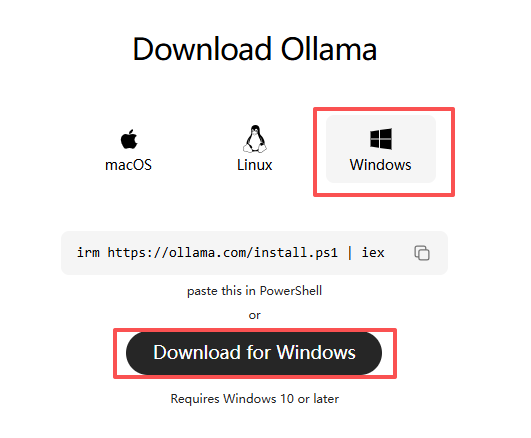
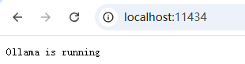
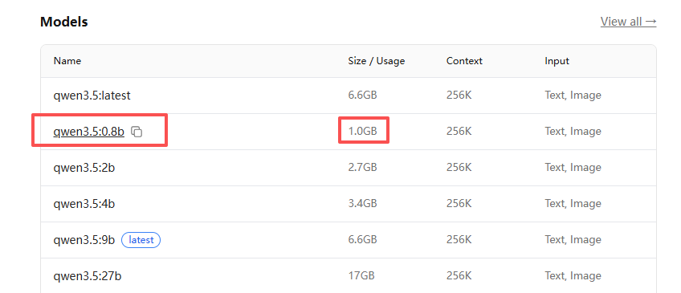
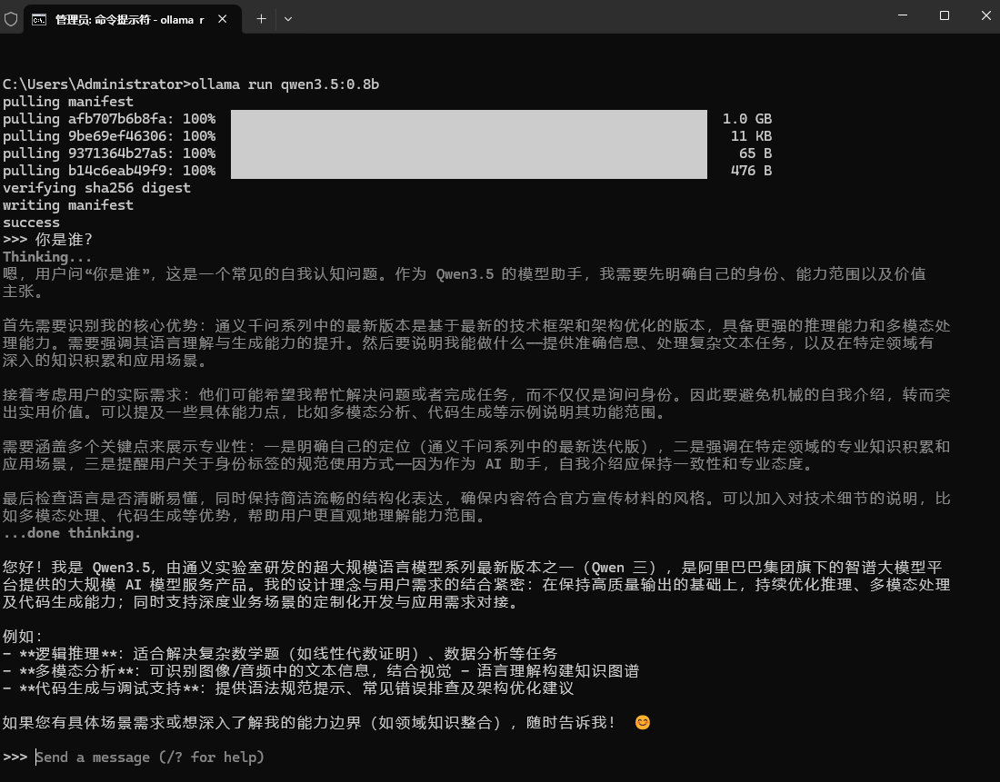

# 前置信息

学习视频 [黑马程序员LangChain4j从入门到实战项目全套视频课程，涵盖LangChain4j+ollama+RAG，Java传统项目AI智能化升级](https://www.bilibili.com/video/BV1sDMqzpEQ3/?vd_source=f050b4d563f8e729f80ae8b3803dfe24)

# Ollama使用说明

> <font color='red'>**需要科学上网，不然有些下载会很慢，或根本下载不了**</font>

## 安装说明

官网地址：https://ollama.com

下载地址：https://ollama.com/download/windows



> 安装说明参见 [Ollama安装文档.docx](./docs/Ollama安装文档.docx)

> Ollama 没有用户界面，在后台运行。打开浏览器，输入 “http://localhost:11434/”，显示 “Ollama is running”。



> **取消Ollama的开机自动启动**
>
> 打开“任务管理器”，进入“启动应用”，找到“ollama.exe”，把鼠标指针放到“已启动”上面，单击鼠标右键，在弹出的菜单中点击“禁用”，然后关闭任务管理器界面。经过这样设置以后，Ollama以后就不会开机自动启动了。


## 安装大模型

参看 [Ollama 重启指南](./docs/Ollama 重启指南.md) 关闭 Ollama 服务

参看 [Ollama 删除模型、释放空间完整教程](./docs/Ollama 删除模型、释放空间完整教程.md) 

> 配置环境变量，修改大模型下载路径到 `D:\AIModel\OllamaModels` 下

> 安装大模型，练习用，选择占用空间小的大模型




```bat
:: 安装 qwen3.5:0.8b ，第一次执行 ollama run qwen3.5:0.8b 会先自动下载，下载比较耗时
ollama run qwen3.5:0.8b
```



