# 前置信息

学习视频 [黑马程序员LangChain4j从入门到实战项目全套视频课程，涵盖LangChain4j+ollama+RAG，Java传统项目AI智能化升级](https://www.bilibili.com/video/BV1sDMqzpEQ3/?vd_source=f050b4d563f8e729f80ae8b3803dfe24)

> jdk-21.0.11，下载地址：https://www.oracle.com/cn/java/technologies/downloads/#java21
>
> > window：https://download.oracle.com/java/21/latest/jdk-21_windows-x64_bin.zip
>
> 编译版本：17

# Ollama使用说明

> <font color='red'>**⚠️需要科学上网，不然有些下载会很慢，或根本下载不了**</font>

## 安装说明

官网地址：https://ollama.com

下载地址：https://ollama.com/download/windows


> 安装说明参见 [Ollama安装文档.docx](./Ollama安装文档.docx)

> Ollama 没有用户界面，在后台运行。打开浏览器，输入 “http://localhost:11434/”，显示 “Ollama is running”表示运行成功。
>
> 
>
> **Ollama 常用 API 端点速查**
>
> | 端点            | 方法 | 用途             |
> | --------------- | ---- | ---------------- |
> | `/`             | GET  | 健康检查         |
> | `/api/tags`     | GET  | 列出本地模型     |
> | `/api/chat`     | POST | 对话补全（推荐） |
> | `/api/generate` | POST | 文本生成         |
> | `/api/pull`     | POST | 拉取模型         |
> | `/api/show`     | POST | 查看模型信息     |


> **取消Ollama的开机自动启动**
>
> 打开“任务管理器”，进入“启动应用”，找到“ollama.exe”，把鼠标指针放到“已启动”上面，单击鼠标右键，在弹出的菜单中点击“禁用”，然后关闭任务管理器界面。经过这样设置以后，Ollama以后就不会开机自动启动了。

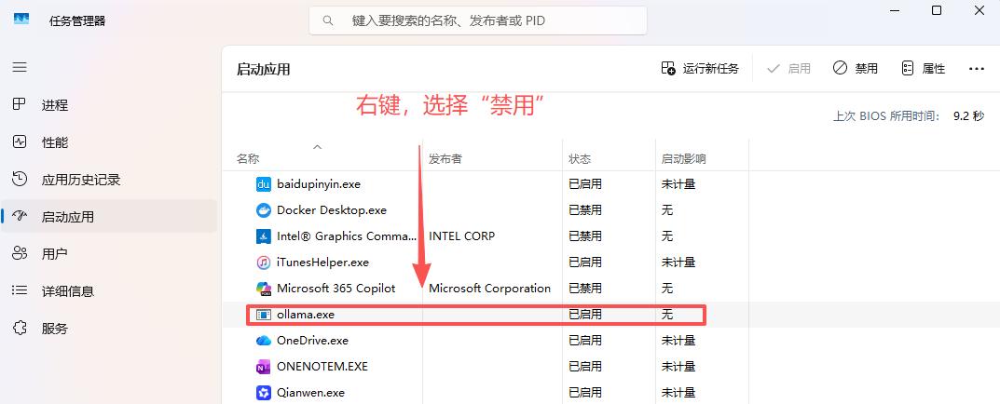

## 常驻服务说明

参见 [Ollama 常驻服务说明](./Ollama 常驻服务说明.md)

## 常用命令

参见 [Ollama 常用命令](./Ollama 常用命令.md)

## 安装大模型

参看 [Ollama 重启指南](./Ollama 重启指南.md) 关闭 Ollama 服务

参看 [Ollama 删除模型、释放空间完整教程](./Ollama 删除模型、释放空间完整教程.md) 

> 配置环境变量，修改大模型下载路径到 `D:\AIModel\OllamaModels` 下

> 安装大模型，练习用，选择占用空间小的大模型

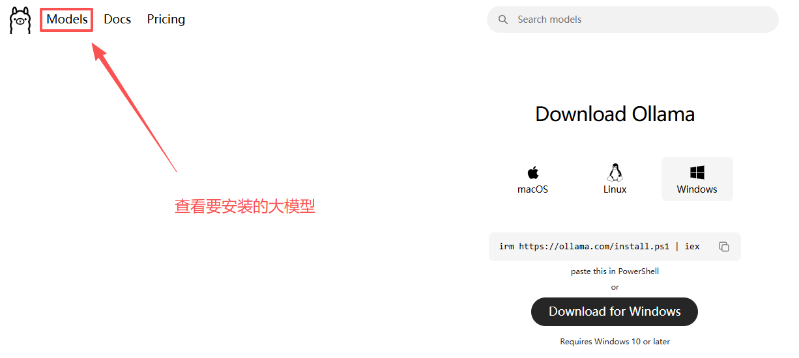

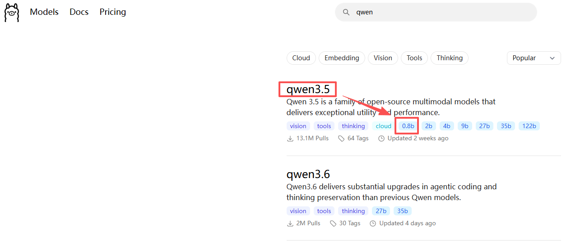


```bat
:: 安装 qwen3.5:0.8b ，第一次执行 ollama run qwen3.5:0.8b 会先自动下载，下载比较耗时
ollama run qwen3.5:0.8b
```


## 指定GPU

> Ollama 把 GPU 1 跑满了，但 GPU 0 却一直空着

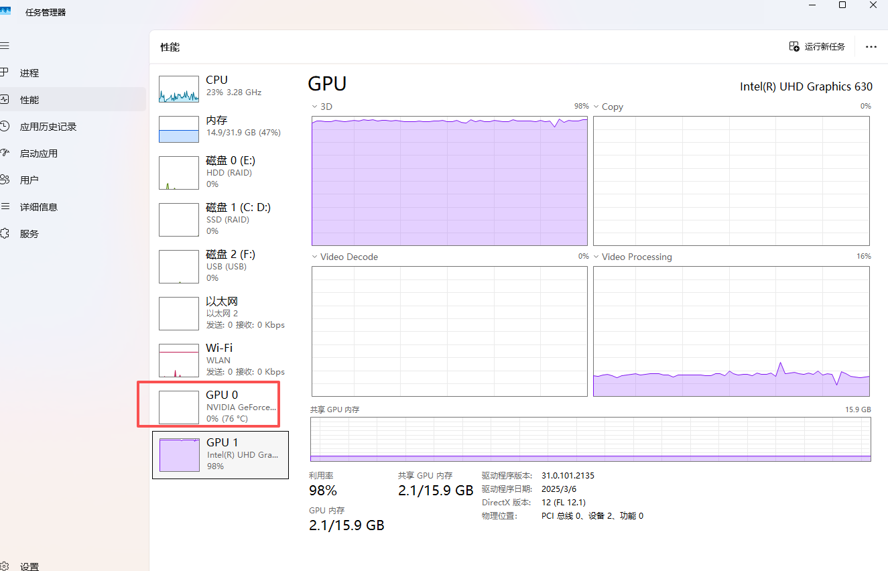

> 系统环境配置 1 个变量
>
> > OLLAMA_VULKAN=false
> >
> > > [Vulkan 是什么](./Vulkan 是什么.md)
> >
> > > - **`OLLAMA_VULKAN=true`**：Ollama 会使用 Vulkan（默认值，对非 NVIDIA 卡有用）
> > > - **`OLLAMA_VULKAN=false`**：Ollama 跳过 Vulkan，只用 CUDA（适合有 NVIDIA 独显的机器）

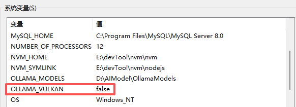

> 配置后，要确保重启 Ollama ，且配置项生效
>
> > 日志位置：C:\Users\Administrator\AppData\Local\Ollama\server.log
>
> ```powershell
> $Start-Sleep -Seconds 2; Get-Content "$env:LOCALAPPDATA\Ollama\server.log" -Tail 20
> ```
>
> 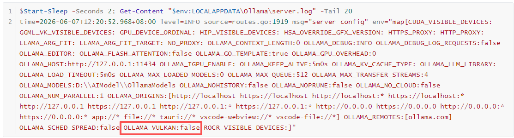

> 📋 **问题总结**
>
> 整个问题的根因链条是：
>
> > 1、Ollama 默认启用 Vulkan 后端 (OLLAMA_VULKAN=true)
> > 2、在你的笔记本平台上，Vulkan 后端把 GTX 1060 (Max-Q) 误判为集成显卡，直接丢弃了
> > 3、模型被迫跑在 Intel UHD 630 核显 上，GTX 1060 完全空转
> > 4、CUDA_VISIBLE_DEVICES=0 虽然正确隐藏了多余设备，但 Vulkan 优先级高于 CUDA，根本轮不到 CUDA 后端
>
> 解决方案：OLLAMA_VULKAN=false 禁用 Vulkan，强制走 CUDA 后端 → GTX 1060 正常使用。
> 💡 你也可以考虑把 OLLAMA_VULKAN=false 保留在系统环境变量中，这样以后每次开机都能自动生效。

> 调整后，正确跑在 GTX 1060 上
>
> 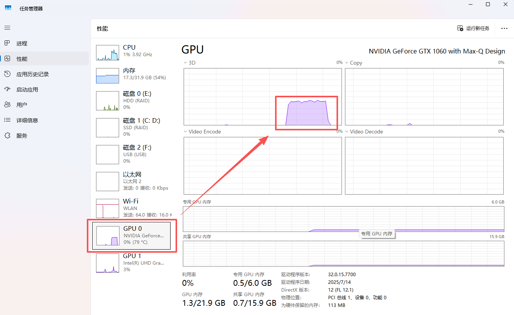

## API验证

官网文档说明：https://docs.ollama.com/capabilities/thinking

官网API说明：https://docs.ollama.com/api/chat

### Chat

```bat
curl http://localhost:11434/api/chat -d '{
  "model": "qwen3.5:0.8b",
  "messages": [
    {
      "role": "user",
      "content": "你是谁？"
    }
  ]
}'
```

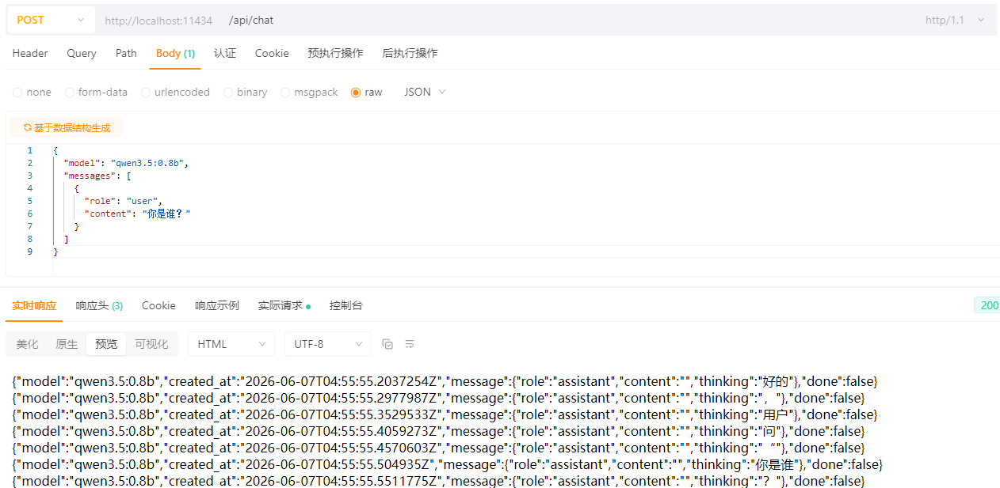

# 阿里云百炼

## 官网信息

> 官网：https://bailian.console.aliyun.com/cn-beijing#/home

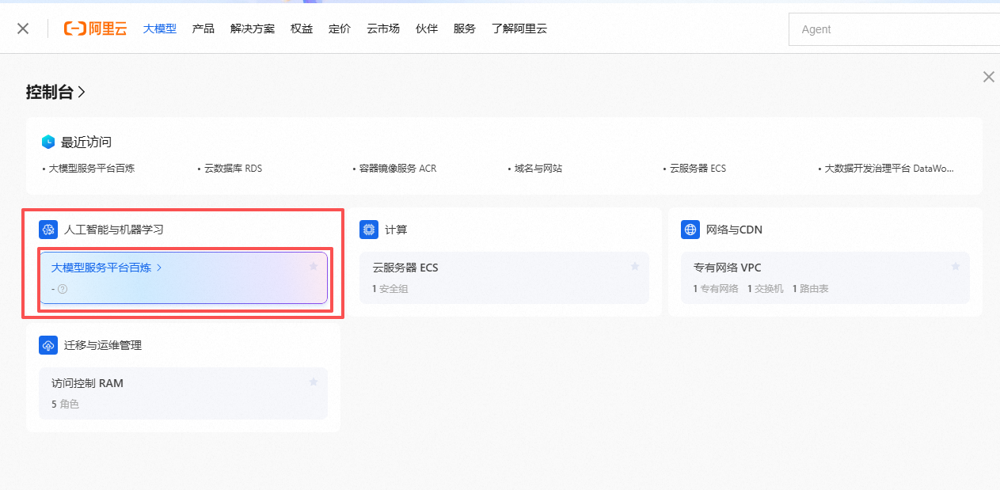


> 模型广场：https://bailian.console.aliyun.com/cn-beijing?tab=model#/model-market/all

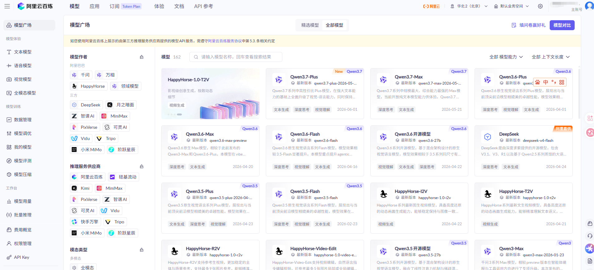

> API Key

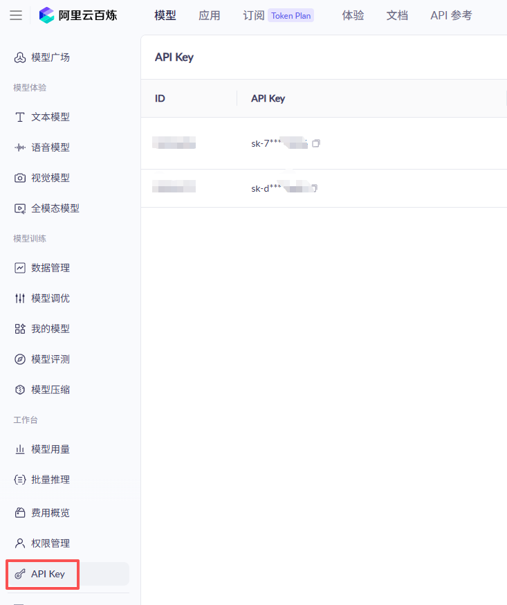

## 大模型调用

### 常见参数

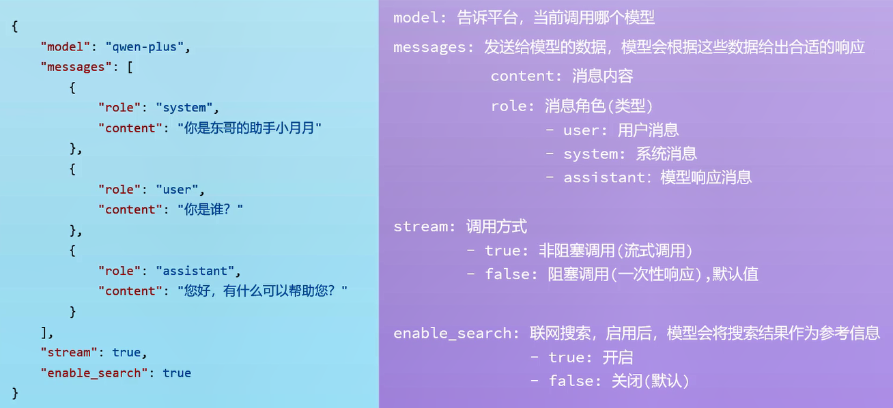

### 响应数据

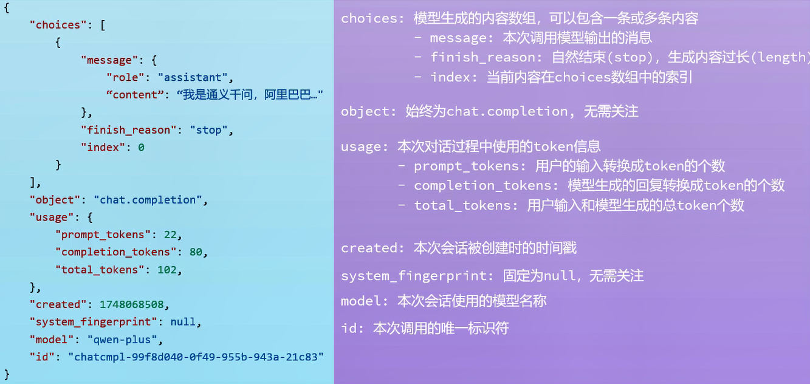

# LangChain4j\_会话功能\_快速入门

> 依赖版本选 1.14.1：https://mvnrepository.com/artifact/dev.langchain4j/langchain4j-open-ai/1.14.1

```XML
<properties>
        <dev.langchain4j.version>1.14.1</dev.langchain4j.version>
    </properties>
    <dependencies>
        <dependency>
            <groupId>dev.langchain4j</groupId>
            <artifactId>langchain4j-open-ai</artifactId>
            <version>${dev.langchain4j.version}</version>
        </dependency>
    </dependencies>
```

> 添加“**用户/系统变量**” `ALI_YUNBAILIAN_API_KEY`
>
> > 用户/系统变量配置完后，要完全重启 IDEA ，否则 IDEA 不会加载到新配置的用户/系统变量

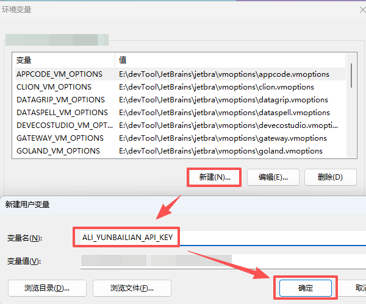
