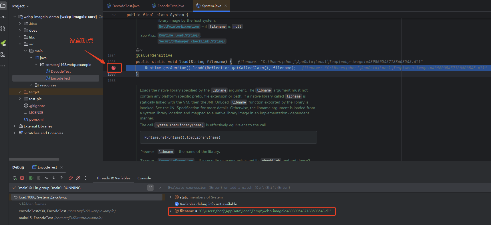
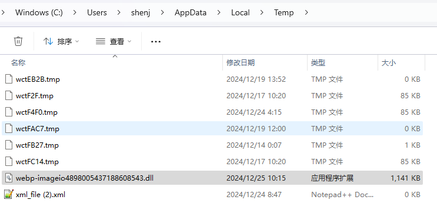
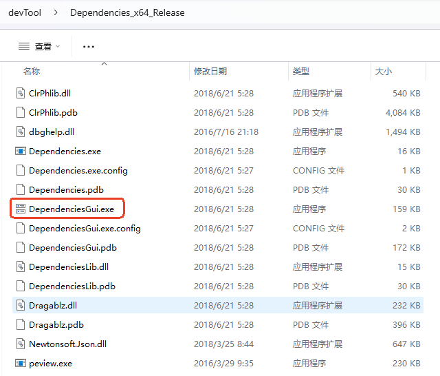
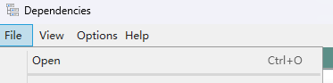
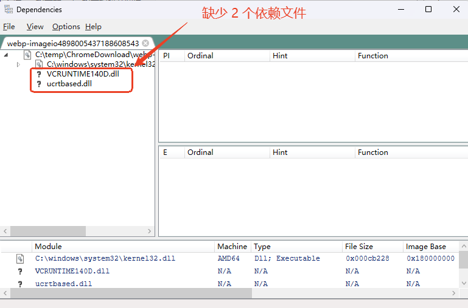
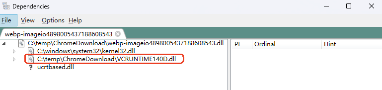
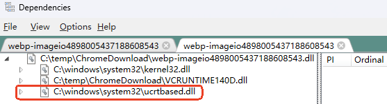
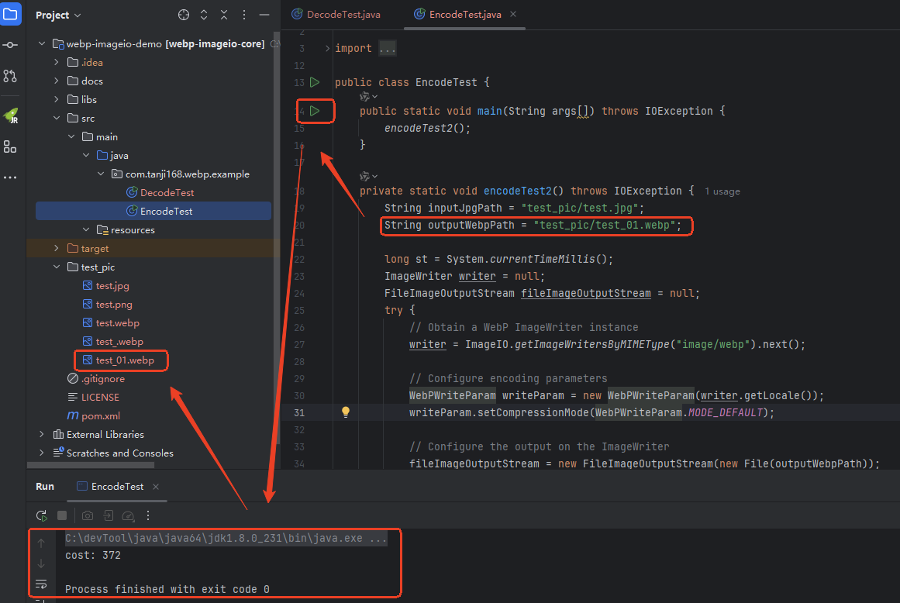

# webp图片与其他格式互转

## 源码及示例

git 源码地址：https://github.com/nintha/webp-imageio-core

本地源码参见 [webp-imageio-core-0.1.3.zip](./webp-imageio-core-0.1.3.zip)

## Win11 系统 jpg格式转webp格式报错及解决

### 报错日志

```bat
java.lang.UnsatisfiedLinkError: C:\Users\shenj\AppData\Local\Temp\webp-imageio4858860616992954776.dll: Can't find dependent libraries
	at java.lang.ClassLoader$NativeLibrary.load(Native Method)
	at java.lang.ClassLoader.loadLibrary0(ClassLoader.java:1934)
	at java.lang.ClassLoader.loadLibrary(ClassLoader.java:1817)
	at java.lang.Runtime.load0(Runtime.java:809)
	at java.lang.System.load(System.java:1086)
	at org.scijava.nativelib.NativeLibraryUtil.loadNativeLibrary(NativeLibraryUtil.java:291)
	at com.luciad.imageio.webp.WebP.loadNativeLibrary(WebP.java:29)
	at com.luciad.imageio.webp.WebP.<clinit>(WebP.java:34)
	at com.luciad.imageio.webp.WebPEncoderOptions.<clinit>(WebPEncoderOptions.java:20)
	at com.luciad.imageio.webp.WebPWriteParam.<init>(WebPWriteParam.java:30)
	at com.tanji168.webp.example.EncodeTest.main(EncodeTest.java:27)
```

> 在 C:\Users\shenj\AppData\Local\Temp 路径没找到 webp-imageio4858860616992954776.dll 文件，通过断点 `java.lang.System.load(System.java:1086)` ，当程序执行到该行时，在 C:\Users\shenj\AppData\Local\Temp 路径可以看到对应的 webp-imageio4898005437188608543.dll 文件，将该文件拷贝出来





### 解决方案

参见 [UnsatisfiedLinkError: Can't find dependent libraries on windows 10](https://github.com/nintha/webp-imageio-core/issues/2#issuecomment-2127972133) 

#### 下载 Dependencies

从 [https://lucasg.github.io/Dependencies](https://lucasg.github.io/Dependencies/) 下载 Dependencies 软件，然后解压

#### 打开 Dependencies



#### 打开有问题的 dll 文件

> 可以看到缺少 2 个依赖文件：
>
> - vcruntime140d.dll
> - ucrtbased.dll





##### vcruntime140d.dll

要获取 vcruntime140，需要下载 Microsoft Visual C++ Redistributable 版本：

- https://learn.microsoft.com/zh-cn/cpp/windows/latest-supported-vc-redist?view=msvc-170#visual-studio-2015-2017-2019-and-2022 

- 或者，https://aka.ms/vs/17/release/vc_redist.x64.exe 

安装完成后，会自动在系统 C:\Windows\System32 目录上安装库，无需手动复制。

> 备注：要将 `vcruntime140.dll` 重命名为 `vcruntime140d.dll` ，不要问为什么，带有 `d` 的版本是调试版本，但是重命名这个技巧可以行得通。



##### ucrtbased.dll

对于 `ucrtbased.dll` ，需要安装 VS2022 社区版：

- 请访问 https://visualstudio.microsoft.com/downloads/ 
- 或 Windows SDK 下载 https://developer.microsoft.com/en-us/windows/downloads/sdk-archive/

安装后，到 `C:\Windows\System32` 目录查看下是否有 `ucrtbased.dll` 文件，如果没有，则到安装目录下找到 `ucrtbased.dll` ，如：

- C:\Program Files (x86)\Windows Kits\10\bin\10.0.22621.0\x64\ucrt\ucrtbased.dll

然后将其复制到 `C:\Windows\System32` 目录下



### jpg 格式正常转 webp 

