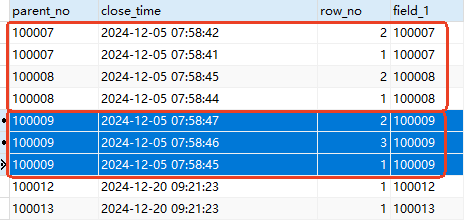
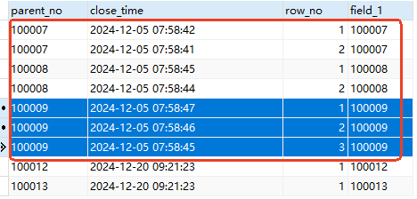
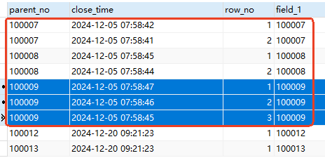

# 初始数据库

安装 MySQL 8.0 并初始化数据库之后，默认会创建以下系统数据库：

- mysql，存储了 MySQL 服务器正常运行所需的各种信息。

- information_schema，提供了访问数据库元数据的各种视图，包括数据库、表、字段类型以及访问权限等。
- performance_schema，为 MySQL 服务器的运行时状态提供了一个底层的监控功能。
- sys，包含了一系列方便 DBA 和开发人员利用 performance_schema 性能数据库进行性能调优和诊断的视图。


# 备份数据库

## Window 命令行

```bat
:: Change to Unicode(UTF-8)
chcp 65001
:: 备份数据库到当前命令行所在目录
:: 备份 dbDemo 数据库
SET dbName=dbDemo

:: --databases，导出的 sql 文件中会附带创建对应数据库的脚本
:: 密码单独输入
mysqldump -uroot -p --databases %dbName% > %dbName%.sql
:: 或直接写入密码
mysqldump -uroot -proot --databases %dbName% > %dbName%.sql

:: 导出所有数据库（所有数据库、表结构、数据），全部备份（除了MySQL自带的4个数据库）：
mysqldump -u root -proot --all-databases > all.sql
```

```bat
:: 备份远程数据库
mysqldump -h127.0.0.1 -P3306 -utest -p123456 student > I:\sql\2021-07-27_14-19-14\student.sql
```

## Linux 命令行

参见 [Linux mysql定时自动备份及清理脚本](https://blog.csdn.net/showadwalker/article/details/107857660) ，mysql_backup.sh

```shell
#!/bin/bash
#################
# 依据实际情况修改 #
#################
# 数据库地址
db_host=127.0.0.1
# 数据库端口
db_port=3306
# 数据库用户名
db_user=root
# 数据库密码
db_password=root
# 数据库名称
db_name=test
# 备份存放路径
backup_dir=/data/db_backup/mysql
#################
# 不用修改       #
#################
# 备份命名所使用的日期格式
date=$(date +%Y%m%d_%H%M%S)
if [ ! -d $backup_dir ]; then
  echo "$backup_dir 目录不存在，创建目录..."
  mkdir -p $backup_dir
  echo "$backup_dir 目录创建完成"
fi
echo "开始备份数据库[$db_name]..."
# 导出备份
#mysqldump -h$db_host -P$db_port -S /tmp/mysql.sock --no-tablespaces -u$db_user -p$db_password $db_name > $backup_dir/${db_name}_${date}.sql
# 对备份进行压缩：
mysqldump -h$db_host -P$db_port -S /tmp/mysql.sock --no-tablespaces -u$db_user -p$db_password $db_name | gzip > $backup_dir/${db_name}_${date}.sql.gz
echo "数据库备份完成：${db_name}_${date}.sql.gz"
```

### 问题

#### Can't connect to local server through socket '/run/mysqld/mysqld.sock' (2)" when trying to connect

```shell
root@dell-PowerEdge-T350:/data/db_backup# mysqldump -u***_dev -p123456 --databases ***_dev > ./***_dev.sql
mysqldump: Got error: 2002: "Can't connect to local server through socket '/run/mysqld/mysqld.sock' (2)" when trying to connect
```

参见 [亲测有效，解决Can 't connect to local MySQL server through socket '/tmp/mysql.sock '(2) ";](https://blog.csdn.net/hjf161105/article/details/78850658)

查看 /etc/my.cnf

```shell
root@dell-PowerEdge-T350:/data/db_backup# cat /etc/my.cnf
[client]
#password       = your_password
port            = 3306
socket          = /tmp/mysql.sock

[mysqld]
bind-address = 0.0.0.0
...
```

指定 socket，链接成功

```shell

root@dell-PowerEdge-T350:/data/db_backup# mysqlcat -u***_dev -p123456
Welcome to the MariaDB monitor.  Commands end with ; or \g.
...
Type 'help;' or '\h' for help. Type '\c' to clear the current input statement.

MySQL [(none)]> show databases
    -> ;
+--------------------+
| Database           |
+--------------------+
| information_schema |
| ***_dev         |
+--------------------+
2 rows in set (0.001 sec)

MySQL [(none)]>
```

#### mysqldump: Error: 'Access denied; you need (at least one of) the PROCESS privilege(s) for this operation' when trying to dump tablespaces

```shell
root@dell-PowerEdge-T350:/data/db_backup# mysqldump -S /tmp/mysql.sock -u***_dev -p123456 --databases ***_dev > ./***_dev.sql
mysqldump: Error: 'Access denied; you need (at least one of) the PROCESS privilege(s) for this operation' when trying to dump tablespaces
```

方案一：针对报错提示，不导出表空间的数据

    使用 mysqldump --no-tablespaces

方案二：更改用户权限为全局，或host对应为设置拥有权限的host

    更新用户权限添加 process privileges

使用管理账号登录mysql，对用户权限进行修改:

    GRANT PROCESS ON *.* TO 'tera_svc'@'%';
    flush privileges;
使用 --no-tablespaces 执行成功

```shell
root@dell-PowerEdge-T350:/data/db_backup# mysqldump -S /tmp/mysql.sock --no-tablespaces -u***_dev -p123456 --databases ***_dev > ./***_dev.sql
```

deepseek

> system: 请扮演一个资深的mysql数据库专家 
>
> user: mysqldump 加不加 --no-tablespaces 有什么区别

````markdown
在 `mysqldump` 中使用 `--no-tablespaces` 选项主要影响导出的 SQL 文件内容和备份行为，具体区别如下：

---

### **1. 不加 `--no-tablespaces` 的默认行为**
- **导出表空间信息**：  
  生成的 SQL 文件会包含 `CREATE TABLESPACE` 语句（如果表使用了自定义表空间），以及表的 `TABLESPACE` 配置（例如 InnoDB 的 `innodb_file_per_table` 配置）。
- **权限要求**：  
  需要用户具备 `PROCESS` 权限（MySQL 8.0+）才能访问 `INFORMATION_SCHEMA.INNODB_TABLESPACES`。如果权限不足，备份会报错：
  ```sql
  -- 错误示例
  mysqldump: Couldn't execute 'SELECT TABLESPACE_NAME...': Access denied for user 'user'@'localhost' to table 'INNODB_TABLESPACES' (1044)
  ```

---

### **2. 加 `--no-tablespaces` 的行为**
- **忽略表空间信息**：  
  生成的 SQL 文件 **不会包含** `CREATE TABLESPACE` 语句，且所有表的 `TABLESPACE` 配置会被移除。备份的 InnoDB 表会默认使用全局表空间（`innodb_system`）或 `innodb_file_per_table` 的默认配置。
- **降低权限要求**：  
  不再需要 `PROCESS` 权限，避免因权限不足导致的备份失败。

---

### **核心区别总结**
| **行为**                | **不加 `--no-tablespaces`**     | **加 `--no-tablespaces`**       |
|-------------------------|--------------------------------|---------------------------------|
| 导出表空间配置          | 保留                          | 移除                            |
| 需要 `PROCESS` 权限     | 是（MySQL 8.0+）              | 否                              |
| 备份兼容性              | 依赖目标环境表空间配置        | 更通用，忽略源环境表空间差异    |

---

### **使用场景建议**
- **加 `--no-tablespaces`**：  
  - 用户权限不足或备份环境受限。
  - 备份仅用于逻辑恢复，不关心表空间物理配置。
  - 目标恢复环境与源环境表空间配置不同（例如跨版本迁移）。

- **不加 `--no-tablespaces`**：  
  - 需要精确还原表空间配置（例如使用自定义表空间优化存储）。
  - 确保目标环境与源环境表空间配置完全一致。

---

### **示例对比**
#### **不加选项的导出片段**
```sql
CREATE TABLESPACE `my_tablespace` ADD DATAFILE 'my_tablespace.ibd' ENGINE=InnoDB;
CREATE TABLE `my_table` (...) TABLESPACE `my_tablespace`;
```

#### **加 `--no-tablespaces` 的导出片段**
```sql
CREATE TABLE `my_table` (...);  -- 无 TABLESPACE 配置
```

---

### **注意事项**
- **MySQL 版本差异**：  
  `--no-tablespaces` 在 MySQL 5.7 及以下版本不可用。对于 MySQL 8.0+，若因权限问题备份失败，此选项是首选解决方案。
- **物理备份替代方案**：  
  如果依赖表空间物理文件（如 `.ibd`），建议直接使用物理备份工具（如 `Percona XtraBackup`）。

合理选择此选项，可避免权限问题并简化跨环境迁移流程。
````


# 还原数据库

## Window 命令行

```bat
:: Change to Unicode(UTF-8)
chcp 65001
:: 在当前命令行所在目录存在 dbDemo.sql 文件

:: 未创建对应数据库的情况下
:: 配套备份脚本：mysqldump -uroot -proot --databases %dbName% > %dbName%.sql
mysql -uroot -proot < dbDemo.sql

:: 已创建对应数据库的情况下
:: 配套备份脚本：mysqldump -uroot -proot %dbName% > %dbName%.sql
mysql -uroot -proot %dbName%  < dbDemo.sql
```

## Linux 命令行

```shell
#!/bin/bash
#################
# 依据实际情况修改 #
#################
# 备份数据库的时间
backup_db_date=20250214_142603
# 数据库地址
db_host=127.0.0.1
# 数据库端口
db_port=3306
# 数据库用户名，注意：需要拥有创建数据库的权限
db_user=root
# 数据库密码
db_password=root
# 数据库名称
db_name=test
# 备份目录
backup_dir=/data/db_backup/mysql
#################
# 不用修改       #
#################
# 恢复的数据库
recover_db_name=${db_name}_${backup_db_date}
# 解压后的SQL文件名
sql_file_name=${backup_db_date}.sql
# 备份的文件名
backup_file_name=${db_name}_${sql_file_name}.gz
# 解压
gunzip -cr ${backup_dir}/${backup_file_name} > $backup_dir/$sql_file_name
# 创建数据库
echo "CREATE DATABASE IF NOT EXISTS $recover_db_name CHARACTER SET utf8mb4 COLLATE utf8mb4_general_ci" | mysql -h$db_host -P$db_port -S /tmp/mysql.sock -u$db_user -p$db_password -Dmysql
echo "创建数据库[$recover_db_name]完成"
echo "开始恢复数据到数据库[$recover_db_name]..."
# 恢复数据
mysql -h$db_host -P$db_port -S /tmp/mysql.sock -u$db_user -p$db_password $recover_db_name < ${backup_dir}/$sql_file_name
echo "恢复数据完成"
```

# 问题/解决

## MySQL排序分页查询数据顺序错乱

参见 [MySQL排序分页查询数据顺序错乱的原因和解决办法](https://blog.csdn.net/weixin_44299027/article/details/121627609)

### 问题说明

当 order by field_xxx 的 field_xxx 字段不是索引，也不是主键，且值又一样，在进行分页查询时，可能会出现第一页查询到的数据又继续在第二页出现

> mysql对无索引字段进行排序后limit ，当被排序字段有相同值时并且在limit范围内，取的值并不是正常排序后的值，有可能第一页查询的记录，重复出现在第二页的查询记录中，而且第二页的查询结果乱序，导致分页结果查询错乱问题。

### 解决方案

给 field_xxx 创建索引，或增加 索引列或主键列 排序

## [MySQL5.7 实现类似 MySQL8.0 中 row_number() over(partition by ... order by ...) 函数的分组排序编号效果](https://blog.csdn.net/weixin_49523761/article/details/129214488)

> 建议嵌套一层，排序效果才会达到预期

### 未嵌套

> 未嵌套，acct_no 关联其他标过滤 [ a.acct_no in (select b.acct_no from temp_acct_no b, crm_trade_account c where b.acct_no = c.acct_no and c.trade_group = '1') ]，查询出的结果没达到预期

```SQL
select a.parent_no, a.close_time, @num := if(@field_1 <=> a.parent_no, @num + 1, 1) row_no, @field_1 := a.parent_no field_1 from crm_trade_order a, (select @num := 0, @field_1 := null) bb where a.acct_no in (select b.acct_no from temp_acct_no b, crm_trade_account c where b.acct_no = c.acct_no and c.trade_group = '1') and a.order_status = '1' order by a.parent_no asc, a.close_time desc;
```



> 未嵌套，acct_no 直接过滤[ a.acct_no in ('142241205123','142241205124','142241205125') ]，查询出的结果达到预期

```SQL
select a.parent_no, a.close_time, @num := if(@field_1 <=> a.parent_no, @num + 1, 1) row_no, @field_1 := a.parent_no field_1 from crm_trade_order a, (select @num := 0, @field_1 := null) bb where a.acct_no in ('142241205123','142241205124','142241205125') and a.order_status = '1' order by a.parent_no asc, a.close_time desc;
```



### 有嵌套

> 未嵌套，acct_no 关联其他标过滤 [ a.acct_no in (select b.acct_no from temp_acct_no b, crm_trade_account c where b.acct_no = c.acct_no and c.trade_group = '1') ]，查询出的结果达到预期

```SQL
select aa.parent_no, aa.close_time, @num := if(@field_1 <=> aa.parent_no, @num + 1, 1) row_no, @field_1 := aa.parent_no field_1 from (select a.parent_no, a.close_time from crm_trade_order a where a.acct_no in (select b.acct_no from temp_acct_no b, crm_trade_account c where b.acct_no = c.acct_no and c.trade_group = '1') and a.order_status = '1') aa, (select @num := 0, @field_1 := null) bb order by aa.parent_no asc, aa.close_time desc;
```



## 死锁 - 1205 -Lock wait timeout exceeded, try restarting transaction

当 MySQL 返回错误 `1205 - Lock wait timeout exceeded; try restarting transaction` 时，这意味着一个事务在等待锁时超时了。这通常是因为另一个事务持有锁的时间过长，导致当前事务无法继续执行。以下是一些解决这个问题的步骤和建议：

### 1. 理解错误信息
- **错误代码**：`1205`
- **错误信息**：`Lock wait timeout exceeded; try restarting transaction`
- **含义**：当前事务在等待锁时超过了 `innodb_lock_wait_timeout` 设置的时间限制。

### 2. 查看当前锁等待情况
你可以通过以下命令查看当前的锁等待情况：

```sql
SELECT * FROM information_schema.INNODB_LOCK_WAITS;
```


这个查询会返回当前所有锁等待的情况，包括等待的事务和持有锁的事务。

### 3. 查看锁信息
你可以通过以下命令查看当前的锁信息：

```sql
SELECT * FROM information_schema.INNODB_LOCKS;
```


这个查询会返回当前所有锁的详细信息，包括锁的类型、持有锁的事务等。

### 4. 查看事务信息
你可以通过以下命令查看当前的事务信息：

```sql
SELECT * FROM information_schema.INNODB_TRX;
```


这个查询会返回当前所有活动事务的详细信息，包括事务 ID、隔离级别、执行的 SQL 语句等。

### 5. 分析死锁和锁等待
结合上述查询结果，你可以分析死锁和锁等待的情况。例如，你可以找到哪个事务持有锁，哪个事务在等待锁，以及锁的类型和范围。

### 6. 解决锁等待超时问题
以下是一些解决锁等待超时问题的方法：

- **优化事务逻辑**：
  - **减少事务持有锁的时间**：尽量减少事务的执行时间，尽快释放锁。
  - **确保事务以相同的顺序访问资源**：例如，所有事务都先更新 `table1`，再更新 `table2`。
  - **避免长时间运行的事务**：长时间运行的事务更容易导致锁等待超时。

- **调整锁等待超时时间**：
  - 你可以通过修改 `innodb_lock_wait_timeout` 参数来调整锁等待超时时间。默认值通常是 50 秒。
  - 例如，将锁等待超时时间设置为 120 秒：

    ```sql
    SET GLOBAL innodb_lock_wait_timeout = 120;
    ```


  - 或者在当前会话中设置：

    ```sql
    SET SESSION innodb_lock_wait_timeout = 120;
    ```


- **终止持有锁的事务**：
  - 如果某个事务持有锁的时间过长，你可以手动终止该事务。
  - 首先，找到持有锁的事务 ID：

    ```sql
    SELECT * FROM information_schema.INNODB_TRX;
    ```


  - 然后，使用 `KILL` 命令终止该事务：

    ```sql
    KILL <transaction_id(trx_mysql_thread_id )>;
    ```


### 7. 示例
假设你通过 `information_schema.INNODB_TRX` 查询找到了一个长时间持有锁的事务：

```sql
SELECT * FROM information_schema.INNODB_TRX;
```


输出可能如下：

```
trx_id    trx_state    trx_started    trx_requested_lock_id    trx_wait_started    trx_weight    trx_mysql_thread_id    trx_query
123456    RUNNING    2023-10-01 12:34:56    NULL    NULL    3    123    UPDATE table1 SET col1 = 'value1' WHERE id = 1
```


你可以通过以下命令终止该事务：

```sql
KILL 123;
```


### 8. 监控和日志
为了更好地管理和预防锁等待超时问题，建议定期监控数据库的锁等待情况，并记录相关日志。你可以使用 MySQL 的监控工具和日志功能来实现这一点。

### 总结
- 使用 `information_schema.INNODB_LOCK_WAITS`、`information_schema.INNODB_LOCKS` 和 `information_schema.INNODB_TRX` 查询来查看锁等待和事务信息。
- 优化事务逻辑，减少事务持有锁的时间，确保事务以相同的顺序访问资源。
- 调整 `innodb_lock_wait_timeout` 参数来调整锁等待超时时间。
- 手动终止长时间持有锁的事务。
- 定期监控和记录锁等待情况，预防锁等待超时问题。

## [SHOW ENGINE INNODB STATUS](https://www.yingnd.com/mysql/188181.html)

在MySQL命令行工具中输入以下命令：

```sql
show engine innodb status;
```

执行后，系统将返回与InnoDB相关的各种信息，包括事务的状态、锁的情况和缓冲池的使用情况。

### 命令输出解析

命令输出通常分为几个部分，每一个部分都提供了不同类型的信息：

#### 历史事务

这一部分展示了最近的事务活动。你可以观察到事务的开始时间、当前状态以及是否在等待锁。通过这些信息，你可以识别潜在的性能瓶颈。

#### 锁的情况

此部分包括所有当前持有的锁和正在等待的锁。锁的竞争可能导致数据库性能下降，了解这个信息能够帮助你优化查询效率。

#### 缓冲池使用情况

缓冲池是InnoDB用来缓存数据和索引的重要内存区域。通过查看缓冲池的使用状况，你可以判断系统是否需要更大的内存来处理当前负载。

#### 死锁信息

如果发生死锁，输出中会显示相关事务的ID以及它们之间的竞争情况。通过这些信息，开发人员可以采取措施来避免未来的死锁问题。
