# 创建虚拟环境
## 虚拟环境工具

| 工具名称         | 类型         | Python版本支持 | 安装方式                   | 特点                       | 适用场景                 |
| :--------------- | :----------- | :------------- | :------------------------- | :------------------------- | :----------------------- |
| **venv**（推荐） | 内置模块     | ≥ 3.3          | 无需安装，内置             | 轻量级、官方推荐、使用简单 | 通用开发、日常项目       |
| **virtualenv**   | 第三方工具   | 2.x 和 3.x     | `pip install virtualenv`   | 功能丰富、兼容多版本       | 需要兼容旧版本或高级功能 |
| **conda**        | Anaconda自带 | 2.x 和 3.x     | 随 Anaconda/Miniconda 安装 | 跨语言包管理、数据科学生态 | 数据科学、机器学习项目   |

若需更老版本支持，可使用 virtualenv（Python 2兼容）：

```shell
pip install virtualenv  # 非必须，venv 通常够用
```

## 查看版本

```shell
python3 --version
# 或者
python --version
```

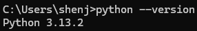

## 创建虚拟环境

```shell
# 进入项目目录
# mkdir my_project && cd my_project

# 创建虚拟环境（命名为'.venv'是常见约定）
python -m venv .venv
```

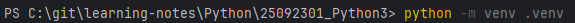

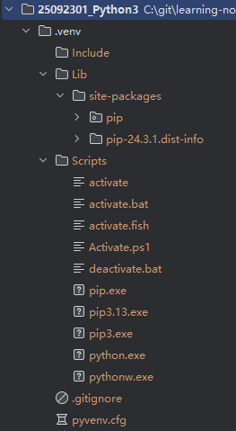

## 激活虚拟环境

```
.venv\Scripts\activate
```

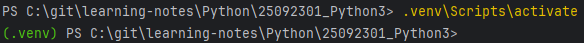

## 使用虚拟环境

### 安装包

在激活的环境中，使用 pip 安装的包只会影响当前环境：

```shell
pip install package_name
```

例如：

```shell
# 安装单个包（如Django）
(.venv) pip install -i https://pypi.tuna.tsinghua.edu.cn/simple django==3.2.12

# 安装多个包
(.venv) pip install -i https://pypi.tuna.tsinghua.edu.cn/simple requests pandas
```

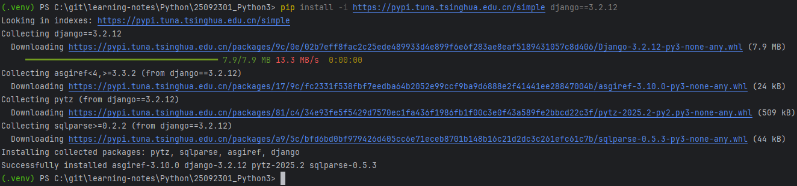

#### 安装问题

##### pip 版本太低

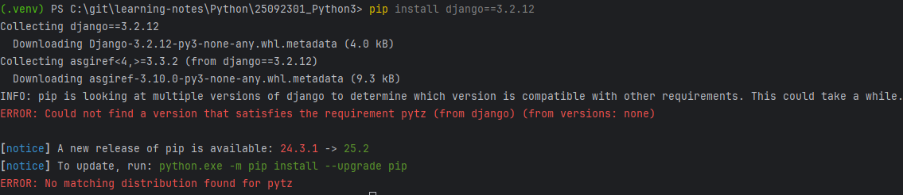

> 使用官方镜像源，安装包速度慢，报超时异常

```SHELL
python -m pip install --upgrade pip
```

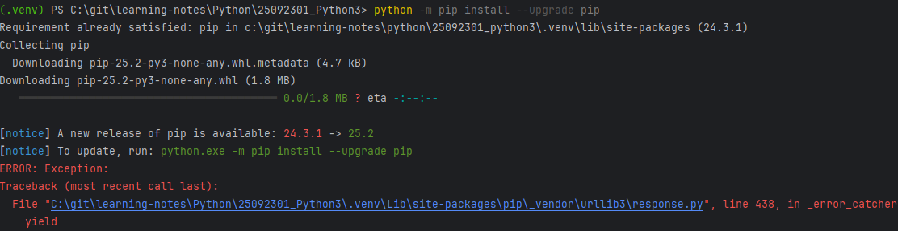

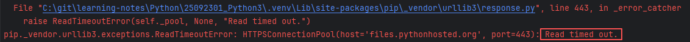

> 使用国内镜像源，安装成功

```SHELL
python -m pip install -i https://pypi.tuna.tsinghua.edu.cn/simple --upgrade pip
```

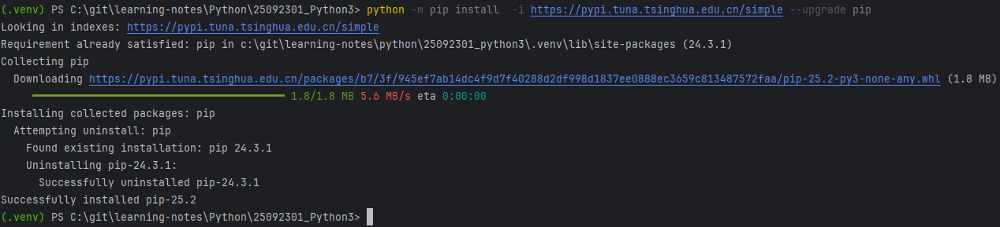

### 查看已安装的包

```shell
(.venv) pip list
Package            Version
------------------ -----------
asgiref            3.10.0
certifi            2025.10.5
charset-normalizer 3.4.3
Django             3.2.12
idna               3.11
numpy              2.3.3
pandas             2.3.3
pip                25.2
python-dateutil    2.9.0.post0
pytz               2025.2
requests           2.32.5
six                1.17.0
sqlparse           0.5.3
tzdata             2025.2
urllib3            2.5.0

```

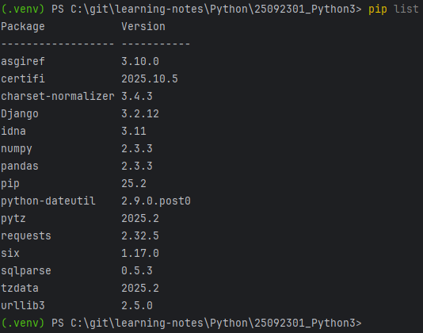

### 导出依赖

```shell
(.venv) pip freeze > requirements.txt
```

requirements.txt 文件内容示例：

```shell
asgiref==3.10.0
certifi==2025.10.5
charset-normalizer==3.4.3
Django==3.2.12
idna==3.11
numpy==2.3.3
pandas==2.3.3
python-dateutil==2.9.0.post0
pytz==2025.2
requests==2.32.5
six==1.17.0
sqlparse==0.5.3
tzdata==2025.2
urllib3==2.5.0
```

### 从文件安装依赖

```shell
(.venv) pip install -i https://pypi.tuna.tsinghua.edu.cn/simple -r requirements.txt
```

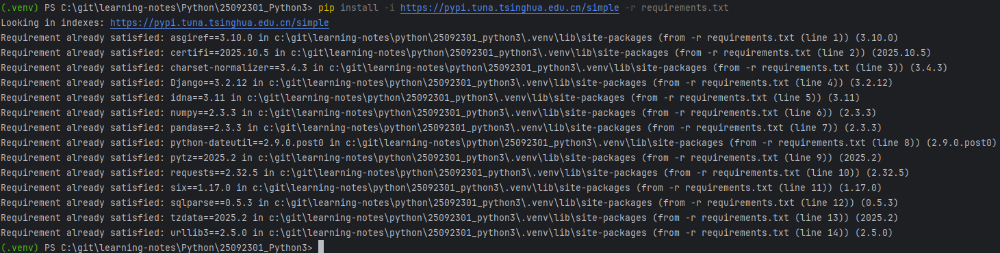

## 退出虚拟环境

```shell
deactivate
```

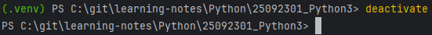

退出后，命令行提示符会恢复正常，Python 和 pip 命令将使用系统全局版本。

## 删除虚拟环境

删除对应的目录即可（续进入 dos 模式，不是 PowerShell 模式）：

```shell
# 确保已退出环境
deactivate

# 删除目录
rm -rf .venv  # Linux/macOS
del /s /q .venv  # Windows (命令提示符)
```

> PowerShell 不认 /q 参数
>
> 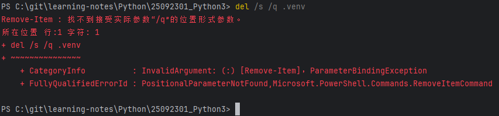

> dos 模式才认 /q 参数
>
> 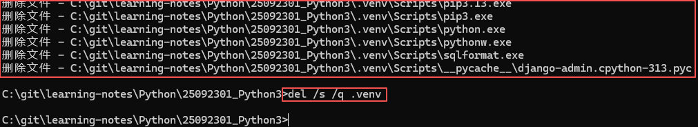

## 常见问题解答

### 1. 为什么我的虚拟环境没有 activate 脚本？

确保你使用的是正确的路径：

- Windows: `Scripts\activate`
- Unix/Linux: `bin/activate`

### 2. 如何知道当前是否在虚拟环境中？

检查命令行提示符是否有环境名称前缀，或运行：

```shell
which python
```

### 3.安装包速度慢

使用国内镜像源：

```shell
pip install -i https://pypi.tuna.tsinghua.edu.cn/simple package_name
```

查看 Python 解释器的路径是否在虚拟环境目录中。

### 4. 虚拟环境可以移动位置吗？

不建议移动虚拟环境，因为其中的路径是硬编码的。如果需要移动，最好重新创建。

### 5. 虚拟环境会占用多少空间？

虚拟环境本身很小（约 20-50MB），但随着安装的包增多，空间占用会增加。

------

## 最佳实践

1. **每个项目一个环境**：为每个 Python 项目创建独立的虚拟环境
2. **记录依赖**：定期更新 `requirements.txt` 文件
3. **不提交环境**：在版本控制中忽略虚拟环境目录
4. **命名清晰**：使用有意义的虚拟环境名称
5. **定期清理**：删除不再使用的虚拟环境
