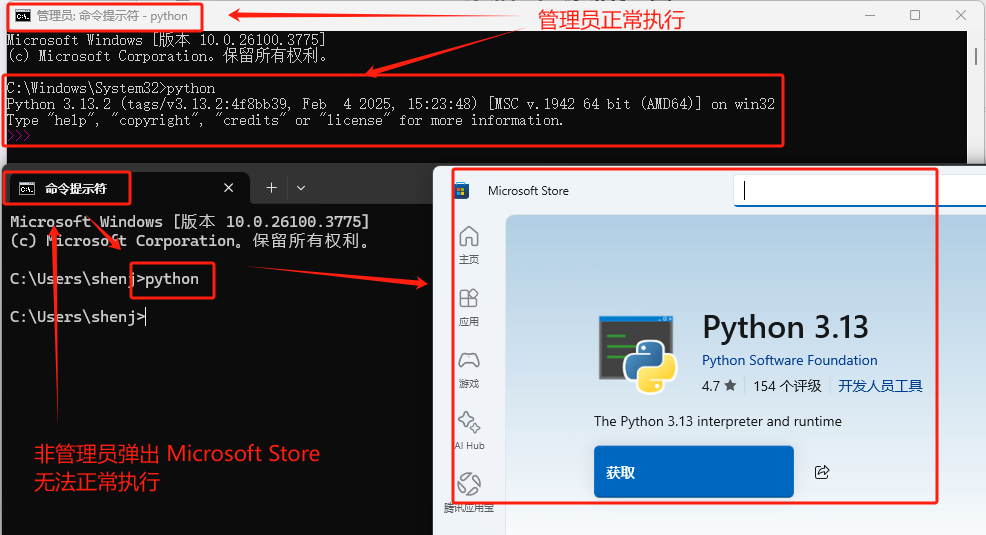
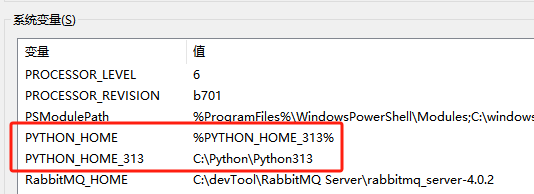
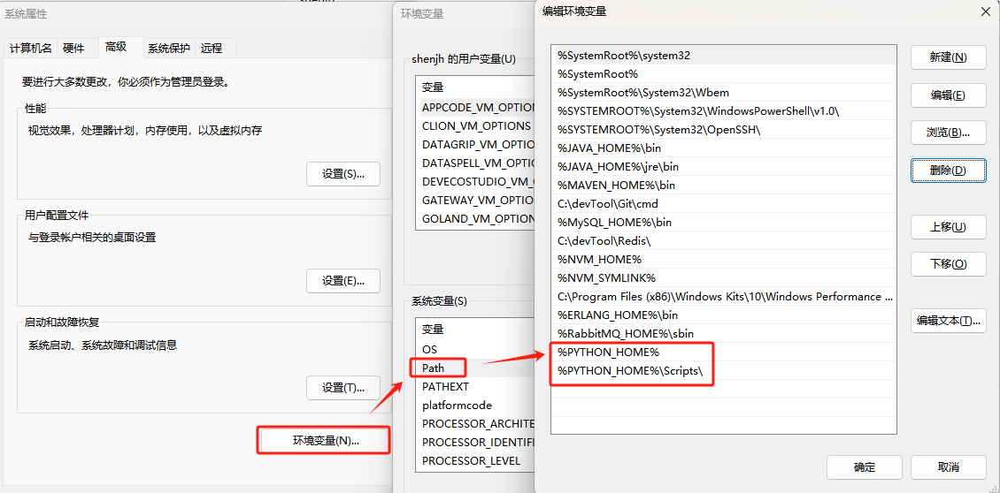
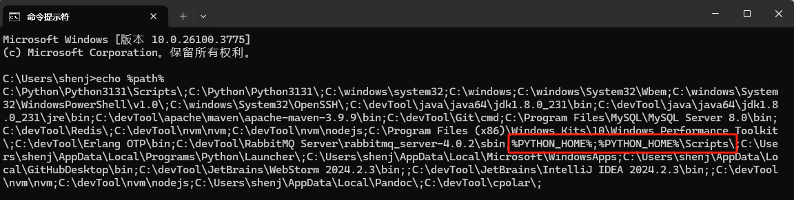
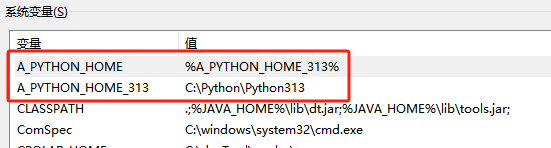
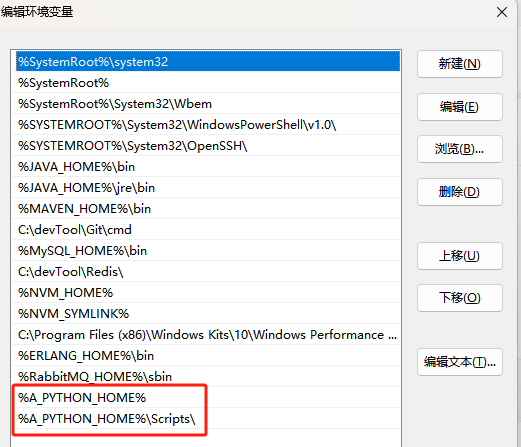
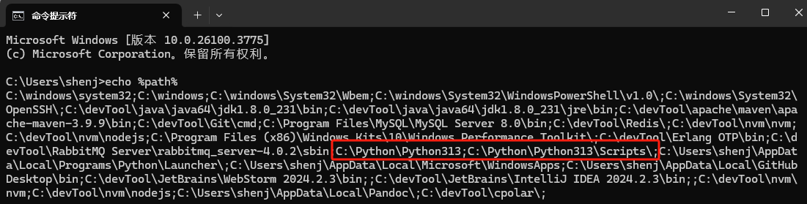

# 学习网站

## Anaconda 教程

https://www.runoob.com/python-qt/anaconda-tutorial.html

本地参见 [Anaconda 教程](./Anaconda 教程.md)

## Python 2.x 版本

https://www.runoob.com/python/python-tutorial.html

## Python 3.X 版本

### 教学地址

https://www.runoob.com/python3/python3-tutorial.htmlpy

### 练习代码

[25092301_Python3](../25092301_Python3)

# Python知识点

## 创建虚拟环境

参见 [Python3.md](../25092301_Python3/docs/Python3)

# 问题备忘

## 管理员能执行python，非管理员不能执行

### 问题描述

> 环境变量配置好后，在 dos 模式下，管理员能执行python，非管理员不能执行
>
> 

### 问题原因

> 定义的环境变量放在了 Path 变量之后（下面），导致识别出来的值为变量的值 `%PYTHON_HOME%`  ，而不是实际值 `C:\Python\Python313`
>
> 
>
> 
>
> 
>
> 

### 问题解决

> 让定义的 Python 路径变量放在 Path 变量之前就可以了
>
> 
>
> 
>
> 

