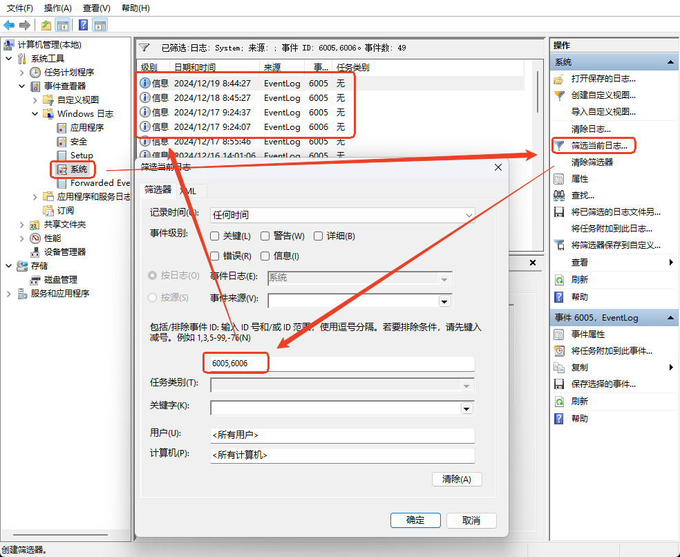
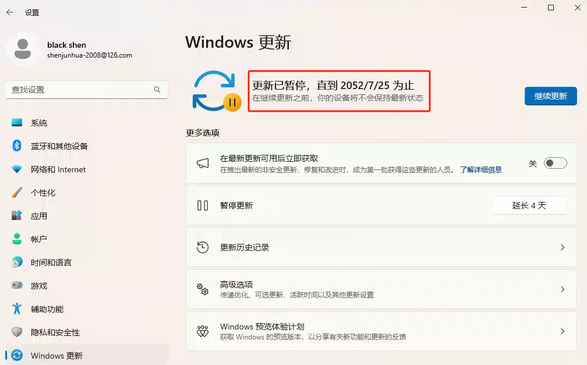
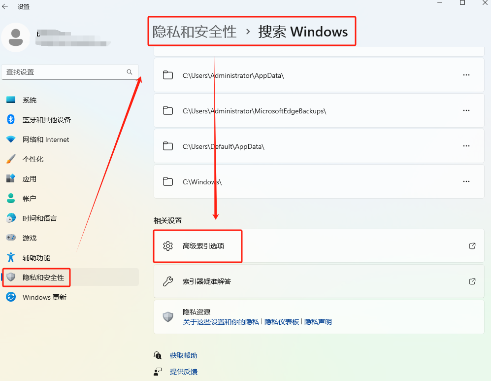

# 批处理脚本.bat

## 常规命令

```bat
:: 获取系统当前日期语法:%DATE%
echo 当前日期【DATE】是：%DATE%
当前日期【DATE】是：2024/11/07 周四

echo 当前日期【date】是：%date%
当前日期【date】是：2024/11/07 周四

:: 获取系统当前时间语法:%TIME%
echo 当前时间【TIME】是：%TIME%
当前时间【TIME】是：13:42:22.41

echo 当前时间【Time】是：%time%
当前时间【Time】是：13:42:22.41

:: 获取指定日期语法(startIndex：表示需获取的日期起始位置；count:表示需要获取几个数字)：%DATE:~startIndex,count%
SET YYYY=%DATE:~0,4%
SET MM=%DATE:~5,2%
SET DD=%DATE:~8,2%
echo 自定义的日期是：%YYYY%-%MM%-%DD%

:: 获取指定时间语法(startIndex：表示需获取的时间起始位置；count:表示需要获取几个数字)：%TIME:~startIndex,count%
SET HH=%TIME:~0,2%
SET MI=%TIME:~3,2%
SET SS=%TIME:~6,2%
echo 自定义的时间是：%HH%:%MI%:%SS%
```

## [注释](https://blog.csdn.net/qq_35421305/article/details/115208862)

> **建议尽量使用下面两种符号来为.bat批处理文件添加注释：**
>
> （1）:: 注释
>
> （2）% 注释 %，注意：为了避免错误，%和注释之间要留有空格。

### 一行注释

```bat
:: 不输出注释内容
REM 输出注释内容
@REM 不输出注释内容
```

```bat
:: @ECHO OFF会关闭注释输出；@ECHO ON则打开注释输出
@ECHO OFF
:: this is comment 4
REM this is comment 5
@REM this is comment 6
@ECHO ON

:: this is comment 7
REM this is comment 8
@REM this is comment 9
```

### 行尾添加注释

```bat
:: 错误写法
echo hello :: this is comment 1
echo hello REM this is comment 2
echo hello @REM this is comment 3

:: 正确写法
echo hello & :: this is comment 4
echo hello & REM this is comment 5
echo hello & @REM this is comment 6
```

### 行间添加注释

```bat
:: % 注释 %放在任何地方都可以。注意：为了避免错误，%和注释之间要留有空格

echo hello % this is a comment % world

% this is a comment %
echo hello world

% cd %
echo hello world

```

### 多行注释

```bat
:: 注意：@GOTO :STEP1 中冒号后面的“STEP1”是标签名，可以随便取。不过建议全部使用大写字母

@GOTO :STEP1
This is comment 1-1
This is comment 1-2.
:STEP1
echo hello

@GOTO :STEP2
This is comment 2-1.
This is comment 2-2.
:STEP2
echo world
```

## 循环

### for

1. for、in 和 do是for语句的关键字，它们三个缺一不可；

2. 在 in 之后，do 之前的括号"()"不能省略，do 后可以有括号，且括号内不能有注释
3. %%i 是for语句中对形式变量的引用；
4. for语句的形式变量I，可以换成26个字母中的任意一个，这些字母会区分大小写；
5. in和do之间的command1表示的字符串或变量可以是一个，也可以是多个，每一个字符串或变量，我们称之为一个元素，每个元素之间，用空格键、跳格键、逗号、分号或等号分隔；

```bat
@echo off

for %%a in (ele1 ele2 ele3) do (
	echo %%a
)
for %%a in (1,2,3) do (
	echo %%a
)
pause
```

```bat
:: for /L %%变量 in (起始值，每次增值，结束时的比较值) do 命令

@echo off 
setlocal enabledelayedexpansion 
set topic[0]=comments 
set topic[1]=variables 
set topic[2]=Arrays 
set topic[3]=Decision making 
set topic[4]=Time and date 
set topic[5]=Operators 

for /l %%n in (0,1,5) do ( 
   echo !topic[%%n]! 
)
pause

```

# Windows

## DOS命令

### DEL

参见 [cmd删除文件命令del/erase和删除目录命令rmdir/rd](https://www.cnblogs.com/macrored/p/11415741.html)

> del或者erase是windows下删除文件的命令，命令不区分大小写

```bat
C:\Users\Administrator>del /?
删除一个或数个文件。

DEL [/P] [/F] [/S] [/Q] [/A[[:]attributes]] names
ERASE [/P] [/F] [/S] [/Q] [/A[[:]attributes]] names

  names         指定一个或多个文件或者目录列表。
                通配符可用来删除多个文件。
                如果指定了一个目录，该目录中的所
                有文件都会被删除。

  /P            删除每一个文件之前提示确认。
  /F            强制删除只读文件。
  /S            删除所有子目录中的指定的文件。
  /Q            安静模式。删除全局通配符时，不要求确认
  /A            根据属性选择要删除的文件
  属性           R  只读文件                    S  系统文件
                H  隐藏文件                    A  存档文件
                I  无内容索引文件               L  重分析点
                -  表示“否”的前缀

如果命令扩展被启用，DEL 和 ERASE 更改如下:

/S 开关的显示句法会颠倒，即只显示已经
```

### RD/RMDIR

> rmdir 和 rd 是 windows 下删除文件夹的命令，除了.（当前目录）和..（上一级目录）不能删除外，其他的文件夹在权限足够的情况下都可以删除，命令不区分大小写

```bat
C:\Users\Administrator>rmdir /?
删除一个目录。

RMDIR [/S] [/Q] [drive:]path
RD [/S] [/Q] [drive:]path

    /S      除目录本身外，还将删除指定目录下的所有子目录和文件。用于删除目录树。

    /Q      安静模式，带 /S 删除目录树时不要求确认
```

## 其他

### 强制删除文件（夹）

参考 [Windows 10文件/文件夹正在使用无法删除的6个解决方法](https://www.reneelab.com.cn/cannot-delete-folder-in-use.html) 的第 4 点 `方法4：制作强制删除的文档`

新建 bat 文件 files_del.bat ，输入：

```bat
:: DEL 删除文件
:: /F 强制删除只读文件
:: /A 根据属性选择要删除的文件
:: /Q 安静模式。删除全局通配符时，不要求确认
DEL /F /A /Q \\?\%1
:: RD 删除文件夹
:: /S 除目录本身外，还将删除指定目录下的所有子目录和文件。用于删除目录树。
:: /Q 安静模式，带 /S 删除目录树时不要求确认
RD /S /Q \\?\%1
```

把需要删除的文件或文件夹拖拽至 files_del.bat 文件上，然后放开，便可成功删除该文件或文件夹


### [创建快捷方式不带“快捷方式“后缀](https://blog.csdn.net/m0_49448331/article/details/125740290)

在“运行”里，输入“regedit”，打开注册表编辑器，依次展开：

​	“HKEY_CURRENT_USER\Software\Microsoft\Windows\CurrentVersion\Explorer”

注：此处可以直接在搜索框中粘贴以上路径。点击选中Explorer项目，在右侧窗口找到并双击link键值项


> 将 link 键值项 1e 改为00（如下图）（有的是 [00 16 00 00]，改为 [00 00 00 00]），重启电脑让修改生效


### 创建相对路径的快捷方式

> explorer.exe 辅助信息\typora.md


### 开机、关机事件ID

开机/关机的事件id：6005,6006



# Win11

## 清理右键菜单

使用 [ContextMenuManager](https://github.com/BluePointLilac/ContextMenuManager) （免安装，双击直接使用）工具进行禁用

### 共享

与创建快捷方式的快捷按键冲突了，需要清理：主页 - 所有对象 - 共享


## [右键默认显示更多](https://www.cnblogs.com/yjung/p/18205317)

### 直接显示

以管理员身份进入 dos 命令窗口执行：

```bat
reg.exe add "HKCU\Software\Classes\CLSID\{86ca1aa0-34aa-4e8b-a509-50c905bae2a2}\InprocServer32" /f /ve
```

此时还没有生效，只需要重启电脑或者重启资源管理器即可，这里推荐重启资源管理器，在 dos 命令窗口执行：

```bat
taskkill /f /im explorer.exe & start explorer.exe
```


### 恢复隐藏

以管理员身份进入 dos 命令窗口执行：

```bat
reg.exe delete "HKCU\Software\Classes\CLSID\{86ca1aa0-34aa-4e8b-a509-50c905bae2a2}\InprocServer32" /va /f
```

此时还没有生效，只需要重启电脑或者重启资源管理器即可，这里推荐重启资源管理器，在 dos 命令窗口执行：

```bat
taskkill /f /im explorer.exe & start explorer.exe
```

## [添加hosts文件](https://blog.csdn.net/weixin_45888898/article/details/109902984)

Win11 在 C:\Windows\System32\drivers\etc\hosts 目录下没有 hosts 文件，参考[解决C:\WINDOWS\system32\drivers\etc\中没有hosts文件的办法](https://blog.csdn.net/weixin_45888898/article/details/109902984)，通过 dos 命令添加 hosts 文件

```bat
:: 以管理员身份运行命令提示符
for /f %P in ('dir %windir%\WinSxS\hosts /b /s') do copy %P %windir%\System32\drivers\etc & echo %P & Notepad %P
```


运行命令后，经过一会儿的卡顿，C:\WINDOWS\system32\drivers\etc\ 目录就添加了 hosts 文件了


## 调大暂停周数

打开注册表，进入：计算机\HKEY_LOCAL_MACHINE\SOFTWARE\Microsoft\WindowsUpdate\UX\Settings

> cmd -> regedit

新建 -> DWORD(32位)值(D) - 名称：`FlightSettingsMaxPauseDays` -> 十进制 -> 10000(天)




## 电源和电池

> 1. **最佳能效**：功耗最低，适合电池电量有限的情况，延长电池续航时间。
> 2. **平衡**：系统默认模式，平衡了性能和功耗，根据任务需求动态调整硬件性能。
> 3. **最佳性能**：功耗最高，允许硬件以最大性能运行，适合对性能要求极高的应用需求。


## 索引位置

本机系统盘是 SSD 固态硬盘，SSD 具有有限的写入/擦除周期，为了降低写入/擦除次数，将系统 `索引` 位置改到机械硬盘（无擦写限制）。




## 截图工具

参见 [在 Windows 11 中截取屏幕截图的 4 种方法](https://cn.windows-office.net/?p=21090)

> - **PrtScn 又名 PrtSc** 截取整个屏幕，保存到剪贴板。
> - **Win+PrtSc** 自动将全屏屏幕截图保存到**图片** > **屏幕截图**。
> - **Win+Shift+S** 可让您选择一个窗口或屏幕部分。

第 4 种 `延迟截图`

> 有时按 PrtScn 时，有些提示框会没掉，这时就需要设置延迟截图，然后让鼠标一直悬停在出提示框的位置，让提示框一直显示，等延迟时间到了自动截图


## 问题

### 磁盘（盘符）出现黄色感叹号

#### 问题


#### 解决

> 系统重启，解决

### 此模块被阻止加载到本地安全机构

#### 问题

```text
程序兼客性助手
此模块被阳止加载到本地安全机构。
Device\HarddiskVolume6\Program Files\Bonjour\mdnsNSP.dl
有关此模块被阻止的原因的详细信息，请单击”了解详细信息”。
```


#### 解决

关闭“本地安全机构保护”


### 系统自动关机

#### 问题

用 Microsoft 账号登录作为操作系统的登录用户，6点下班后没再操作，第二天过来，系统关机了，查看系统日志，只有当前开机的日志，没有关机日志（查看关机事件ID（6006），在关机对应时间点没有看到关机日志（对应关机时间点没再生成其他日志）），有 20 点多关机的，有 21 点多关机的，也有 23 点多关机的，找不到规律。

#### 解决

调整为本地账户登录后，自动关机问题解决


